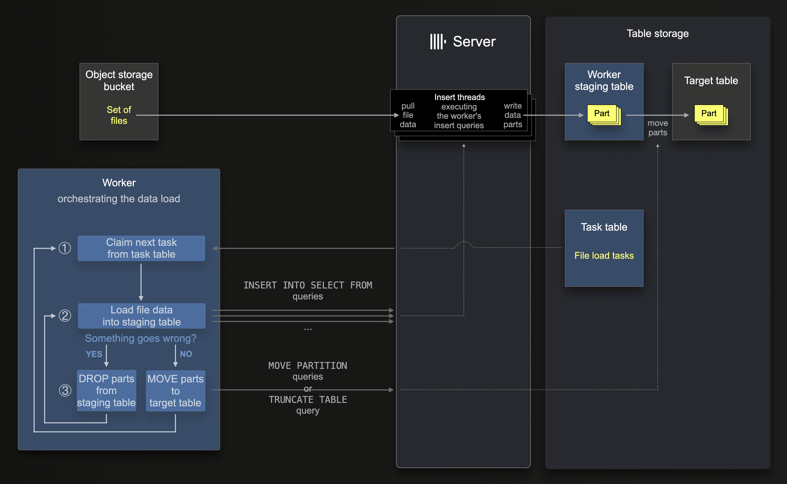
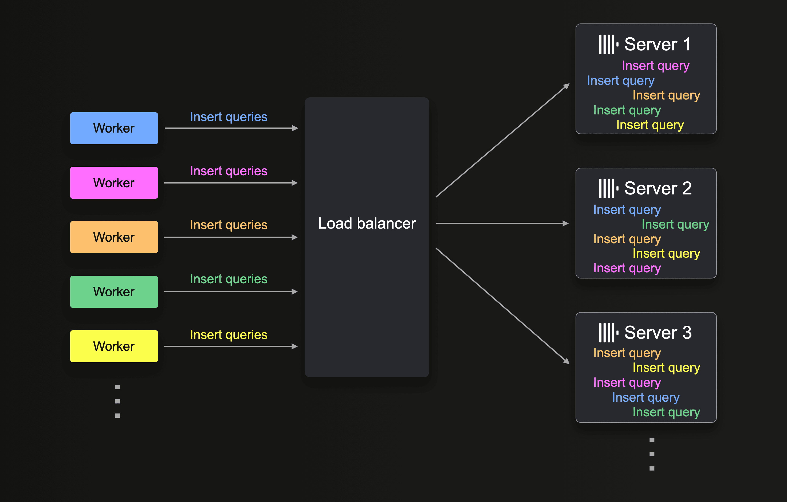
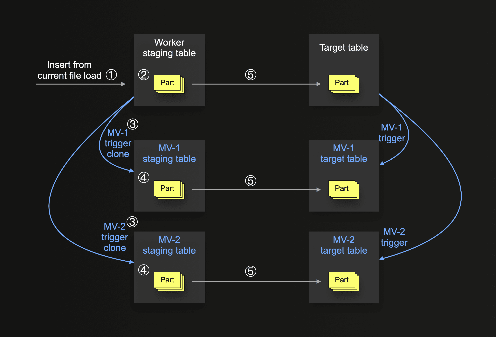

# Supercharging your large ClickHouse data loads - Making a large data load resilient

Tom Schreiber

Nov 1, 2023 - 17 minutes read

[Introduction](https://clickhouse.com/#introduction)[Resilient data loading](https://clickhouse.com/#resilient-data-loading)[ClickPipes](https://clickhouse.com/#clickpipes)[ClickLoad](https://clickhouse.com/#clickload)[Summary](https://clickhouse.com/#summary)

This blog post is part of the `Supercharging your large ClickHouse data loads` series:

- [Performance and resource usage factors](https://clickhouse.com/blog/supercharge-your-clickhouse-data-loads-part1)
- [Tuning a large data load for speed](https://clickhouse.com/blog/supercharge-your-clickhouse-data-loads-part2)

## Introduction

Often, especially when [migrating](https://clickhouse.com/blog/escape-rising-costs-of-snowflake-speed-and-cost-savings-clickhouse-cloud) from another system to ClickHouse Cloud, a large amount of data must be initially loaded. Loading billions or trillions of rows from scratch can be challenging, as such data loads take some time. The longer it takes, the higher the chances of transient issues like network glitches potentially interrupting and stopping the data load. We will show how to address these challenges and avoid interruptions to your data load.

In this third and last part of our [three-part](https://clickhouse.com/blog/supercharge-your-clickhouse-data-loads-part1) blog series about supercharging your large ClickHouse data loads, we will equip you with our best practices for resilient and efficient large data loads.

For this, we will briefly introduce you to a new managed solution for loading large data volumes from external systems into ClickHouse with built-in resiliency. We then look under the hood of a [script](https://github.com/ClickHouse/examples/tree/main/large_data_loads) originating from our magnificent [support](https://clickhouse.com/support/program) team helping some of our [ClickHouse Cloud](https://clickhouse.com/cloud) customers successfully migrate their datasets with trillions of rows. In the case that your external data source is not supported by our built-in managed solution yet, you can utilize this script in the meantime for loading a large dataset incrementally and reliably over a long period of time.

## Resilient data loading

Loading billions or even trillions of rows from scratch from an external system into a ClickHouse table takes some time. For example, assuming an (arbitrarily) basic transfer throughput of 10 million rows per second, 36 billion rows can be loaded per hour and 864 billion rows per day. Loading a few trillion rows would require multiple days.

This is enough time for things to go temporarily wrong - for example, there could be a transient network connection issue, causing the data load to be interrupted and fail. Without a managed solution using a stateful orchestration of the data transfer with built-in resiliency and automatic retries, users often resort to truncating the ClickHouse target table and starting the whole data load from scratch again. This further increases the overall time it takes to load the data and, most importantly, could also fail again, leaving you unhappy. Alternatively, you can try to identify which data was successfully ingested into the ClickHouse target table and then try to load just the missing subset. This can be tricky without a unique sequence in your data and requires manual intervention and extra time.

## ClickPipes

[ClickPipes](https://clickhouse.com/cloud/clickpipes) is a fully managed integration solution in [ClickHouse Cloud](https://clickhouse.com/cloud) providing built-in support for continuous, fast, resilient, and scalable data ingestion from an external system:

Having only [GA’d](https://clickhouse.com/blog/clickpipes-is-generally-available) this September, ClickPipes currently supports Apache Kafka in a number of flavors: OSS [Apache Kafka](https://kafka.apache.org/), [Confluent Cloud](https://www.confluent.io/lp/confluent-cloud/), and [AWS MSK](https://aws.amazon.com/msk/). Additional event pipelines and object stores (S3, GCS, etc.) will be supported [soon](https://clickhouse.com/blog/clickhouse-cloud-clickpipes-for-kafka-managed-ingestion-service#besides-confluent-cloud-and-apache-kafka-whats-coming-next), and, over time, direct integrations with other database systems.

Note that ClickPipes will [automatically retry](https://clickhouse.com/docs/en/integrations/clickpipes#faq) data transfers in the event of failures and currently [offers](https://clickhouse.com/docs/en/integrations/clickpipes#faq) at-least-once semantics. We also offer a [Kafka Connect connector](https://github.com/ClickHouse/clickhouse-kafka-connect) for users loading data from Kafka, who need exactly-once semantics.

## ClickLoad

If your external data source is not supported by [ClickPipes](https://clickhouse.com/cloud/clickpipes) yet, or if you are not using ClickHouse Cloud, we recommend the approach sketched in this diagram:① Export your data first into an [object storage](https://en.wikipedia.org/wiki/Object_storage) bucket (e.g. Amazon AWS [S3](https://aws.amazon.com/s3/), Google GCP [Cloud Storage](https://cloud.google.com/storage), or Microsoft Azure [Blob Storage](https://azure.microsoft.com/en-us/products/storage/blobs/)), ideally as [moderately](https://clickhouse.com/blog/supercharge-your-clickhouse-data-loads-part3#clickload-works-best-with-moderate-file-sizes) sized [Parquet](https://blog.twitter.com/engineering/en_us/a/2013/announcing-parquet-10-columnar-storage-for-hadoop) files between 50 and 150MB, but other [formats](https://clickhouse.com/docs/en/interfaces/formats) work too. This recommendation is made for several reasons:

1. Most current database systems and external data sources support an efficient and reliable export of very large data volumes into (relatively cheap) object storage.
2. [Parquet](https://clickhouse.com/blog/apache-parquet-clickhouse-local-querying-writing) has become almost ubiquitous as a file interchange format that offers highly efficient [storage](https://clickhouse.com/blog/apache-parquet-clickhouse-local-querying-writing-internals-row-groups#compression) and [retrieval](https://clickhouse.com/blog/clickhouse-release-23-05#parquet-reading-even-faster-michael-kolupaev). ClickHouse has blazingly [fast](https://clickhouse.com/blog/clickhouse-release-23-08#reading-files-faster-michael-kolupaevpavel-kruglov) built-in Parquet support.
3. A ClickHouse server can process and insert the data from files stored in object storage with a [high level of parallelism](https://clickhouse.com/blog/supercharge-your-clickhouse-data-loads-part1#configuration-when-data-is-pulled-by-clickhouse-servers-1) utilizing all available CPU cores.

② You can then use our [ClickLoad script](https://github.com/ClickHouse/examples/tree/main/large_data_loads#clickload), described in more detail below, that orchestrates a reliable and resilient data transfer into your ClickHouse target table by utilizing one of our object storage integration table functions (e.g. [s3](https://clickhouse.com/docs/en/engines/table-engines/integrations/s3#wildcards-in-path), [GCS](https://github.com/ClickHouse/ClickHouse/blob/9200b121acee094ec89fb350910eddfa4e1b98f4/src/TableFunctions/TableFunctionS3.cpp#L365), or [AzureBlobStorage](https://github.com/ClickHouse/ClickHouse/blob/9200b121acee094ec89fb350910eddfa4e1b98f4/src/TableFunctions/TableFunctionAzureBlobStorage.h#L18C20-L18C36)).

We provide a step-by-step example of using ClickLoad [here](https://github.com/ClickHouse/examples/blob/main/large_data_loads/examples/pypi/README.md#example-for-resiliently-loading-a-large-data-set).

### The core approach

The basic idea for ClickLoad originated from our[ support](https://clickhouse.com/support/program) team guiding some of our ClickHouse Cloud customers in successfully migrating their data with trillions of rows.

In a classical [divide-and-conquer](https://en.wikipedia.org/wiki/Divide-and-conquer_algorithm) fashion, ClickLoad splits the overall to-be-loaded file data into repeatable and retry-able tasks. These tasks are used to load the data from object storage incrementally into ClickHouse tables, with automatic retries in case of failures.

For **easy scalability**, we adapt the queue-worker approach [introduced](https://clickhouse.com/blog/building-real-time-applications-with-clickhouse-and-hex-notebook-keeper-engine) in another blog. Stateless ClickLoad [workers](https://github.com/ClickHouse/examples/blob/main/large_data_loads/src/worker.py) orchestrate the data loading by reliably claiming file load tasks from a [task table](https://github.com/ClickHouse/examples/tree/main/large_data_loads#table-schemas-for-job-task-table) backed by the [KeeperMap table engine](https://clickhouse.com/docs/en/engines/table-engines/special/keeper-map). Each task potentially contains multiple files to process, with the KeeperMap table [guaranteeing](https://clickhouse.com/blog/building-real-time-applications-with-clickhouse-and-hex-notebook-keeper-engine#using-the-keepermap-table-engine) each task (and thus file) can only be assigned to one worker. This allows us to parallelize the file load process by [spinning up](https://github.com/ClickHouse/examples/blob/main/large_data_loads/examples/pypi/README.md#step--spinning-up-100-workers) additional workers, [increasing](https://clickhouse.com/blog/supercharge-your-clickhouse-data-loads-part3#insert-throughput-can-be-easily-scaled) the overall ingest throughput.

As a prerequisite, the task table is populated with file load tasks for the ClickLoad workers:

① Users can utilize a corresponding object storage command line interface tool (e.g. Amazon [aws-cli](https://aws.amazon.com/cli/), Microsoft [azure-cli](https://learn.microsoft.com/en-us/cli/azure/), or Google [gsutil](https://cloud.google.com/storage/docs/gsutil)) for [creating](https://github.com/ClickHouse/examples/blob/main/large_data_loads/examples/pypi/README.md#step--create-a-file-containing-the-bucket-urls-for-all-to-be-loaded-files) a local file containing the object storage urls of the to-be-loaded files.

② We provide [instructions](https://github.com/ClickHouse/examples/tree/main/large_data_loads#scheduling-files-for-clickhouse-import) plus a separate script [queue_files.py](https://github.com/ClickHouse/examples/blob/main/large_data_loads/src/queue_files.py) that [splits](https://github.com/ClickHouse/examples/blob/4bc78a92bb86e3cad3dd46e8aabf6c14a7b69e65/large_data_loads/src/queue_files.py#L123) the entries from the file from step ① into [chunks](https://github.com/ClickHouse/examples/blob/4bc78a92bb86e3cad3dd46e8aabf6c14a7b69e65/large_data_loads/src/queue_files.py#L128) of file urls and [loads](https://github.com/ClickHouse/examples/blob/4bc78a92bb86e3cad3dd46e8aabf6c14a7b69e65/large_data_loads/src/queue_files.py#L105) these chunks as file load tasks into the task table.

The following diagram shows how these file load tasks from the task table are used by a ClickLoad worker orchestrating the data load:

For **easy retry-able file loads** in case [something goes wrong](https://clickhouse.com/blog/supercharge-your-clickhouse-data-loads-part3#resilient-data-loading), each ClickLoad worker first loads all file data into a ([different](https://github.com/ClickHouse/examples/blob/cc4287fe759e67fd7af0ab3a5a79b42ac0c5a969/large_data_loads/src/worker.py#L617) per worker) `staging table`: after ① [claiming](https://github.com/ClickHouse/examples/blob/cc4287fe759e67fd7af0ab3a5a79b42ac0c5a969/large_data_loads/src/worker.py#L209) its next task, a worker [iterates](https://github.com/ClickHouse/examples/blob/cc4287fe759e67fd7af0ab3a5a79b42ac0c5a969/large_data_loads/src/worker.py#L279) over the task’s list of file urls and ② (sequentially) instructs the ClickHouse server to load each file from the task into a `staging table` by using [INSERT INTO SELECT FROM queries](https://github.com/ClickHouse/examples/blob/cc4287fe759e67fd7af0ab3a5a79b42ac0c5a969/large_data_loads/src/worker.py#L297) (where the ClickHouse server by itself [pulls](https://clickhouse.com/blog/supercharge-your-clickhouse-data-loads-part1#configuration-when-data-is-pulled-by-clickhouse-servers-1) the file data from object storage). This inserts the file data with a [high level of parallelism](https://clickhouse.com/blog/supercharge-your-clickhouse-data-loads-part1#configuration-when-data-is-pulled-by-clickhouse-servers-1) and creates [data parts](https://clickhouse.com/docs/en/engines/table-engines/mergetree-family/mergetree#mergetree-data-storage) in the staging table.

Suppose one of the insert queries for the current task is interrupted and fails in between a state where the staging table already contains some data in the form of parts. In this case, the worker first ③ instructs the ClickHouse server to [truncate](https://github.com/ClickHouse/examples/blob/cc4287fe759e67fd7af0ab3a5a79b42ac0c5a969/large_data_loads/src/worker.py#L263C17-L263C17) the staging table (drop all parts), and then ② [retries](https://github.com/ClickHouse/examples/blob/cc4287fe759e67fd7af0ab3a5a79b42ac0c5a969/large_data_loads/src/worker.py#L256) its current file load task from scratch. On successfully completing the task, the worker ③ uses specific [queries](https://github.com/ClickHouse/examples/blob/8b7b3114ba35d95aff7386f7adf0fb57e304f09a/large_data_loads/src/worker.py#L591) and [commands](https://github.com/ClickHouse/examples/blob/8b7b3114ba35d95aff7386f7adf0fb57e304f09a/large_data_loads/src/worker.py#L606), causing the ClickHouse server to [move](https://github.com/ClickHouse/examples/blob/cc4287fe759e67fd7af0ab3a5a79b42ac0c5a969/large_data_loads/src/worker.py#L269) all parts (from all partitions) from the staging table to the target table. The worker then ① claims and processes the next task from the task table.

In [ClickHouse Cloud](https://clickhouse.com/cloud), all data is stored [separately](https://clickhouse.com/blog/clickhouse-cloud-boosts-performance-with-sharedmergetree-and-lightweight-updates#clickhouse-cloud-enters-the-stage) from the ClickHouse servers in [shared object storage](https://clickhouse.com/blog/clickhouse-cloud-boosts-performance-with-sharedmergetree-and-lightweight-updates#shared-object-storage-for-data-availability). Consequently, moving parts is a lightweight operation that only changes parts' [metadata](https://clickhouse.com/blog/clickhouse-cloud-boosts-performance-with-sharedmergetree-and-lightweight-updates#sharedmergetree-for-cloud-native-data-processing) but doesn’t physically move parts.

Note that each worker [creates](https://github.com/ClickHouse/examples/blob/8b7b3114ba35d95aff7386f7adf0fb57e304f09a/large_data_loads/src/worker.py#L173) its [own](https://github.com/ClickHouse/examples/blob/8b7b3114ba35d95aff7386f7adf0fb57e304f09a/large_data_loads/src/worker.py#L406) staging tables on startup and then executes an [endless loop](https://github.com/ClickHouse/examples/blob/cc4287fe759e67fd7af0ab3a5a79b42ac0c5a969/large_data_loads/src/worker.py#L191) checking for unprocessed tasks, with [sleep breaks](https://github.com/ClickHouse/examples/blob/cc4287fe759e67fd7af0ab3a5a79b42ac0c5a969/large_data_loads/src/worker.py#L203C16-L203C16) in case no new task is found. We use a [signal handler](https://github.com/ClickHouse/examples/blob/8b7b3114ba35d95aff7386f7adf0fb57e304f09a/large_data_loads/src/worker.py#L124) [registered](https://github.com/ClickHouse/examples/blob/8b7b3114ba35d95aff7386f7adf0fb57e304f09a/large_data_loads/src/worker.py#L143) for `SIGINT` (`Ctrl+C`) and `SIGTERM` (Unix process `kill signal`) signals for cleaning up (deleting) the worker’s staging tables when a worker is shut down.

Also, note that a worker processes atomic [chunks of files](https://github.com/ClickHouse/examples/blob/cc4287fe759e67fd7af0ab3a5a79b42ac0c5a969/large_data_loads/src/worker.py#L194) instead of single files to reduce [contention on Keeper](https://clickhouse.com/blog/clickhouse-keeper-a-zookeeper-alternative-written-in-cpp#linearizability-vs-multi-core-processing) when replicated tables are used. The latter creates a (much) larger number of [MOVE PARTITION](https://clickhouse.com/docs/en/sql-reference/statements/alter/partition#move-partition-to-table) calls that are coordinated by Keeper in a replicated cluster. Furthermore, we [randomize](https://github.com/ClickHouse/examples/blob/4bc78a92bb86e3cad3dd46e8aabf6c14a7b69e65/large_data_loads/src/queue_files.py#L127) the file chunk size to prevent Keeper contention when multiple parallel workers run.

### Staging tables ensure that loaded data will be stored exactly once

The `INSERT INTO SELECT FROM` queries used by the ClickLoad workers could insert the file data directly into the target table. But when an insert query invariably fails, so as not to cause data duplication when we retried the task, we would need to delete all data from the previously failed task. This deletion is much more difficult than when data is inserted into a staging table, which can simply be truncated.

For example, just dropping parts in the target table is impossible as the initially inserted parts get automatically [merged](https://clickhouse.com/blog/supercharge-your-clickhouse-data-loads-part1#more-parts--more-background-part-merges) (potentially with parts from prior successful inserts) in the background.

Relying on [automatic insert deduplication](https://clickhouse.com/blog/common-getting-started-issues-with-clickhouse#5-deduplication-at-insert-time) is also not generally possible because (1) it is highly unlikely that [insert threads](https://clickhouse.com/blog/supercharge-your-clickhouse-data-loads-part1#configuration-when-data-is-pulled-by-clickhouse-servers-1) recreate exactly the same insert blocks, and (2) with a high number of running workers, the [default](https://clickhouse.com/docs/en/operations/settings/merge-tree-settings#replicated-deduplication-window) per-table deduplication window in ClickHouse could be insufficient.

Lastly, explicitly deduplicating all rows with an [OPTIMIZE DEDUPLICATE](https://clickhouse.com/docs/en/sql-reference/statements/optimize) statement would be (1) a very heavy and slow operation the larger the target table gets and (2) could potentially accidentally deduplicate rows that are intentionally identical in the source data files.

The only way to reliably delete the data from a failed insert from the target table before retrying the insert would be to use an [ALTER TABLE DELETE](https://clickhouse.com/docs/en/sql-reference/statements/alter/delete), a [lightweight delete](https://clickhouse.com/docs/en/guides/developer/lightweight-delete), or a [lightweight update](https://clickhouse.com/docs/en/guides/developer/lightweight-update) statement. All of these are eventually materialized with a heavy [mutation](https://clickhouse.com/docs/en/sql-reference/statements/alter#mutations) operation, which becomes more expensive as the table increases in size.

Conversely, the detour via a staging table allows our workers to guarantee that each row from the loaded files is stored exactly once in the target table by efficiently dropping or moving parts, depending on whether the task failed or succeeded.

### Workers are lightweight

ClickLoad’s worker [script](https://github.com/ClickHouse/examples/blob/main/large_data_loads/src/worker.py) only orchestrates data loading but doesn’t actually load any data by itself. Instead, the ClickHouse server and its hardware resources are utilized for [pulling](https://clickhouse.com/blog/supercharge-your-clickhouse-data-loads-part1#configuration-when-data-is-pulled-by-clickhouse-servers-1) the data from object storage and writing it into ClickHouse tables.

Note that running ClickLoad requires a separate machine with network access to both the source object storage bucket and the target ClickHouse instance. Because of the workers’ lightweight working fashion, a moderately sized machine [can](https://github.com/ClickHouse/examples/blob/main/large_data_loads/examples/pypi/README.md#example-for-resiliently-loading-a-large-data-set) run 100s of parallel worker instances.

### Insert throughput can be easily scaled

Multiple workers and [multiple ClickHouse servers](https://clickhouse.com/blog/supercharge-your-clickhouse-data-loads-part1#clickhouse-cloud) (with a [load balancer](https://clickhouse.com/docs/en/cloud/reference/architecture) in front in ClickHouse Cloud) can be utilized for [scaling](https://github.com/ClickHouse/examples/blob/main/large_data_loads/examples/pypi/README.md#result) the ingest throughput:

The `INSERT INTO SELECT FROM` queries from all workers are evenly distributed to, and then executed in parallel, by the number of available ClickHouse servers. Note that each worker has its [own](https://github.com/ClickHouse/examples/blob/cc4287fe759e67fd7af0ab3a5a79b42ac0c5a969/large_data_loads/src/worker.py#L617) staging table.

Doubling the number of workers can double the ingest throughput, provided the ClickHouse servers executing the insert queries have enough resources.

Similarly, doubling the number of ClickHouse servers can double the ingest throughput. In our tests, when loading a 600+ billion row [dataset](https://clickhouse.com/blog/clickhouse-vs-snowflake-for-real-time-analytics-benchmarks-cost-analysis#pypi-dataset) (with 100 parallel workers), increasing the number of ClickHouse servers in a ClickHouse Cloud service from 3 to 6 exactly doubled the ingest throughput (from 4 million rows/second to 8 million rows/second).

### Continuous data ingestion is possible

As mentioned above, each worker executes an [endless loop](https://github.com/ClickHouse/examples/blob/cc4287fe759e67fd7af0ab3a5a79b42ac0c5a969/large_data_loads/src/worker.py#L191) checking for unprocessed tasks in the task table with [sleep breaks](https://github.com/ClickHouse/examples/blob/cc4287fe759e67fd7af0ab3a5a79b42ac0c5a969/large_data_loads/src/worker.py#L203C16-L203C16) in case no new task is found. This allows the easy implementation of a continuous data ingestion process by adding new file load tasks into the task table in case new files are detected in the object storage bucket. The running workers will then automatically claim these new scheduled tasks. We describe a concrete example [here](https://github.com/ClickHouse/examples/blob/main/large_data_loads/examples/pypi/README.md#setting-up-a-continuous-data-load) but leave this implementation to the reader

### Any partitioning key is supported

The ClickLoad worker's file load mechanism is independent of any [partitioning](https://clickhouse.com/docs/en/engines/table-engines/mergetree-family/custom-partitioning-key) scheme of the target table. The workers don’t create any partitions by themselves. We also don’t require that each loaded file belong to a specific partition. Instead, the target table can have any (or no) [custom partition key](https://clickhouse.com/docs/en/engines/table-engines/mergetree-family/custom-partitioning-key), which we duplicate in the staging table (which is a DDL-level [clone](https://github.com/ClickHouse/examples/blob/cc4287fe759e67fd7af0ab3a5a79b42ac0c5a969/large_data_loads/src/worker.py#L399) of the target table).

After each successful [files chunk transfer](https://github.com/ClickHouse/examples/blob/cc4287fe759e67fd7af0ab3a5a79b42ac0c5a969/large_data_loads/src/worker.py#L261), we just [move](https://github.com/ClickHouse/examples/blob/cc4287fe759e67fd7af0ab3a5a79b42ac0c5a969/large_data_loads/src/worker.py#L269) over all (parts belonging to) partitions that were naturally created for the staging table during the ingest of data from the currently processed files. This means that overall, exactly the same number of partitions [are](https://github.com/ClickHouse/examples/tree/main/large_data_loads/internals#support-for-arbitrary-partitioning-keys) created for the target table as if we inserted all data (without using our ClickLoad script) directly into the target table.

You can find a more detailed explanation [here](https://github.com/ClickHouse/examples/tree/main/large_data_loads/internals#support-for-arbitrary-partitioning-keys).

### Projections and Materialized views are fully supported

Loading trillions of rows reliably into the target table is a good first step. However, [projections](https://clickhouse.com/docs/en/sql-reference/statements/alter/projection) and [materialized views](https://clickhouse.com/docs/en/guides/developer/cascading-materialized-views) can [supercharge your queries](https://clickhouse.com/blog/clickhouse-faster-queries-with-projections-and-primary-indexes) by allowing a table to have [automatic incremental aggregations](https://www.youtube.com/watch?v=QDAJTKZT8y4&t=414s) and multiple-row orders with [additional primary indexes](https://clickhouse.com/docs/en/optimize/sparse-primary-indexes#using-multiple-primary-indexes).

Creating projections or materialized views on the target table **after** the trillions of rows are initially loaded would require expensive projection [materializations](https://clickhouse.com/docs/en/sql-reference/statements/alter/projection#materialize-projection) or a ClickHouse-side table-to-table reload of the data for [triggering](https://www.youtube.com/watch?v=QDAJTKZT8y4) materialized views. Both of these would again take a long period of time, including the risk that something goes wrong. Therefore, the most efficient option is to create projections and materialized views **before** the initial data load. ClickLoad fully (and transparently) supports this.

#### Projections support

The staging table [created](https://github.com/ClickHouse/examples/blob/cc4287fe759e67fd7af0ab3a5a79b42ac0c5a969/large_data_loads/src/worker.py#L165) by our ClickLoad worker script is a full DDL-level clone of the target table, including all defined projections. Because the data parts of projections [are](https://clickhouse.com/docs/en/optimize/sparse-primary-indexes#option-3-projections) stored as subdirectories within the [part directories](https://github.com/ClickHouse/examples/tree/main/large_data_loads/internals#support-for-arbitrary-partitioning-keys) of the projection's host table, they are automatically moved over from the staging table to the target table after each file load task.

#### Materialized views support

The following diagram shows the basic logic for ClickLoad’s materialized views support:

In the diagram above, the target table has two connected materialized views (`MV-1` and `MV-2`) that would trigger on new direct inserts into the target table and store the data (in a [transformed](https://youtu.be/QDAJTKZT8y4?si=a6isJuHsYCG-dTDA) form) in their own target tables.

Our ClickLoad worker script replicates this behavior by automatically creating a staging table not [just](https://github.com/ClickHouse/examples/blob/cc4287fe759e67fd7af0ab3a5a79b42ac0c5a969/large_data_loads/src/worker.py#L399) for the main target table but [also](https://github.com/ClickHouse/examples/blob/cc4287fe759e67fd7af0ab3a5a79b42ac0c5a969/large_data_loads/src/worker.py#L419) for all materialized view (mv) target tables. Together with the additional staging tables, we automatically [create](https://github.com/ClickHouse/examples/blob/cc4287fe759e67fd7af0ab3a5a79b42ac0c5a969/large_data_loads/src/worker.py#L422) clones of the materialized view triggers but configure them to react to inserts on the staging table and then target their corresponding target staging tables.

When ① data gets inserted into the target table’s staging table (and ② stored in the form of parts), this insert ③ automatically triggers the mv copies, ④ causing corresponding inserts into the target tables of the staging mvs. If the whole insert succeeds, we ⑤ [move](https://github.com/ClickHouse/examples/blob/cc4287fe759e67fd7af0ab3a5a79b42ac0c5a969/large_data_loads/src/worker.py#L269) all parts (partitions) from the staging tables into their counterparts. If something goes wrong, e.g., one of the materialized views has a problem with the current data, we just [drop](https://github.com/ClickHouse/examples/blob/cc4287fe759e67fd7af0ab3a5a79b42ac0c5a969/large_data_loads/src/worker.py#L263) all parts from all staging tables and [retry](https://github.com/ClickHouse/examples/blob/cc4287fe759e67fd7af0ab3a5a79b42ac0c5a969/large_data_loads/src/worker.py#L256) the insert. If the [maximum number of retries](https://github.com/ClickHouse/examples/blob/cc4287fe759e67fd7af0ab3a5a79b42ac0c5a969/large_data_loads/src/worker.py#L23) is exceeded, we skip (and log) the current file and continue with the next one. With this mechanism, we ensure that the insert is atomic and the data is always consistent between the main target table and all connected materialized views.

Note that moving parts into the target table in step ⑤ does not trigger any of the connected original materialized views.

Detailed error information about failed materialized views is in the [query_views_log](https://clickhouse.com/docs/en/operations/system-tables/query_views_log) system table.

Also, as explained [above](https://clickhouse.com/blog/supercharge-your-clickhouse-data-loads-part3#any-partitioning-key-is-supported), the target tables for the materialized views can have any (or no) [custom partition key](https://clickhouse.com/docs/en/engines/table-engines/mergetree-family/custom-partitioning-key). Our orchestration logic is independent of this.

Our ClickLoad worker script currently only supports materialized views created with the `TO target_table` [clause](https://clickhouse.com/docs/en/sql-reference/statements/create/view#materialized-view) and doesn’t support [chained](https://clickhouse.com/docs/en/guides/developer/cascading-materialized-views#yearly-aggregated-table-and-materialized-view) (`cascaded`) materialized views.

### ClickLoad works best with moderate file sizes

The worker’s processing unit is a whole file. If something goes wrong while a file is loaded, we reload the whole file. Therefore, we recommend using moderately sized files with millions but not trillions of rows per file and approximately 100 to 150 MB in compressed size. This ensures an efficient retry mechanism.

### PRs are welcome

As mentioned above, the origin of our ClickLoad script was helping some of our ClickHouse Cloud customers migrate their large data amounts during support interactions. Therefore, the script currently relies on cloud-specific features like `MOVE PARTITION` [being](https://clickhouse.com/blog/supercharge-your-clickhouse-data-loads-part3#the-core-approach) a lightweight operation for the [SharedMergeTree](https://clickhouse.com/blog/clickhouse-cloud-boosts-performance-with-sharedmergetree-and-lightweight-updates) engine. This engine also allows the [easy](https://clickhouse.com/blog/clickhouse-cloud-boosts-performance-with-sharedmergetree-and-lightweight-updates#seamless-cluster-scaling) scaling up of the number of ClickHouse servers for [increasing](https://clickhouse.com/blog/supercharge-your-clickhouse-data-loads-part3#insert-throughput-can-be-easily-scaled) the ingest throughput. We haven’t had a chance to test the script on alternative setups yet, but we welcome [contributions](https://github.com/ClickHouse/examples/tree/8b7b3114ba35d95aff7386f7adf0fb57e304f09a/large_data_loads). In principle, it should work on alternative setups with minimal tweaks. The [MOVE PARTITION operations](https://github.com/ClickHouse/examples/blob/cc4287fe759e67fd7af0ab3a5a79b42ac0c5a969/large_data_loads/src/worker.py#L592) must run on all shards in a sharded cluster, e.g., by utilizing the [ON CLUSTER](https://clickhouse.com/docs/en/sql-reference/distributed-ddl) clause. Also, note that MOVE PARTITION currently cannot be run concurrently when [zero-copy replication](https://clickhouse.com/docs/en/operations/storing-data#zero-copy) is used. We hope the script serves as a helpful starting point, and we welcome its use in more use cases and scenarios and collaborating on improvements!

In the future, we expect the mechanics of this script to be considered as we build out support in [ClickPipes](https://clickhouse.com/blog/supercharge-your-clickhouse-data-loads-part3#clickpipes) for ingesting files from object storage. Stay tuned for updates!

## Summary

Loading large datasets with trillions of rows can be a challenge. To overcome this, ClickHouse Cloud has [ClickPipes](https://clickhouse.com/cloud/clickpipes) - a built-in managed integration solution featuring support for resiliently loading large data volumes robust to interruptions with automatic retries. If your external data source is not supported yet, we explored the mechanics of [ClickLoad](https://github.com/ClickHouse/examples/blob/main/large_data_loads/README.md) - a script for loading large datasets incrementally and reliably over a long period of time.

This finishes our three-part blog series about supercharging large data loads.