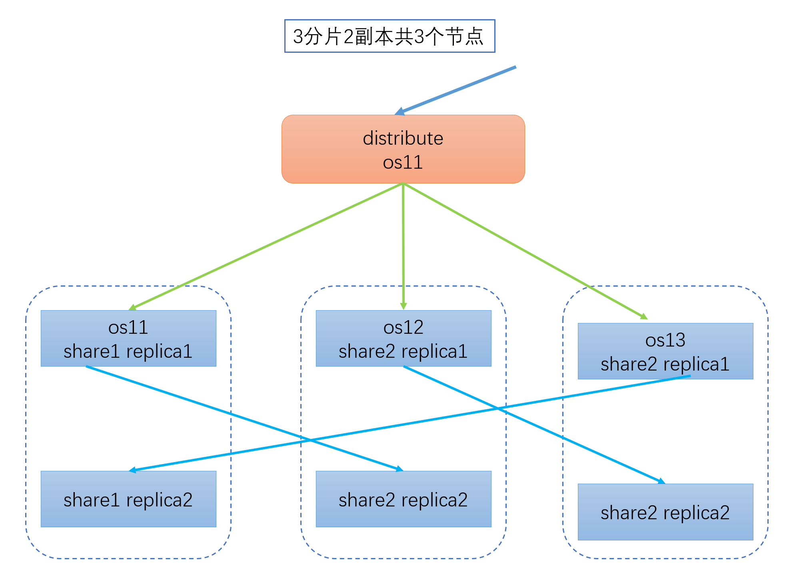

# 配制3个节点2副本的分片




os11

```xml
<macros>
    <shard01>01</shard01>
    <replica01>rep_1_1</replica01>
    <shard02>03</shard02>
    <replica02>rep_3_2</replica02>
</macros>
```

os12

```xml
<macros>
	<shard01>01</shard01>
    <replica01>rep_1_2</replica01>
    <shard02>02</shard02>
    <replica02>rep_2_1</replica02>
</macros>
```

os13

```xml
<macros>
    <shard01>02</shard01>
    <replica01>rep_2_2</replica01>
    <shard02>03</shard02>
    <replica02>rep_3_1</replica02>
</macros>
```

## 1. 集群分片的配制文件

使用外部文件的方式，内置文件同副本方式中的一样。

os11上的配制

在/etc/clickhouse-server/config.d/ 下创建metrika-cluster.xml

vi /etc/clickhouse-server/config.d/metrika-cluster.xml

```xml
<?xml version="1.0"?>
<yandex>
    <remote_servers>
        <nullnull_cluster>
            <!-- 集群名称-->
            <shard>
                <!--集群的第一个分片-->
                <internal_replication>true</internal_replication>
                <replica>
                    <!--该分片的第一个副本-->
                    <default_database>nullnull01</default_database>
                    <host>os11</host>
                    <port>9000</port>
                    <user>default</user>
                    <password>liujun</password>
                </replica>
                <replica>
                    <!--该分片的第二个副本-->
                    <default_database>nullnull01</default_database>
                    <host>os12</host>
                    <port>9000</port>
                    <user>default</user>
                    <password>liujun</password>
                </replica>
            </shard>
            <shard>
                <!--集群的第二个分片-->
                <internal_replication>true</internal_replication>
                <replica>
                    <!--该分片的第一个副本-->
                    <default_database>nullnull02</default_database>
                    <host>os12</host>
                    <port>9000</port>
                    <user>default</user>
                    <password>liujun</password>
                </replica>
                 <replica>
                    <!--该分片的第二个副本-->
                    <default_database>nullnull02</default_database>
                    <host>os13</host>
                    <port>9000</port>
                    <user>default</user>
                    <password>liujun</password>
                </replica>
            </shard>
            <shard>
                <!--集群的第三个分片-->
                <internal_replication>true</internal_replication>
                <replica>
                    <!--该分片的第一个副本-->
                    <default_database>nullnull03</default_database>
                    <host>os13</host>
                    <port>9000</port>
                    <user>default</user>
                    <password>liujun</password>
                </replica>
                 <replica>
                    <!--该分片的第二个副本-->
                    <default_database>nullnull03</default_database>
                    <host>os11</host>
                    <port>9000</port>
                    <user>default</user>
                    <password>liujun</password>
                </replica>
            </shard>
        </nullnull_cluster>
    </remote_servers>
    <zookeeper-servers>
        <node index="1">
            <host>os11</host>
            <port>2181</port>
        </node>
        <node index="2">
            <host>os12</host>
            <port>2181</port>
        </node>
        <node index="3">
            <host>os13</host>
            <port>2181</port>
        </node>
    </zookeeper-servers>
    <macros>
        <!--宏标签，建表时需要引入的参数。名称可以随便定义-->
        <shard01>01</shard01>
        <replica01>rep_1_1</replica01>
	    <shard02>03</shard02>
	    <replica02>rep_3_2</replica02>
    </macros>
</yandex>
```

os12配制

在/etc/clickhouse-server/config.d/ 下创建metrika-cluster.xml

vi /etc/clickhouse-server/config.d/metrika-cluster.xml

```xml
<?xml version="1.0"?>
<yandex>
    <remote_servers>
        <nullnull_cluster>
            <!-- 集群名称-->
            <shard>
                <!--集群的第一个分片-->
                <internal_replication>true</internal_replication>
                <replica>
                    <!--该分片的第一个副本-->
                    <default_database>nullnull01</default_database>
                    <host>os11</host>
                    <port>9000</port>
                    <user>default</user>
                    <password>liujun</password>
                </replica>
                <replica>
                    <!--该分片的第二个副本-->
                    <default_database>nullnull01</default_database>
                    <host>os12</host>
                    <port>9000</port>
                </replica>
            </shard>
            <shard>
                <!--集群的第二个分片-->
                <internal_replication>true</internal_replication>
                <replica>
                    <!--该分片的第一个副本-->
                    <default_database>nullnull02</default_database>
                    <host>os12</host>
                    <port>9000</port>
                    <user>default</user>
                    <password>liujun</password>
                </replica>
                 <replica>
                    <!--该分片的第二个副本-->
                    <default_database>nullnull02</default_database>
                    <host>os13</host>
                    <port>9000</port>
                    <user>default</user>
                    <password>liujun</password>
                </replica>
            </shard>
            <shard>
                <!--集群的第三个分片-->
                <internal_replication>true</internal_replication>
                <replica>
                    <!--该分片的第一个副本-->
                    <default_database>nullnull03</default_database>
                    <host>os13</host>
                    <port>9000</port>
                    <user>default</user>
                    <password>liujun</password>
                </replica>
                 <replica>
                    <!--该分片的第二个副本-->
                    <default_database>nullnull03</default_database>
                    <host>os11</host>
                    <port>9000</port>
                    <user>default</user>
                    <password>liujun</password>
                </replica>
            </shard>
        </nullnull_cluster>
    </remote_servers>
    <zookeeper-servers>
        <node index="1">
            <host>os11</host>
            <port>2181</port>
        </node>
        <node index="2">
            <host>os12</host>
            <port>2181</port>
        </node>
        <node index="3">
            <host>os13</host>
            <port>2181</port>
        </node>
    </zookeeper-servers>
    <macros>
        <!--宏标签，建表时需要引入的参数。名称可以随便定义-->
        <shard01>01</shard01>
        <replica01>rep_1_2</replica01>
	    <shard02>02</shard02>
	    <replica02>rep_2_1</replica02>
	</macros>
</yandex>
```

os13配制

在/etc/clickhouse-server/config.d/ 下创建metrika-cluster.xml

vi /etc/clickhouse-server/config.d/metrika-cluster.xml

```xml
<?xml version="1.0"?>
<yandex>
    <remote_servers>
        <nullnull_cluster>
            <!-- 集群名称-->
            <shard>
                <!--集群的第一个分片-->
                <internal_replication>true</internal_replication>
                <replica>
                    <!--该分片的第一个副本-->
                    <default_database>nullnull01</default_database>
                    <host>os11</host>
                    <port>9000</port>
                    <user>default</user>
                    <password>liujun</password>
                </replica>
                <replica>
                    <!--该分片的第二个副本-->
                    <default_database>nullnull01</default_database>
                    <host>os12</host>
                    <port>9000</port>
                    <user>default</user>
                    <password>liujun</password>
                </replica>
            </shard>
            <shard>
                <!--集群的第二个分片-->
                <internal_replication>true</internal_replication>
                <replica>
                    <!--该分片的第一个副本-->
                    <default_database>nullnull02</default_database>
                    <host>os12</host>
                    <port>9000</port>
                    <user>default</user>
                    <password>liujun</password>
                </replica>
                 <replica>
                    <!--该分片的第二个副本-->
                    <default_database>nullnull02</default_database>
                    <host>os13</host>
                    <port>9000</port>
                    <user>default</user>
                    <password>liujun</password>
                </replica>
            </shard>
            <shard>
                <!--集群的第三个分片-->
                <internal_replication>true</internal_replication>
                <replica>
                    <!--该分片的第一个副本-->
                    <default_database>nullnull03</default_database>
                    <host>os13</host>
                    <port>9000</port>
                    <user>default</user>
                    <password>liujun</password>
                </replica>
                 <replica>
                    <!--该分片的第二个副本-->
                    <default_database>nullnull03</default_database>
                    <host>os11</host>
                    <port>9000</port>
                    <user>default</user>
                    <password>liujun</password>
                </replica>
            </shard>
        </nullnull_cluster>
    </remote_servers>
    <zookeeper-servers>
        <node index="1">
            <host>os11</host>
            <port>2181</port>
        </node>
        <node index="2">
            <host>os12</host>
            <port>2181</port>
        </node>
        <node index="3">
            <host>os13</host>
            <port>2181</port>
        </node>
    </zookeeper-servers>
    <macros>
        <!--宏标签，建表时需要引入的参数。名称可以随便定义-->
        <shard01>02</shard01>
        <replica01>rep_2_2</replica01>
		<shard02>03</shard02>
		<replica02>rep_3_1</replica02>
	</macros>
</yandex>
```

修改/etc/clickhouse-server/config.xml（每台机器都需要修改）

vi /etc/clickhouse-server/config.xml

```xml
<zookeeper incl="zookeeper-servers" optional="true" />
<include_from>/etc/clickhouse-server/config.d/metrika-cluster.xml</include_from>
```

注意： /etc/clickhouse-server/config.d/metrika-cluster.xml 文件所属的用户和组，需要为clickhouse

```sh
chown clickhouse:clickhouse /etc/clickhouse-server/config.d/metrika-cluster.xml
```

重启clickhouse节点

```sh
clickhouse restart
```


开放端口

```sh
firewall-cmd --permanent --zone=public --add-port=8123/tcp
firewall-cmd --permanent --zone=public --add-port=9000/tcp
firewall-cmd --permanent --zone=public --add-port=9009/tcp
firewall-cmd --reload
```

## 2. 集群分片的表创建

节点重装时需要执行的清理动作

```sh
# 清理操作
drop table nullnull01.cluster_user;
drop table nullnull03.cluster_user;
drop table nullnull02.cluster_user;
drop table nullnull.cluster_user_distribute;
drop database nullnull01;
drop database nullnull02;
drop database nullnull03;

# 清理zookeeper
deleteall /clickhouse/cluster/table
```

### 2.1 os11上执行的操作

```sql
# os11上的建表语句
# 1. 集群会自动在os12和os13上创建表。

# 查看宏信息
SELECT * FROM system.macros;
# 查看集群集群
select * from system.clusters;


CREATE DATABASE IF NOT EXISTS nullnull01;
CREATE DATABASE IF NOT EXISTS nullnull03;


# drop table nullnull01.cluster_user;
# os11 上创建分片1和副本1
create table nullnull01.cluster_user  (
    id UInt32,
    order_id String, 
    name String,
    money decimal(16,2),
    create_time Datetime    
)engine=ReplicatedMergeTree('/clickhouse/cluster/table/{shard01}/r1/cluster_user','{replica01}')
partition by toYYYYMMDD(create_time)
order by (id,order_id,intHash32(id))
SAMPLE BY intHash32(id);

# os11上 创建的节点3的分片2
create table nullnull03.cluster_user (
	id UInt32,
    order_id String, 
    name String,
    money decimal(16,2),
    create_time Datetime    
)engine=ReplicatedMergeTree('/clickhouse/cluster/table/{shard02}/r1/cluster_user','{replica02}')
partition by toYYYYMMDD(create_time)
order by (id,order_id,intHash32(id))
SAMPLE BY intHash32(id);

# 查询数据
select * from nullnull01.cluster_user;
select * from nullnull03.cluster_user;

# 查看副本信息
SELECT * FROM system.replicas ;


```

输出：

```sh
# 查看集群信息
os11 :) select * from system.clusters;

SELECT *
FROM system.clusters

Query id: 9702042b-cff8-4a9c-9613-aceebdae783e

┌─cluster─────────────────────────────────────────┬─shard_num─┬─shard_weight─┬─replica_num─┬─host_name─┬─host_address─┬─port─┬─is_local─┬─user────┬─default_database─┬─errors_count─┬─slowdowns_count─┬─estimated_recovery_time─┐
│ nullnull_cluster                                │         1 │            1 │           1 │ os11      │ 192.168.5.11 │ 9000 │        0 │ default │ nullnull01       │            0 │               0 │                       0 │
│ nullnull_cluster                                │         1 │            1 │           2 │ os12      │ 192.168.5.12 │ 9000 │        0 │ default │ nullnull01       │            0 │               0 │                       0 │
│ nullnull_cluster                                │         2 │            1 │           1 │ os12      │ 192.168.5.12 │ 9000 │        0 │ default │ nullnull02       │            0 │               0 │                       0 │
│ nullnull_cluster                                │         2 │            1 │           2 │ os13      │ 192.168.5.13 │ 9000 │        0 │ default │ nullnull02       │            0 │               0 │                       0 │
│ nullnull_cluster                                │         3 │            1 │           1 │ os13      │ 192.168.5.13 │ 9000 │        0 │ default │ nullnull03       │            0 │               0 │                       0 │
│ nullnull_cluster                                │         3 │            1 │           2 │ os11      │ 192.168.5.11 │ 9000 │        0 │ default │ nullnull03       │            0 │               0 │                       0 │
│ test_cluster_one_shard_three_replicas_localhost │         1 │            1 │           1 │ 127.0.0.1 │ 127.0.0.1    │ 9000 │        1 │ default │                  │            0 │               0 │                       0 │
│ test_cluster_one_shard_three_replicas_localhost │         1 │            1 │           2 │ 127.0.0.2 │ 127.0.0.2    │ 9000 │        0 │ default │                  │            0 │               0 │                       0 │
│ test_cluster_one_shard_three_replicas_localhost │         1 │            1 │           3 │ 127.0.0.3 │ 127.0.0.3    │ 9000 │        0 │ default │                  │            0 │               0 │                       0 │
│ test_cluster_two_shards                         │         1 │            1 │           1 │ 127.0.0.1 │ 127.0.0.1    │ 9000 │        1 │ default │                  │            0 │               0 │                       0 │
│ test_cluster_two_shards                         │         2 │            1 │           1 │ 127.0.0.2 │ 127.0.0.2    │ 9000 │        0 │ default │                  │            0 │               0 │                       0 │
│ test_cluster_two_shards_internal_replication    │         1 │            1 │           1 │ 127.0.0.1 │ 127.0.0.1    │ 9000 │        1 │ default │                  │            0 │               0 │                       0 │
│ test_cluster_two_shards_internal_replication    │         2 │            1 │           1 │ 127.0.0.2 │ 127.0.0.2    │ 9000 │        0 │ default │                  │            0 │               0 │                       0 │
│ test_cluster_two_shards_localhost               │         1 │            1 │           1 │ localhost │ ::1          │ 9000 │        1 │ default │                  │            0 │               0 │                       0 │
│ test_cluster_two_shards_localhost               │         2 │            1 │           1 │ localhost │ ::1          │ 9000 │        1 │ default │                  │            0 │               0 │                       0 │
│ test_shard_localhost                            │         1 │            1 │           1 │ localhost │ ::1          │ 9000 │        1 │ default │                  │            0 │               0 │                       0 │
│ test_shard_localhost_secure                     │         1 │            1 │           1 │ localhost │ ::1          │ 9440 │        0 │ default │                  │            0 │               0 │                       0 │
│ test_unavailable_shard                          │         1 │            1 │           1 │ localhost │ ::1          │ 9000 │        1 │ default │                  │            0 │               0 │                       0 │
│ test_unavailable_shard                          │         2 │            1 │           1 │ localhost │ ::1          │    1 │        0 │ default │                  │            0 │               0 │                       0 │
└─────────────────────────────────────────────────┴───────────┴──────────────┴─────────────┴───────────┴──────────────┴──────┴──────────┴─────────┴──────────────────┴──────────────┴─────────────────┴─────────────────────────┘

19 rows in set. Elapsed: 0.001 sec. 

# 创建库
os11 :) CREATE DATABASE IF NOT EXISTS nullnull01;

CREATE DATABASE IF NOT EXISTS nullnull01

Query id: 60aaeb8b-199e-48cd-be14-057312560550

Ok.

0 rows in set. Elapsed: 0.386 sec. 

os11 :) CREATE DATABASE IF NOT EXISTS nullnull03;

CREATE DATABASE IF NOT EXISTS nullnull03

Query id: ad9f618e-268e-4cb0-a5af-d75073b83563

Ok.

0 rows in set. Elapsed: 0.004 sec. 

# 创建表
os11 :) create table nullnull01.cluster_user  (
            id UInt32,
            order_id String, 
            name String,
            money decimal(16,2),
            create_time Datetime    
        )engine=ReplicatedMergeTree('/clickhouse/cluster/table/{shard01}/r1/cluster_user','{replica01}')
        partition by toYYYYMMDD(create_time)
        order by (id,order_id,intHash32(id))
        SAMPLE BY intHash32(id);

CREATE TABLE nullnull01.cluster_user
(
    `id` UInt32,
    `order_id` String,
    `name` String,
    `money` decimal(16, 2),
    `create_time` Datetime
)
ENGINE = ReplicatedMergeTree('/clickhouse/cluster/table/{shard01}/r1/cluster_user', '{replica01}')
PARTITION BY toYYYYMMDD(create_time)
ORDER BY (id, order_id, intHash32(id))
SAMPLE BY intHash32(id)

Query id: a658074f-a93b-4b9f-b016-e3893d932b93

Ok.

0 rows in set. Elapsed: 0.445 sec. 

os11 :) create table nullnull03.cluster_user (
        ^Iid UInt32,
            order_id String, 
            name String,
            money decimal(16,2),
            create_time Datetime    
        )engine=ReplicatedMergeTree('/clickhouse/cluster/table/{shard02}/r1/cluster_user','{replica02}')
        partition by toYYYYMMDD(create_time)
        order by (id,order_id,intHash32(id))
        SAMPLE BY intHash32(id);

CREATE TABLE nullnull03.cluster_user
(
    `id` UInt32,
    `order_id` String,
    `name` String,
    `money` decimal(16, 2),
    `create_time` Datetime
)
ENGINE = ReplicatedMergeTree('/clickhouse/cluster/table/{shard02}/r1/cluster_user', '{replica02}')
PARTITION BY toYYYYMMDD(create_time)
ORDER BY (id, order_id, intHash32(id))
SAMPLE BY intHash32(id)

Query id: 8ad96dfb-4c9f-485b-ae95-ef028d03278a

Ok.

0 rows in set. Elapsed: 0.199 sec. 

# 检查库中的数据
os11 :) select * from nullnull01.cluster_user;

SELECT *
FROM nullnull01.cluster_user

Query id: 7d417d15-c30b-4799-ab68-e81189eacbd4

Ok.

0 rows in set. Elapsed: 0.001 sec. 

os11 :) select * from nullnull03.cluster_user;

SELECT *
FROM nullnull03.cluster_user

Query id: e3ef3d6f-4f1f-45b4-8844-cca2d1c52a25

Ok.

0 rows in set. Elapsed: 0.001 sec. 

# 查看表的副本情况
os11 :) SELECT * FROM system.replicas ;

SELECT *
FROM system.replicas

Query id: 0677123d-6c21-4562-bf87-f9858e0c6f7b

┌─database───┬─table────────┬─engine──────────────┬─is_leader─┬─can_become_leader─┬─is_readonly─┬─is_session_expired─┬─future_parts─┬─parts_to_check─┬─zookeeper_path───────────────────────────────┬─replica_name─┬─replica_path──────────────────────────────────────────────────┬─columns_version─┬─queue_size─┬─inserts_in_queue─┬─merges_in_queue─┬─part_mutations_in_queue─┬───queue_oldest_time─┬─inserts_oldest_time─┬──merges_oldest_time─┬─part_mutations_oldest_time─┬─oldest_part_to_get─┬─oldest_part_to_merge_to─┬─oldest_part_to_mutate_to─┬─log_max_index─┬─log_pointer─┬───last_queue_update─┬─absolute_delay─┬─total_replicas─┬─active_replicas─┬─last_queue_update_exception─┬─zookeeper_exception─┬─replica_is_active─┐
│ nullnull01 │ cluster_user │ ReplicatedMergeTree │         1 │                 1 │           0 │                  0 │            0 │              0 │ /clickhouse/cluster/table/01/r1/cluster_user │ rep_1_1      │ /clickhouse/cluster/table/01/r1/cluster_user/replicas/rep_1_1 │              -1 │          0 │                0 │               0 │                       0 │ 1970-01-01 08:00:00 │ 1970-01-01 08:00:00 │ 1970-01-01 08:00:00 │        1970-01-01 08:00:00 │                    │                         │                          │             0 │           0 │ 1970-01-01 08:00:00 │              0 │              1 │               1 │                             │                     │ {'rep_1_1':1}     │
│ nullnull03 │ cluster_user │ ReplicatedMergeTree │         1 │                 1 │           0 │                  0 │            0 │              0 │ /clickhouse/cluster/table/03/r1/cluster_user │ rep_3_2      │ /clickhouse/cluster/table/03/r1/cluster_user/replicas/rep_3_2 │              -1 │          0 │                0 │               0 │                       0 │ 1970-01-01 08:00:00 │ 1970-01-01 08:00:00 │ 1970-01-01 08:00:00 │        1970-01-01 08:00:00 │                    │                         │                          │             0 │           0 │ 1970-01-01 08:00:00 │              0 │              1 │               1 │                             │                     │ {'rep_3_2':1}     │
└────────────┴──────────────┴─────────────────────┴───────────┴───────────────────┴─────────────┴────────────────────┴──────────────┴────────────────┴──────────────────────────────────────────────┴──────────────┴───────────────────────────────────────────────────────────────┴─────────────────┴────────────┴──────────────────┴─────────────────┴─────────────────────────┴─────────────────────┴─────────────────────┴─────────────────────┴────────────────────────────┴────────────────────┴─────────────────────────┴──────────────────────────┴───────────────┴─────────────┴─────────────────────┴────────────────┴────────────────┴─────────────────┴─────────────────────────────┴─────────────────────┴───────────────────┘

2 rows in set. Elapsed: 0.004 sec. 


```

### 2.2 os12节点上执行创建

```sh
# 查看宏信息
SELECT * FROM system.macros;
# 查看集群集群
select * from system.clusters;

# os12节点上执行表
# 创建库操作
CREATE DATABASE IF NOT EXISTS nullnull01;
CREATE DATABASE IF NOT EXISTS nullnull02;


# drop table  nullnull02.cluster_user;
# drop table nullnull01.cluster_user;
# os12上创建分片2和副本1
create table nullnull02.cluster_user  (
    id UInt32,
    order_id String, 
    name String,
    money decimal(16,2),
    create_time Datetime    
)engine=ReplicatedMergeTree('/clickhouse/cluster/table/{shard01}/r1/cluster_user','{replica01}')
partition by toYYYYMMDD(create_time)
order by (id,order_id,intHash32(id))
SAMPLE BY intHash32(id);

# os12上创建分片1和副本2
create table nullnull01.cluster_user (
	id UInt32,
    order_id String, 
    name String,
    money decimal(16,2),
    create_time Datetime    
)engine=ReplicatedMergeTree('/clickhouse/cluster/table/{shard02}/r1/cluster_user','{replica02}')
partition by toYYYYMMDD(create_time)
order by (id,order_id,intHash32(id))
SAMPLE BY intHash32(id);


# os12上检查表是否创建成功。
select * from nullnull02.cluster_user;
select * from nullnull01.cluster_user;

# 查看副本信息
SELECT * FROM system.replicas ;

```


输出:

```sh
os12 :) CREATE DATABASE IF NOT EXISTS nullnull01;

CREATE DATABASE IF NOT EXISTS nullnull01

Query id: 263cc22c-7874-4747-ade5-bba210e9d62f

Ok.

0 rows in set. Elapsed: 0.004 sec. 

os12 :) CREATE DATABASE IF NOT EXISTS nullnull02;

CREATE DATABASE IF NOT EXISTS nullnull02

Query id: 0736c59a-69c0-4e51-92fb-b94e527448c5

Ok.

0 rows in set. Elapsed: 0.004 sec. 

os12 :) create table nullnull02.cluster_user  (
            id UInt32,
            order_id String, 
            name String,
            money decimal(16,2),
            create_time Datetime    
        )engine=ReplicatedMergeTree('/clickhouse/cluster/table/{shard01}/r1/cluster_user','{replica01}')
        partition by toYYYYMMDD(create_time)
        order by (id,order_id,intHash32(id))
        SAMPLE BY intHash32(id);

CREATE TABLE nullnull02.cluster_user
(
    `id` UInt32,
    `order_id` String,
    `name` String,
    `money` decimal(16, 2),
    `create_time` Datetime
)
ENGINE = ReplicatedMergeTree('/clickhouse/cluster/table/{shard01}/r1/cluster_user', '{replica01}')
PARTITION BY toYYYYMMDD(create_time)
ORDER BY (id, order_id, intHash32(id))
SAMPLE BY intHash32(id)

Query id: 2ac2277f-c77b-45a2-9a68-05992f87d29b

Ok.

0 rows in set. Elapsed: 0.191 sec. 

os12 :) create table nullnull01.cluster_user (
        ^Iid UInt32,
            order_id String, 
            name String,
            money decimal(16,2),
            create_time Datetime    
        )engine=ReplicatedMergeTree('/clickhouse/cluster/table/{shard02}/r1/cluster_user','{replica02}')
        partition by toYYYYMMDD(create_time)
        order by (id,order_id,intHash32(id))
        SAMPLE BY intHash32(id);

CREATE TABLE nullnull01.cluster_user
(
    `id` UInt32,
    `order_id` String,
    `name` String,
    `money` decimal(16, 2),
    `create_time` Datetime
)
ENGINE = ReplicatedMergeTree('/clickhouse/cluster/table/{shard02}/r1/cluster_user', '{replica02}')
PARTITION BY toYYYYMMDD(create_time)
ORDER BY (id, order_id, intHash32(id))
SAMPLE BY intHash32(id)

Query id: a4984dd3-cecd-4a4c-ab13-28942e4bc55b

Ok.

0 rows in set. Elapsed: 0.037 sec. 

os12 :) select * from nullnull02.cluster_user;

SELECT *
FROM nullnull02.cluster_user

Query id: 17910415-32e7-4e6d-9c1f-f08d0a87d5d2

Ok.

0 rows in set. Elapsed: 0.001 sec. 

os12 :) select * from nullnull01.cluster_user;

SELECT *
FROM nullnull01.cluster_user

Query id: 1703e2b6-2205-47b9-8072-d10f1b48c3be

Ok.

0 rows in set. Elapsed: 0.001 sec. 

os12 :) SELECT * FROM system.replicas ;

SELECT *
FROM system.replicas

Query id: b506ea68-b065-4012-95e8-9cc732e70829

┌─database───┬─table────────────┬─engine──────────────┬─is_leader─┬─can_become_leader─┬─is_readonly─┬─is_session_expired─┬─future_parts─┬─parts_to_check─┬─zookeeper_path─────────────────────────────────┬─replica_name─┬─replica_path───────────────────────────────────────────────────┬─columns_version─┬─queue_size─┬─inserts_in_queue─┬─merges_in_queue─┬─part_mutations_in_queue─┬───queue_oldest_time─┬─inserts_oldest_time─┬──merges_oldest_time─┬─part_mutations_oldest_time─┬─oldest_part_to_get─┬─oldest_part_to_merge_to─┬─oldest_part_to_mutate_to─┬─log_max_index─┬─log_pointer─┬───last_queue_update─┬─absolute_delay─┬─total_replicas─┬─active_replicas─┬─last_queue_update_exception─┬─zookeeper_exception─┬─replica_is_active─────────┐
│ nullnull   │ replicatemt_user │ ReplicatedMergeTree │         1 │                 1 │           0 │                  0 │            0 │              0 │ /clickhouse/table/nullnull/r1/replicatemt_user │ rep_12       │ /clickhouse/table/nullnull/r1/replicatemt_user/replicas/rep_12 │              -1 │          0 │                0 │               0 │                       0 │ 1970-01-01 08:00:00 │ 1970-01-01 08:00:00 │ 1970-01-01 08:00:00 │        1970-01-01 08:00:00 │                    │                         │                          │             3 │           4 │ 1970-01-01 08:00:00 │              0 │              1 │               1 │                             │                     │ {'rep_12':1}              │
│ nullnull01 │ cluster_user     │ ReplicatedMergeTree │         1 │                 1 │           0 │                  0 │            0 │              0 │ /clickhouse/cluster/table/03/r1/cluster_user   │ rep_2_1      │ /clickhouse/cluster/table/03/r1/cluster_user/replicas/rep_2_1  │              -1 │          0 │                0 │               0 │                       0 │ 1970-01-01 08:00:00 │ 1970-01-01 08:00:00 │ 1970-01-01 08:00:00 │        1970-01-01 08:00:00 │                    │                         │                          │             0 │           0 │ 1970-01-01 08:00:00 │              0 │              2 │               2 │                             │                     │ {'rep_2_1':1,'rep_3_2':1} │
│ nullnull02 │ cluster_user     │ ReplicatedMergeTree │         1 │                 1 │           0 │                  0 │            0 │              0 │ /clickhouse/cluster/table/01/r1/cluster_user   │ rep_1_2      │ /clickhouse/cluster/table/01/r1/cluster_user/replicas/rep_1_2  │              -1 │          0 │                0 │               0 │                       0 │ 1970-01-01 08:00:00 │ 1970-01-01 08:00:00 │ 1970-01-01 08:00:00 │        1970-01-01 08:00:00 │                    │                         │                          │             0 │           0 │ 1970-01-01 08:00:00 │              0 │              2 │               2 │                             │                     │ {'rep_1_1':1,'rep_1_2':1} │
└────────────┴──────────────────┴─────────────────────┴───────────┴───────────────────┴─────────────┴────────────────────┴──────────────┴────────────────┴────────────────────────────────────────────────┴──────────────┴────────────────────────────────────────────────────────────────┴─────────────────┴────────────┴──────────────────┴─────────────────┴─────────────────────────┴─────────────────────┴─────────────────────┴─────────────────────┴────────────────────────────┴────────────────────┴─────────────────────────┴──────────────────────────┴───────────────┴─────────────┴─────────────────────┴────────────────┴────────────────┴─────────────────┴─────────────────────────────┴─────────────────────┴───────────────────────────┘

3 rows in set. Elapsed: 0.006 sec. 
```

### 2.3 os13上执行的操作

```sh
# os13上执行
CREATE DATABASE IF NOT EXISTS nullnull03;
CREATE DATABASE IF NOT EXISTS nullnull02;

# 创建分片2和副本2
create table nullnull03.cluster_user  (
    id UInt32,
    order_id String, 
    name String,
    money decimal(16,2),
    create_time Datetime    
)engine=ReplicatedMergeTree('/clickhouse/cluster/table/{shard01}/r1/cluster_user','{replica01}')
partition by toYYYYMMDD(create_time)
order by (id,order_id,intHash32(id))
SAMPLE BY intHash32(id);

# 创建分片3和副本1
create table nullnull02.cluster_user (
	id UInt32,
    order_id String, 
    name String,
    money decimal(16,2),
    create_time Datetime    
)engine=ReplicatedMergeTree('/clickhouse/cluster/table/{shard02}/r1/cluster_user','{replica02}')
partition by toYYYYMMDD(create_time)
order by (id,order_id,intHash32(id))
SAMPLE BY intHash32(id);


# os12上检查表是否创建成功。
select * from nullnull03.cluster_user;
select * from nullnull02.cluster_user;


# 查看副本信息
SELECT * FROM system.replicas ;
```

输出:

```sh
os13 :) CREATE DATABASE IF NOT EXISTS nullnull03;

CREATE DATABASE IF NOT EXISTS nullnull03

Query id: 1464641e-b893-4a57-97e6-ac439d2675fa

Ok.

0 rows in set. Elapsed: 0.335 sec. 

os13 :) CREATE DATABASE IF NOT EXISTS nullnull02;

CREATE DATABASE IF NOT EXISTS nullnull02

Query id: ef6960a0-10b4-482f-be70-1c6ee28ed134

Ok.

0 rows in set. Elapsed: 0.002 sec. 

os13 :) create table nullnull03.cluster_user  (
            id UInt32,
            order_id String, 
            name String,
            money decimal(16,2),
            create_time Datetime    
        )engine=ReplicatedMergeTree('/clickhouse/cluster/table/{shard01}/r1/cluster_user','{replica01}')
        partition by toYYYYMMDD(create_time)
        order by (id,order_id,intHash32(id))
        SAMPLE BY intHash32(id);

CREATE TABLE nullnull03.cluster_user
(
    `id` UInt32,
    `order_id` String,
    `name` String,
    `money` decimal(16, 2),
    `create_time` Datetime
)
ENGINE = ReplicatedMergeTree('/clickhouse/cluster/table/{shard01}/r1/cluster_user', '{replica01}')
PARTITION BY toYYYYMMDD(create_time)
ORDER BY (id, order_id, intHash32(id))
SAMPLE BY intHash32(id)

Query id: 23a0f173-c23c-41ed-95af-4671fd1b170d

Ok.

0 rows in set. Elapsed: 0.031 sec. 

os13 :) create table nullnull02.cluster_user (
        ^Iid UInt32,
            order_id String, 
            name String,
            money decimal(16,2),
            create_time Datetime    
        )engine=ReplicatedMergeTree('/clickhouse/cluster/table/{shard02}/r1/cluster_user','{replica02}')
        partition by toYYYYMMDD(create_time)
        order by (id,order_id,intHash32(id))
        SAMPLE BY intHash32(id);

CREATE TABLE nullnull02.cluster_user
(
    `id` UInt32,
    `order_id` String,
    `name` String,
    `money` decimal(16, 2),
    `create_time` Datetime
)
ENGINE = ReplicatedMergeTree('/clickhouse/cluster/table/{shard02}/r1/cluster_user', '{replica02}')
PARTITION BY toYYYYMMDD(create_time)
ORDER BY (id, order_id, intHash32(id))
SAMPLE BY intHash32(id)

Query id: f9aa11a6-451e-4324-a7c6-1e3e909f97a4

Ok.

0 rows in set. Elapsed: 0.209 sec. 

os13 :) select * from nullnull03.cluster_user;

SELECT *
FROM nullnull03.cluster_user

Query id: 912a75d1-04c3-4d78-a652-c139b26d7d86

Ok.

0 rows in set. Elapsed: 0.001 sec. 

os13 :) 
os13 :) select * from nullnull02.cluster_user;

SELECT *
FROM nullnull02.cluster_user

Query id: 7069ef08-75d5-4c30-a1c1-462cca42010d

Ok.

0 rows in set. Elapsed: 0.001 sec. 

os13 :) SELECT * FROM system.replicas ;

SELECT *
FROM system.replicas

Query id: b6294873-41fd-4382-9cf9-59d53bcdb00b

┌─database───┬─table────────┬─engine──────────────┬─is_leader─┬─can_become_leader─┬─is_readonly─┬─is_session_expired─┬─future_parts─┬─parts_to_check─┬─zookeeper_path───────────────────────────────┬─replica_name─┬─replica_path──────────────────────────────────────────────────┬─columns_version─┬─queue_size─┬─inserts_in_queue─┬─merges_in_queue─┬─part_mutations_in_queue─┬───queue_oldest_time─┬─inserts_oldest_time─┬──merges_oldest_time─┬─part_mutations_oldest_time─┬─oldest_part_to_get─┬─oldest_part_to_merge_to─┬─oldest_part_to_mutate_to─┬─log_max_index─┬─log_pointer─┬───last_queue_update─┬─absolute_delay─┬─total_replicas─┬─active_replicas─┬─last_queue_update_exception─┬─zookeeper_exception─┬─replica_is_active─────────────────────┐
│ nullnull02 │ cluster_user │ ReplicatedMergeTree │         1 │                 1 │           0 │                  0 │            0 │              0 │ /clickhouse/cluster/table/03/r1/cluster_user │ rep_3_1      │ /clickhouse/cluster/table/03/r1/cluster_user/replicas/rep_3_1 │              -1 │          0 │                0 │               0 │                       0 │ 1970-01-01 08:00:00 │ 1970-01-01 08:00:00 │ 1970-01-01 08:00:00 │        1970-01-01 08:00:00 │                    │                         │                          │             0 │           0 │ 1970-01-01 08:00:00 │              0 │              3 │               3 │                             │                     │ {'rep_3_1':1,'rep_2_1':1,'rep_3_2':1} │
│ nullnull03 │ cluster_user │ ReplicatedMergeTree │         1 │                 1 │           0 │                  0 │            0 │              0 │ /clickhouse/cluster/table/01/r1/cluster_user │ rep_2_2      │ /clickhouse/cluster/table/01/r1/cluster_user/replicas/rep_2_2 │              -1 │          0 │                0 │               0 │                       0 │ 1970-01-01 08:00:00 │ 1970-01-01 08:00:00 │ 1970-01-01 08:00:00 │        1970-01-01 08:00:00 │                    │                         │                          │             0 │           0 │ 1970-01-01 08:00:00 │              0 │              3 │               3 │                             │                     │ {'rep_2_2':1,'rep_1_1':1,'rep_1_2':1} │
└────────────┴──────────────┴─────────────────────┴───────────┴───────────────────┴─────────────┴────────────────────┴──────────────┴────────────────┴──────────────────────────────────────────────┴──────────────┴───────────────────────────────────────────────────────────────┴─────────────────┴────────────┴──────────────────┴─────────────────┴─────────────────────────┴─────────────────────┴─────────────────────┴─────────────────────┴────────────────────────────┴────────────────────┴─────────────────────────┴──────────────────────────┴───────────────┴─────────────┴─────────────────────┴────────────────┴────────────────┴─────────────────┴─────────────────────────────┴─────────────────────┴───────────────────────────────────────┘

2 rows in set. Elapsed: 0.004 sec.
```


### 2.4 插入数据测试

```sh
# CREATE DATABASE IF NOT EXISTS nullnull;

# 在os11上创建分页式表，用于数据查询分发的管理。
#drop table nullnull.cluster_user_distribute;

create table nullnull.cluster_user_distribute (
	id UInt32,
    order_id String, 
    name String,
    money decimal(16,2),
    create_time Datetime    
)engine==Distributed(nullnull_cluster,'',cluster_user,intHash32(id));


# 查看数据
select * from nullnull.cluster_user_distribute;


# 查看zookeeper中的信息
zkCli.sh
ls -R  /clickhouse/cluster/table/


# 插入数据测试
insert into nullnull.cluster_user_distribute values
(1,'001','空空1',20000,'2024-10-27 19:50:00'),
(2,'002','空空2',20000,'2024-10-27 19:50:00'),
(3,'003','空空3',20000,'2024-10-27 19:50:00'),
(4,'004','空空4',20000,'2024-10-28 19:50:00'),
(5,'005','空空5',20000,'2024-10-28 19:50:00'),
(6,'006','空空6',20000,'2024-10-28 19:50:00'),
(7,'007','空空7',20000,'2024-10-29 19:50:00'),
(8,'008','空空8',20000,'2024-10-29 19:50:00'),
(9,'009','空空9',20000,'2024-10-29 19:50:00'),
(10,'010','空空10',20000,'2024-10-29 19:50:00');


# 查询分布式表
select * from nullnull.cluster_user_distribute;

```

输出 ：

```sh
os11 :) create table nullnull.cluster_user_distribute (
        ^Iid UInt32,
            order_id String, 
            name String,
            money decimal(16,2),
            create_time Datetime    
        )engine==Distributed(nullnull_cluster,'',cluster_user,intHash32(id));

CREATE TABLE nullnull.cluster_user_distribute
(
    `id` UInt32,
    `order_id` String,
    `name` String,
    `money` decimal(16, 2),
    `create_time` Datetime
)
ENGINE = Distributed(nullnull_cluster, '', cluster_user, intHash32(id))

Query id: 17ea1de7-8b75-4111-9aea-59fc9336ab3c

Ok.

0 rows in set. Elapsed: 0.009 sec. 

os11 :) select * from nullnull.cluster_user_distribute;

SELECT *
FROM nullnull.cluster_user_distribute

Query id: 09651158-5b52-4a0d-8b20-667173f1a321

Ok.

0 rows in set. Elapsed: 0.003 sec. 

os11 :) insert into nullnull.cluster_user_distribute values
        (1,'001','空空1',20000,'2024-10-27 19:50:00'),
        (2,'002','空空2',20000,'2024-10-27 19:50:00'),
        (3,'003','空空3',20000,'2024-10-27 19:50:00'),
        (4,'004','空空4',20000,'2024-10-28 19:50:00'),
        (5,'005','空空5',20000,'2024-10-28 19:50:00'),
        (6,'006','空空6',20000,'2024-10-28 19:50:00'),
        (7,'007','空空7',20000,'2024-10-29 19:50:00'),
        (8,'008','空空8',20000,'2024-10-29 19:50:00'),
        (9,'009','空空9',20000,'2024-10-29 19:50:00'),
        (10,'010','空空10',20000,'2024-10-29 19:50:00');

INSERT INTO nullnull.cluster_user_distribute FORMAT Values

Query id: 7ee98474-d928-4042-895c-12794d2b7a9a

Ok.

10 rows in set. Elapsed: 0.004 sec. 

os11 :) select * from nullnull.cluster_user_distribute;

SELECT *
FROM nullnull.cluster_user_distribute

Query id: 30d41930-a804-4d22-bf55-5d42bdee68ff

┌─id─┬─order_id─┬─name──┬─money─┬─────────create_time─┐
│  4 │ 004      │ 空空4 │ 20000 │ 2024-10-28 19:50:00 │
└────┴──────────┴───────┴───────┴─────────────────────┘
┌─id─┬─order_id─┬─name──┬─money─┬─────────create_time─┐
│  2 │ 002      │ 空空2 │ 20000 │ 2024-10-27 19:50:00 │
└────┴──────────┴───────┴───────┴─────────────────────┘
┌─id─┬─order_id─┬─name──┬─money─┬─────────create_time─┐
│  7 │ 007      │ 空空7 │ 20000 │ 2024-10-29 19:50:00 │
└────┴──────────┴───────┴───────┴─────────────────────┘
┌─id─┬─order_id─┬─name───┬─money─┬─────────create_time─┐
│  8 │ 008      │ 空空8  │ 20000 │ 2024-10-29 19:50:00 │
│ 10 │ 010      │ 空空10 │ 20000 │ 2024-10-29 19:50:00 │
└────┴──────────┴────────┴───────┴─────────────────────┘
┌─id─┬─order_id─┬─name──┬─money─┬─────────create_time─┐
│  1 │ 001      │ 空空1 │ 20000 │ 2024-10-27 19:50:00 │
└────┴──────────┴───────┴───────┴─────────────────────┘
┌─id─┬─order_id─┬─name──┬─money─┬─────────create_time─┐
│  5 │ 005      │ 空空5 │ 20000 │ 2024-10-28 19:50:00 │
│  6 │ 006      │ 空空6 │ 20000 │ 2024-10-28 19:50:00 │
└────┴──────────┴───────┴───────┴─────────────────────┘

8 rows in set. Elapsed: 0.006 sec. 

os11 :) 
```

### 2.5 每个库中查询分片数据 

os11的数据及副本

```sh
# 至每台机器查询本地表。查看分片信息
#os11
select * from nullnull01.cluster_user;
# 至os12查看os11的副本
select * from nullnull02.cluster_user;

```

输出：

```sh
# os11的数据
os11 :) select * from nullnull01.cluster_user;

SELECT *
FROM nullnull01.cluster_user

Query id: 37f9dfd4-ac06-46a9-99f6-94f89e8ed0f4

Ok.

0 rows in set. Elapsed: 0.001 sec. 


# os12节点上的副本数据
os12 :) select * from nullnull02.cluster_user;

SELECT *
FROM nullnull02.cluster_user

Query id: 963c61b6-5601-4b05-9874-b071b26bec76

Connecting to database nullnull at localhost:9000 as user default.
Connected to ClickHouse server version 22.12.6 revision 54461.

Ok.

0 rows in set. Elapsed: 0.001 sec.

```

os12上的数据及副本

```sh
#os12
select * from nullnull01.cluster_user;
#os13数据上，os12的副本
select * from nullnull03.cluster_user;
```

输出数据

```sh
# os12上的数据
os12 :) select * from nullnull01.cluster_user;

SELECT *
FROM nullnull01.cluster_user

Query id: 4adc893e-a2e6-4e4f-abfa-4f8908985f8b

┌─id─┬─order_id─┬─name──┬─money─┬─────────create_time─┐
│  9 │ 009      │ 空空9 │ 20000 │ 2024-10-29 19:50:00 │
└────┴──────────┴───────┴───────┴─────────────────────┘
┌─id─┬─order_id─┬─name──┬─money─┬─────────create_time─┐
│  3 │ 003      │ 空空3 │ 20000 │ 2024-10-27 19:50:00 │
└────┴──────────┴───────┴───────┴─────────────────────┘

2 rows in set. Elapsed: 0.001 sec. 


# os13上的副本数据
os13 :) select * from nullnull03.cluster_user;

SELECT *
FROM nullnull03.cluster_user

Query id: 14cb5d86-4a6f-45eb-8ed5-d3e2cfe9db16

┌─id─┬─order_id─┬─name──┬─money─┬─────────create_time─┐
│  9 │ 009      │ 空空9 │ 20000 │ 2024-10-29 19:50:00 │
└────┴──────────┴───────┴───────┴─────────────────────┘
┌─id─┬─order_id─┬─name──┬─money─┬─────────create_time─┐
│  3 │ 003      │ 空空3 │ 20000 │ 2024-10-27 19:50:00 │
└────┴──────────┴───────┴───────┴─────────────────────┘

2 rows in set. Elapsed: 0.002 sec. 
```


os13的数据及副本

```sh
# os13上的数据
select * from nullnull02.cluster_user;

# os11上的os13的副本
select * from nullnull03.cluster_user;

```

输出:

```sh
# os13上的数据
os13 :) select * from nullnull02.cluster_user;

SELECT *
FROM nullnull02.cluster_user

Query id: 45bfb391-142d-46f9-8481-6bb3a04f83e1

┌─id─┬─order_id─┬─name──┬─money─┬─────────create_time─┐
│  4 │ 004      │ 空空4 │ 20000 │ 2024-10-28 19:50:00 │
└────┴──────────┴───────┴───────┴─────────────────────┘
┌─id─┬─order_id─┬─name──┬─money─┬─────────create_time─┐
│  1 │ 001      │ 空空1 │ 20000 │ 2024-10-27 19:50:00 │
│  2 │ 002      │ 空空2 │ 20000 │ 2024-10-27 19:50:00 │
└────┴──────────┴───────┴───────┴─────────────────────┘
┌─id─┬─order_id─┬─name──┬─money─┬─────────create_time─┐
│  7 │ 007      │ 空空7 │ 20000 │ 2024-10-29 19:50:00 │
└────┴──────────┴───────┴───────┴─────────────────────┘
┌─id─┬─order_id─┬─name──┬─money─┬─────────create_time─┐
│  5 │ 005      │ 空空5 │ 20000 │ 2024-10-28 19:50:00 │
│  6 │ 006      │ 空空6 │ 20000 │ 2024-10-28 19:50:00 │
└────┴──────────┴───────┴───────┴─────────────────────┘
┌─id─┬─order_id─┬─name───┬─money─┬─────────create_time─┐
│  8 │ 008      │ 空空8  │ 20000 │ 2024-10-29 19:50:00 │
│ 10 │ 010      │ 空空10 │ 20000 │ 2024-10-29 19:50:00 │
└────┴──────────┴────────┴───────┴─────────────────────┘

8 rows in set. Elapsed: 0.002 sec. 

# os11上的os13的副本
os11 :) select * from nullnull03.cluster_user;

SELECT *
FROM nullnull03.cluster_user

Query id: c409aca6-c46b-47df-8bb5-d20e6567e970

┌─id─┬─order_id─┬─name──┬─money─┬─────────create_time─┐
│  4 │ 004      │ 空空4 │ 20000 │ 2024-10-28 19:50:00 │
└────┴──────────┴───────┴───────┴─────────────────────┘
┌─id─┬─order_id─┬─name──┬─money─┬─────────create_time─┐
│  1 │ 001      │ 空空1 │ 20000 │ 2024-10-27 19:50:00 │
│  2 │ 002      │ 空空2 │ 20000 │ 2024-10-27 19:50:00 │
└────┴──────────┴───────┴───────┴─────────────────────┘
┌─id─┬─order_id─┬─name──┬─money─┬─────────create_time─┐
│  7 │ 007      │ 空空7 │ 20000 │ 2024-10-29 19:50:00 │
└────┴──────────┴───────┴───────┴─────────────────────┘
┌─id─┬─order_id─┬─name───┬─money─┬─────────create_time─┐
│  8 │ 008      │ 空空8  │ 20000 │ 2024-10-29 19:50:00 │
│ 10 │ 010      │ 空空10 │ 20000 │ 2024-10-29 19:50:00 │
└────┴──────────┴────────┴───────┴─────────────────────┘
┌─id─┬─order_id─┬─name──┬─money─┬─────────create_time─┐
│  5 │ 005      │ 空空5 │ 20000 │ 2024-10-28 19:50:00 │
│  6 │ 006      │ 空空6 │ 20000 │ 2024-10-28 19:50:00 │
└────┴──────────┴───────┴───────┴─────────────────────┘

8 rows in set. Elapsed: 0.002 sec. 
```


## 结束

至此3节点3分片，2副本，已经完成。

此配制特别的绕，有条件的话，还是组偶数个的物理机更好。


参考文章：

https://zhuanlan.zhihu.com/p/461792873?utm_id=0

https://www.cnblogs.com/wan-ming-zhu/p/18095576


# 配制4个节点2分片2副本的分片


## 1. 集群分片的配制文件

使用外部文件的方式，内置文件同副本方式中的一样。

os11上的配制

在/etc/clickhouse-server/config.d/ 下创建metrika-cluster-r2.xml

vi /etc/clickhouse-server/config.d/metrika-cluster-r2.xml

```xml
<?xml version="1.0"?>
<yandex>
    <remote_servers>
        <nullnull_rs_cluster>
            <!-- 集群名称-->
            <shard>
                <!--集群的第一个分片-->
                <internal_replication>true</internal_replication>
                <replica>
                    <!--该分片的第一个副本-->
                    <default_database>nullnull_r2</default_database>
                    <host>os11</host>
                    <port>9000</port>
                    <user>default</user>
                    <password>liujun</password>
                </replica>
                <replica>
                    <!--该分片的第二个副本-->
                    <default_database>nullnull_r2</default_database>
                    <host>os12</host>
                    <port>9000</port>
                    <user>default</user>
                    <password>liujun</password>
                </replica>
            </shard>
            <shard>
                <!--集群的第二个分片-->
                <internal_replication>true</internal_replication>
                <replica>
                    <!--该分片的第一个副本-->
                    <default_database>nullnull_r2</default_database>
                    <host>os13</host>
                    <port>9000</port>
                    <user>default</user>
                    <password>liujun</password>
                </replica>
                 <replica>
                    <!--该分片的第二个副本-->
                    <default_database>nullnull_r2</default_database>
                    <host>os14</host>
                    <port>9000</port>
                    <user>default</user>
                    <password>liujun</password>
                </replica>
            </shard>
        </nullnull_rs_cluster>
    </remote_servers>
    <zookeeper-servers>
        <node index="1">
            <host>os11</host>
            <port>2181</port>
        </node>
        <node index="2">
            <host>os12</host>
            <port>2181</port>
        </node>
        <node index="3">
            <host>os13</host>
            <port>2181</port>
        </node>
    </zookeeper-servers>
    <macros>
        <!--宏标签，建表时需要引入的参数。名称可以随便定义-->
        <shardrs01>01</shardrs01>
        <replicars01>rep_1_1</replicars01>
    </macros>
</yandex>
```

os12配制

在/etc/clickhouse-server/config.d/ 下创建metrika-cluster-r2.xml

vi /etc/clickhouse-server/config.d/metrika-cluster-r2.xml

```xml
<?xml version="1.0"?>
<yandex>
    <remote_servers>
        <nullnull_rs_cluster>
            <!-- 集群名称-->
            <shard>
                <!--集群的第一个分片-->
                <internal_replication>true</internal_replication>
                <replica>
                    <!--该分片的第一个副本-->
                    <default_database>nullnull_r2</default_database>
                    <host>os11</host>
                    <port>9000</port>
                    <user>default</user>
                    <password>liujun</password>
                </replica>
                <replica>
                    <!--该分片的第二个副本-->
                    <default_database>nullnull_r2</default_database>
                    <host>os12</host>
                    <port>9000</port>
                    <user>default</user>
                    <password>liujun</password>
                </replica>
            </shard>
            <shard>
                <!--集群的第二个分片-->
                <internal_replication>true</internal_replication>
                <replica>
                    <!--该分片的第一个副本-->
                    <default_database>nullnull_r2</default_database>
                    <host>os13</host>
                    <port>9000</port>
                    <user>default</user>
                    <password>liujun</password>
                </replica>
                 <replica>
                    <!--该分片的第二个副本-->
                    <default_database>nullnull_r2</default_database>
                    <host>os14</host>
                    <port>9000</port>
                    <user>default</user>
                    <password>liujun</password>
                </replica>
            </shard>
        </nullnull_rs_cluster>
    </remote_servers>
    <zookeeper-servers>
        <node index="1">
            <host>os11</host>
            <port>2181</port>
        </node>
        <node index="2">
            <host>os12</host>
            <port>2181</port>
        </node>
        <node index="3">
            <host>os13</host>
            <port>2181</port>
        </node>
    </zookeeper-servers>
    <macros>
        <!--宏标签，建表时需要引入的参数。名称可以随便定义-->
        <shardrs01>01</shardrs01>
        <replicars01>rep_1_2</replicars01>
    </macros>
</yandex>
```

os13配制

在/etc/clickhouse-server/config.d/ 下创建metrika-cluster-r2.xml

vi /etc/clickhouse-server/config.d/metrika-cluster-r2.xml

```xml
<?xml version="1.0"?>
<yandex>
    <remote_servers>
        <nullnull_rs_cluster>
            <!-- 集群名称-->
            <shard>
                <!--集群的第一个分片-->
                <internal_replication>true</internal_replication>
                <replica>
                    <!--该分片的第一个副本-->
                    <default_database>nullnull_r2</default_database>
                    <host>os11</host>
                    <port>9000</port>
                    <user>default</user>
                    <password>liujun</password>
                </replica>
                <replica>
                    <!--该分片的第二个副本-->
                    <default_database>nullnull_r2</default_database>
                    <host>os12</host>
                    <port>9000</port>
                    <user>default</user>
                    <password>liujun</password>
                </replica>
            </shard>
            <shard>
                <!--集群的第二个分片-->
                <internal_replication>true</internal_replication>
                <replica>
                    <!--该分片的第一个副本-->
                    <default_database>nullnull_r2</default_database>
                    <host>os13</host>
                    <port>9000</port>
                    <user>default</user>
                    <password>liujun</password>
                </replica>
                 <replica>
                    <!--该分片的第二个副本-->
                    <default_database>nullnull_r2</default_database>
                    <host>os14</host>
                    <port>9000</port>
                    <user>default</user>
                    <password>liujun</password>
                </replica>
            </shard>
        </nullnull_rs_cluster>
    </remote_servers>
    <zookeeper-servers>
        <node index="1">
            <host>os11</host>
            <port>2181</port>
        </node>
        <node index="2">
            <host>os12</host>
            <port>2181</port>
        </node>
        <node index="3">
            <host>os13</host>
            <port>2181</port>
        </node>
    </zookeeper-servers>
    <macros>
        <!--宏标签，建表时需要引入的参数。名称可以随便定义-->
        <shardrs01>02</shardrs01>
        <replicars01>rep_2_1</replicars01>
    </macros>
</yandex>
```

os14配制

在/etc/clickhouse-server/config.d/ 下创建metrika-cluster-r2.xml

vi /etc/clickhouse-server/config.d/metrika-cluster-r2.xml

```xml
<?xml version="1.0"?>
<yandex>
    <remote_servers>
        <nullnull_rs_cluster>
            <!-- 集群名称-->
            <shard>
                <!--集群的第一个分片-->
                <internal_replication>true</internal_replication>
                <replica>
                    <!--该分片的第一个副本-->
                    <default_database>nullnull_r2</default_database>
                    <host>os11</host>
                    <port>9000</port>
                    <user>default</user>
                    <password>liujun</password>
                </replica>
                <replica>
                    <!--该分片的第二个副本-->
                    <default_database>nullnull_r2</default_database>
                    <host>os12</host>
                    <port>9000</port>
                    <user>default</user>
                    <password>liujun</password>
                </replica>
            </shard>
            <shard>
                <!--集群的第二个分片-->
                <internal_replication>true</internal_replication>
                <replica>
                    <!--该分片的第一个副本-->
                    <default_database>nullnull_r2</default_database>
                    <host>os13</host>
                    <port>9000</port>
                    <user>default</user>
                    <password>liujun</password>
                </replica>
                 <replica>
                    <!--该分片的第二个副本-->
                    <default_database>nullnull_r2</default_database>
                    <host>os14</host>
                    <port>9000</port>
                    <user>default</user>
                    <password>liujun</password>
                </replica>
            </shard>
        </nullnull_rs_cluster>
    </remote_servers>
    <zookeeper-servers>
        <node index="1">
            <host>os11</host>
            <port>2181</port>
        </node>
        <node index="2">
            <host>os12</host>
            <port>2181</port>
        </node>
        <node index="3">
            <host>os13</host>
            <port>2181</port>
        </node>
    </zookeeper-servers>
    <macros>
        <!--宏标签，建表时需要引入的参数。名称可以随便定义-->
        <shardrs01>02</shardrs01>
        <replicars01>rep_2_2</replicars01>
    </macros>
</yandex>
```

修改/etc/clickhouse-server/config.xml（每台机器都需要修改）

vi /etc/clickhouse-server/config.xml

```xml
<zookeeper incl="zookeeper-servers" optional="true" />
<include_from>/etc/clickhouse-server/config.d/metrika-cluster-r2.xml</include_from>
```

注意： /etc/clickhouse-server/config.d/metrika-cluster.xml 文件所属的用户和组，需要为clickhouse

```sh
chown clickhouse:clickhouse /etc/clickhouse-server/config.d/metrika-cluster-r2.xml
```

重启clickhouse节点

```sh
clickhouse restart
```

开放端口

```sh
firewall-cmd --permanent --zone=public --add-port=8123/tcp
firewall-cmd --permanent --zone=public --add-port=9000/tcp
firewall-cmd --permanent --zone=public --add-port=9009/tcp
firewall-cmd --reload
```

## 2. 执行表的操作

```sh
# os11上的建表语句
# 1. 集群会自动在os12和os13上创建表。

# 查看宏信息
SELECT * FROM system.macros;
# 查看集群集群
select * from system.clusters;

# drop database nullnull_r2;
CREATE DATABASE IF NOT EXISTS nullnull_r2;


# drop table nullnull_r2.cluster_user_r2;
# os11 上创建分片1和副本1
create table nullnull_r2.cluster_user_r2  (
    id UInt32,
    order_id String, 
    name String,
    money decimal(16,2),
    create_time Datetime    
)engine=ReplicatedMergeTree('/clickhouse/cluster-r2/table/{shardrs01}/r1/cluster_user','{replicars01}')
partition by toYYYYMMDD(create_time)
order by (id,order_id,intHash32(id))
SAMPLE BY intHash32(id);

# 其他节点需要手动创建表


# 查询数据
select * from nullnull_r2.cluster_user_r2;


# 创建分布式表
create table nullnull_r2.cluster_user_rs_distribute (
	id UInt32,
    order_id String, 
    name String,
    money decimal(16,2),
    create_time Datetime    
)engine==Distributed(nullnull_rs_cluster,'',cluster_user_r2,intHash32(id));

# 插入数据以查看分片
insert into nullnull_r2.cluster_user_rs_distribute values
(1,'001','空空1',20000,'2024-10-27 19:50:00'),
(2,'002','空空2',20000,'2024-10-27 19:50:00'),
(3,'003','空空3',20000,'2024-10-27 19:50:00'),
(4,'004','空空4',20000,'2024-10-28 19:50:00'),
(5,'005','空空5',20000,'2024-10-28 19:50:00'),
(6,'006','空空6',20000,'2024-10-28 19:50:00'),
(7,'007','空空7',20000,'2024-10-29 19:50:00'),
(8,'008','空空8',20000,'2024-10-29 19:50:00'),
(9,'009','空空9',20000,'2024-10-29 19:50:00'),
(10,'010','空空10',20000,'2024-10-29 19:50:00');


select * from nullnull_r2.cluster_user_rs_distribute;

# 查看副本信息
SELECT * FROM system.replicas ;


# os11节点查看数据
select * from nullnull_r2.cluster_user_r2;
```

日志输出：

```sh
# os11创建库及数据表
os11 :) CREATE DATABASE IF NOT EXISTS nullnull_r2;

CREATE DATABASE IF NOT EXISTS nullnull_r2

Query id: 56c3122f-0c72-4e23-9c09-a6933bbf629f

Ok.

0 rows in set. Elapsed: 0.001 sec. 

os11 :) create table nullnull_r2.cluster_user_r2  (
            id UInt32,
            order_id String, 
            name String,
            money decimal(16,2),
            create_time Datetime    
        )engine=ReplicatedMergeTree('/clickhouse/cluster-r2/table/{shardrs01}/r1/cluster_user','{replicars01}')
        partition by toYYYYMMDD(create_time)
        order by (id,order_id,intHash32(id))
        SAMPLE BY intHash32(id);

CREATE TABLE nullnull_r2.cluster_user_r2
(
    `id` UInt32,
    `order_id` String,
    `name` String,
    `money` decimal(16, 2),
    `create_time` Datetime
)
ENGINE = ReplicatedMergeTree('/clickhouse/cluster-r2/table/{shardrs01}/r1/cluster_user', '{replicars01}')
PARTITION BY toYYYYMMDD(create_time)
ORDER BY (id, order_id, intHash32(id))
SAMPLE BY intHash32(id)

Query id: 757b69b8-f686-4568-bff9-b8bc9fae66d2

Ok.

0 rows in set. Elapsed: 0.151 sec. 


# os 12创建os11的副本数据库表
os12 :) CREATE DATABASE IF NOT EXISTS nullnull_r2;

CREATE DATABASE IF NOT EXISTS nullnull_r2

Query id: 61f55c0e-c8e2-4149-ace7-04c06acf525b

Ok.

0 rows in set. Elapsed: 0.001 sec. 

os12 :) create table nullnull_r2.cluster_user_r2  (
            id UInt32,
            order_id String, 
            name String,
            money decimal(16,2),
            create_time Datetime    
        )engine=ReplicatedMergeTree('/clickhouse/cluster-r2/table/{shardrs01}/r1/cluster_user','{replicars01}')
        partition by toYYYYMMDD(create_time)
        order by (id,order_id,intHash32(id))
        SAMPLE BY intHash32(id);

CREATE TABLE nullnull_r2.cluster_user_r2
(
    `id` UInt32,
    `order_id` String,
    `name` String,
    `money` decimal(16, 2),
    `create_time` Datetime
)
ENGINE = ReplicatedMergeTree('/clickhouse/cluster-r2/table/{shardrs01}/r1/cluster_user', '{replicars01}')
PARTITION BY toYYYYMMDD(create_time)
ORDER BY (id, order_id, intHash32(id))
SAMPLE BY intHash32(id)

Query id: 9759cba3-3f7d-4381-8e24-373926fb484f


Ok.

0 rows in set. Elapsed: 0.263 sec. 

os12 :) 


# os 13 数据库创建库及表
os13 :) CREATE DATABASE IF NOT EXISTS nullnull_r2;

CREATE DATABASE IF NOT EXISTS nullnull_r2

Query id: 9faa4a25-932f-48aa-80f4-d09ccc767404

Ok.

0 rows in set. Elapsed: 0.001 sec. 

os13 :) create table nullnull_r2.cluster_user_r2  (
            id UInt32,
            order_id String, 
            name String,
            money decimal(16,2),
            create_time Datetime    
        )engine=ReplicatedMergeTree('/clickhouse/cluster-r2/table/{shardrs01}/r1/cluster_user','{replicars01}')
        partition by toYYYYMMDD(create_time)
        order by (id,order_id,intHash32(id))
        SAMPLE BY intHash32(id);

CREATE TABLE nullnull_r2.cluster_user_r2
(
    `id` UInt32,
    `order_id` String,
    `name` String,
    `money` decimal(16, 2),
    `create_time` Datetime
)
ENGINE = ReplicatedMergeTree('/clickhouse/cluster-r2/table/{shardrs01}/r1/cluster_user', '{replicars01}')
PARTITION BY toYYYYMMDD(create_time)
ORDER BY (id, order_id, intHash32(id))
SAMPLE BY intHash32(id)

Query id: 16152274-c8f3-4d1a-9022-029ec5fe2cf3

Ok.

0 rows in set. Elapsed: 0.024 sec. 

os13 :) 


# os14创建数据库及表
os14 :) CREATE DATABASE IF NOT EXISTS nullnull_r2;

CREATE DATABASE IF NOT EXISTS nullnull_r2

Query id: 39995857-517f-47d2-8faf-5b55643cd016

Ok.

0 rows in set. Elapsed: 0.001 sec. 

os14 :) create table nullnull_r2.cluster_user_r2  (
            id UInt32,
            order_id String, 
            name String,
            money decimal(16,2),
            create_time Datetime    
        )engine=ReplicatedMergeTree('/clickhouse/cluster-r2/table/{shardrs01}/r1/cluster_user','{replicars01}')
        partition by toYYYYMMDD(create_time)
        order by (id,order_id,intHash32(id))
        SAMPLE BY intHash32(id);

CREATE TABLE nullnull_r2.cluster_user_r2
(
    `id` UInt32,
    `order_id` String,
    `name` String,
    `money` decimal(16, 2),
    `create_time` Datetime
)
ENGINE = ReplicatedMergeTree('/clickhouse/cluster-r2/table/{shardrs01}/r1/cluster_user', '{replicars01}')
PARTITION BY toYYYYMMDD(create_time)
ORDER BY (id, order_id, intHash32(id))
SAMPLE BY intHash32(id)

Query id: b009d567-99dd-4787-bb04-fe1c13f07ed5

Ok.

0 rows in set. Elapsed: 0.065 sec. 

os14 :) 
```

## 3. 创建分布式表，然后插入数据

```sh
os13 :) 
os13 :) create table nullnull_r2.cluster_user_rs_distribute (
        ^Iid UInt32,
            order_id String, 
            name String,
            money decimal(16,2),
            create_time Datetime    
        )engine==Distributed(nullnull_rs_cluster,'',cluster_user_r2,intHash32(id));

CREATE TABLE nullnull_r2.cluster_user_rs_distribute
(
    `id` UInt32,
    `order_id` String,
    `name` String,
    `money` decimal(16, 2),
    `create_time` Datetime
)
ENGINE = Distributed(nullnull_rs_cluster, '', cluster_user_r2, intHash32(id))

Query id: 082627a9-c097-4b2f-a8e0-8d8558204100

Ok.

0 rows in set. Elapsed: 0.003 sec. 

os13 :) insert into nullnull_r2.cluster_user_rs_distribute values
        (1,'001','空空1',20000,'2024-10-27 19:50:00'),
        (2,'002','空空2',20000,'2024-10-27 19:50:00'),
        (3,'003','空空3',20000,'2024-10-27 19:50:00'),
        (4,'004','空空4',20000,'2024-10-28 19:50:00'),
        (5,'005','空空5',20000,'2024-10-28 19:50:00'),
        (6,'006','空空6',20000,'2024-10-28 19:50:00'),
        (7,'007','空空7',20000,'2024-10-29 19:50:00'),
        (8,'008','空空8',20000,'2024-10-29 19:50:00'),
        (9,'009','空空9',20000,'2024-10-29 19:50:00'),
        (10,'010','空空10',20000,'2024-10-29 19:50:00');

INSERT INTO nullnull_r2.cluster_user_rs_distribute FORMAT Values

Query id: b62bdc1e-22cb-4895-a16d-0ac659a05aac

Ok.

10 rows in set. Elapsed: 0.003 sec. 

# 查询数据
os13 :) select * from nullnull_r2.cluster_user_rs_distribute;

SELECT *
FROM nullnull_r2.cluster_user_rs_distribute

Query id: 19dd9a88-82f1-4ec6-93e9-704c430b6a1e

┌─id─┬─order_id─┬─name──┬─money─┬─────────create_time─┐
│  2 │ 002      │ 空空2 │ 20000 │ 2024-10-27 19:50:00 │
│  3 │ 003      │ 空空3 │ 20000 │ 2024-10-27 19:50:00 │
└────┴──────────┴───────┴───────┴─────────────────────┘
┌─id─┬─order_id─┬─name──┬─money─┬─────────create_time─┐
│  1 │ 001      │ 空空1 │ 20000 │ 2024-10-27 19:50:00 │
└────┴──────────┴───────┴───────┴─────────────────────┘
┌─id─┬─order_id─┬─name──┬─money─┬─────────create_time─┐
│  4 │ 004      │ 空空4 │ 20000 │ 2024-10-28 19:50:00 │
└────┴──────────┴───────┴───────┴─────────────────────┘
┌─id─┬─order_id─┬─name───┬─money─┬─────────create_time─┐
│  7 │ 007      │ 空空7  │ 20000 │ 2024-10-29 19:50:00 │
│  9 │ 009      │ 空空9  │ 20000 │ 2024-10-29 19:50:00 │
│ 10 │ 010      │ 空空10 │ 20000 │ 2024-10-29 19:50:00 │
└────┴──────────┴────────┴───────┴─────────────────────┘
┌─id─┬─order_id─┬─name──┬─money─┬─────────create_time─┐
│  5 │ 005      │ 空空5 │ 20000 │ 2024-10-28 19:50:00 │
│  6 │ 006      │ 空空6 │ 20000 │ 2024-10-28 19:50:00 │
└────┴──────────┴───────┴───────┴─────────────────────┘
┌─id─┬─order_id─┬─name──┬─money─┬─────────create_time─┐
│  8 │ 008      │ 空空8 │ 20000 │ 2024-10-29 19:50:00 │
└────┴──────────┴───────┴───────┴─────────────────────┘
┌─id─┬─order_id─┬─name──┬─money─┬─────────create_time─┐
│  2 │ 002      │ 空空2 │ 20000 │ 2024-10-27 19:50:00 │
└────┴──────────┴───────┴───────┴─────────────────────┘

11 rows in set. Elapsed: 0.006 sec. 

os13 :)
```

## 4. 至各节点查看各分片数据

os11查看数据

```sh
os11 :) select * from nullnull_r2.cluster_user_r2;

SELECT *
FROM nullnull_r2.cluster_user_r2

Query id: 234163fc-babd-4bb8-bf08-84d78b3b4a71

┌─id─┬─order_id─┬─name──┬─money─┬─────────create_time─┐
│  1 │ 001      │ 空空1 │ 20000 │ 2024-10-27 19:50:00 │
└────┴──────────┴───────┴───────┴─────────────────────┘
┌─id─┬─order_id─┬─name──┬─money─┬─────────create_time─┐
│  4 │ 004      │ 空空4 │ 20000 │ 2024-10-28 19:50:00 │
└────┴──────────┴───────┴───────┴─────────────────────┘
┌─id─┬─order_id─┬─name───┬─money─┬─────────create_time─┐
│  7 │ 007      │ 空空7  │ 20000 │ 2024-10-29 19:50:00 │
│  9 │ 009      │ 空空9  │ 20000 │ 2024-10-29 19:50:00 │
│ 10 │ 010      │ 空空10 │ 20000 │ 2024-10-29 19:50:00 │
└────┴──────────┴────────┴───────┴─────────────────────┘

5 rows in set. Elapsed: 0.002 sec. 

os11 :) 
```

os12查看os11的副本

```sh
os12 :) select * from nullnull_r2.cluster_user_r2;

SELECT *
FROM nullnull_r2.cluster_user_r2

Query id: 2274568c-0f48-41bc-adce-12e59b0aceef

┌─id─┬─order_id─┬─name──┬─money─┬─────────create_time─┐
│  4 │ 004      │ 空空4 │ 20000 │ 2024-10-28 19:50:00 │
└────┴──────────┴───────┴───────┴─────────────────────┘
┌─id─┬─order_id─┬─name──┬─money─┬─────────create_time─┐
│  1 │ 001      │ 空空1 │ 20000 │ 2024-10-27 19:50:00 │
└────┴──────────┴───────┴───────┴─────────────────────┘
┌─id─┬─order_id─┬─name───┬─money─┬─────────create_time─┐
│  7 │ 007      │ 空空7  │ 20000 │ 2024-10-29 19:50:00 │
│  9 │ 009      │ 空空9  │ 20000 │ 2024-10-29 19:50:00 │
│ 10 │ 010      │ 空空10 │ 20000 │ 2024-10-29 19:50:00 │
└────┴──────────┴────────┴───────┴─────────────────────┘

5 rows in set. Elapsed: 0.002 sec. 

os12 :) 
```

os13查看数据

```sh
os13 :) select * from nullnull_r2.cluster_user_r2;

SELECT *
FROM nullnull_r2.cluster_user_r2

Query id: 39c2fc91-ab61-4958-8311-09fa92e08421

┌─id─┬─order_id─┬─name──┬─money─┬─────────create_time─┐
│  5 │ 005      │ 空空5 │ 20000 │ 2024-10-28 19:50:00 │
│  6 │ 006      │ 空空6 │ 20000 │ 2024-10-28 19:50:00 │
└────┴──────────┴───────┴───────┴─────────────────────┘
┌─id─┬─order_id─┬─name──┬─money─┬─────────create_time─┐
│  2 │ 002      │ 空空2 │ 20000 │ 2024-10-27 19:50:00 │
│  3 │ 003      │ 空空3 │ 20000 │ 2024-10-27 19:50:00 │
└────┴──────────┴───────┴───────┴─────────────────────┘
┌─id─┬─order_id─┬─name──┬─money─┬─────────create_time─┐
│  2 │ 002      │ 空空2 │ 20000 │ 2024-10-27 19:50:00 │
└────┴──────────┴───────┴───────┴─────────────────────┘
┌─id─┬─order_id─┬─name──┬─money─┬─────────create_time─┐
│  8 │ 008      │ 空空8 │ 20000 │ 2024-10-29 19:50:00 │
└────┴──────────┴───────┴───────┴─────────────────────┘

6 rows in set. Elapsed: 0.002 sec. 
```

os14查看os13的副本

```sh
os14 :) select * from nullnull_r2.cluster_user_r2;

SELECT *
FROM nullnull_r2.cluster_user_r2

Query id: 0264ed14-f8be-4829-9ed4-b8a9e9862f08

┌─id─┬─order_id─┬─name──┬─money─┬─────────create_time─┐
│  5 │ 005      │ 空空5 │ 20000 │ 2024-10-28 19:50:00 │
│  6 │ 006      │ 空空6 │ 20000 │ 2024-10-28 19:50:00 │
└────┴──────────┴───────┴───────┴─────────────────────┘
┌─id─┬─order_id─┬─name──┬─money─┬─────────create_time─┐
│  2 │ 002      │ 空空2 │ 20000 │ 2024-10-27 19:50:00 │
│  3 │ 003      │ 空空3 │ 20000 │ 2024-10-27 19:50:00 │
└────┴──────────┴───────┴───────┴─────────────────────┘
┌─id─┬─order_id─┬─name──┬─money─┬─────────create_time─┐
│  8 │ 008      │ 空空8 │ 20000 │ 2024-10-29 19:50:00 │
└────┴──────────┴───────┴───────┴─────────────────────┘
┌─id─┬─order_id─┬─name──┬─money─┬─────────create_time─┐
│  2 │ 002      │ 空空2 │ 20000 │ 2024-10-27 19:50:00 │
└────┴──────────┴───────┴───────┴─────────────────────┘

6 rows in set. Elapsed: 0.002 sec. 
```

至此分片表的的试验完成。


参考文章：

https://zhuanlan.zhihu.com/p/461792873?utm_id=0

https://www.cnblogs.com/wan-ming-zhu/p/18095576
