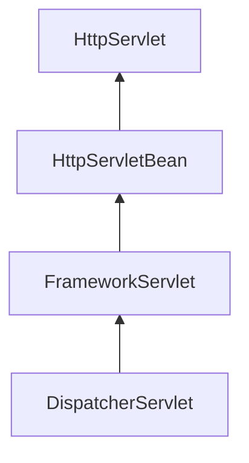

# SpringMVC源码阅读

## 1. SpringMVC的源码DispatcherServlet继承结构继承结构

要了解DispatcherServlet继承结构就直接从Web.xml文件中开始看起。

```xml
<?xml version="1.0" encoding="UTF-8"?>
<web-app xmlns="http://xmlns.jcp.org/xml/ns/javaee"
		 xmlns:xsi="http://www.w3.org/2001/XMLSchema-instance"
		 xsi:schemaLocation="http://xmlns.jcp.org/xml/ns/javaee http://xmlns.jcp.org/xml/ns/javaee/web-app_3_1.xsd"
		 version="3.1">


	<servlet>
		<servlet-name>spring-mvc</servlet-name>
		<servlet-class>org.springframework.web.servlet.DispatcherServlet</servlet-class>
		<init-param>
			<param-name>contextConfigLocation</param-name>
			<param-value>classpath*:spring-mvc.xml</param-value>
		</init-param>
	</servlet>

	<servlet-mapping>
		<servlet-name>spring-mvc</servlet-name>
		<url-pattern>/</url-pattern>
	</servlet-mapping>

</web-app>
```

在Web.xml中配制了Servlet了，我们都知道做为一个Servlet，就必须提提供对应的方法doGet()、doPost()、service()等方法来提供服务，既然如此，我们就看看DispatcherServlet

```xml
public class DispatcherServlet extends FrameworkServlet {
......
}
```

可以看到DispatcherServlet继承自FrameworkServlet，并没有熟知的HttpServlet，那接着继续来追踪FrameworkServlet

```xml
public abstract class FrameworkServlet extends HttpServletBean implements ApplicationContextAware {
......
}
```

同样的，在FrameworkServlet中也没有HttpServlet,但是却有HttpServletBean，这个跟我们熟悉的HttpServlet有点相近了。那就继续追踪这个HttpServletBean

```
public abstract class HttpServletBean extends HttpServlet implements EnvironmentCapable, EnvironmentAware {
......
}
```

当追踪到这个HttpServletBean就看到了我们熟悉的HttpServlet.

至此我们便了解了一个初步的继承结构。



既然DispatcherServlet最终继承的是HttpServlet,那提供服务的方法又是在哪里提供的呢？带着这个问题，我们从HttpServlet开始找吧.

以下是HttpServletBean提代的方法。

```
HttpServletBean
  ServletConfigPropertyValues
  ServletConfigPropertyValues
  addRequiredProperty
  setEnvironment
  getEnvironment
  createEnvironment
  init
  initBeanWrapper
  initServletBean
  getServletName
  logger
  environment
  requiredProperties
```

很明显，方法中并没有提供doGet()、doPost()、service()等方法来提供服务，那就继续FrameworkServlet中去查找看看

```
FrameworkServlet
  ContextRefreshListener
  RequestBindingInterceptor
  FrameworkServlet
  FrameworkServlet
  setContextAttribute
  getContextAttribute
  setContextClass
  getContextClass
  setContextId
  getContextId
  setNamespace
  getNamespace
  setContextConfigLocation
  getContextConfigLocation
  setContextInitializers
  setContextInitializerClasses
  setPublishContext
  setPublishEvents
  setThreadContextInheritable
  setDispatchOptionsRequest
  setDispatchTraceRequest
  setEnableLoggingRequestDetails
  isEnableLoggingRequestDetails
  setApplicationContext
  initServletBean
  initWebApplicationContext
  findWebApplicationContext
  createWebApplicationContext
  configureAndRefreshWebApplicationContext
  createWebApplicationContext
  postProcessWebApplicationContext
  applyInitializers
  loadInitializer
  getServletContextAttributeName
  getWebApplicationContext
  initFrameworkServlet
  refresh
  onApplicationEvent
  onRefresh
  destroy
  service
  doGet
  doPost
  doPut
  doDelete
  doOptions
  doTrace
  processRequest
  buildLocaleContext
  buildRequestAttributes
  initContextHolders
  resetContextHolders
  logResult
  publishRequestHandledEvent
  getUsernameForRequest
  doService
```

在此方法中，我们发现了    doGet、  doPost、  doPut、  doDelete等方法，我们就去看看代码。

```java
public abstract class FrameworkServlet extends HttpServletBean implements ApplicationContextAware {
......
  /**
	 * Delegate GET requests to processRequest/doService.
	 * <p>Will also be invoked by HttpServlet's default implementation of {@code doHead},
	 * with a {@code NoBodyResponse} that just captures the content length.
	 * @see #doService
	 * @see #doHead
	 */
	@Override
	protected final void doGet(HttpServletRequest request, HttpServletResponse response)
			throws ServletException, IOException {

		processRequest(request, response);
	}

	/**
	 * Delegate POST requests to {@link #processRequest}.
	 * @see #doService
	 */
	@Override
	protected final void doPost(HttpServletRequest request, HttpServletResponse response)
			throws ServletException, IOException {

		processRequest(request, response);
	}

	/**
	 * Delegate PUT requests to {@link #processRequest}.
	 * @see #doService
	 */
	@Override
	protected final void doPut(HttpServletRequest request, HttpServletResponse response)
			throws ServletException, IOException {

		processRequest(request, response);
	}

	/**
	 * Delegate DELETE requests to {@link #processRequest}.
	 * @see #doService
	 */
	@Override
	protected final void doDelete(HttpServletRequest request, HttpServletResponse response)
			throws ServletException, IOException {

		processRequest(request, response);
	}
......
}
```

通过查看这些方法，都调用了一个叫processRequest的方法。那继承追踪

```java
public abstract class FrameworkServlet extends HttpServletBean implements ApplicationContextAware {
......
	/**
	 * Process this request, publishing an event regardless of the outcome.
	 * <p>The actual event handling is performed by the abstract
	 * {@link #doService} template method.
	 */
	protected final void processRequest(HttpServletRequest request, HttpServletResponse response)
			throws ServletException, IOException {

		long startTime = System.currentTimeMillis();
		Throwable failureCause = null;

		// 获取一个请求保存的LocaleContext对象。
		LocaleContext previousLocaleContext = LocaleContextHolder.getLocaleContext();
		//建立新的LocaleContext对象
		LocaleContext localeContext = buildLocaleContext(request);

		//获取一个请求保存的RequestAttributes对象。
		RequestAttributes previousAttributes = RequestContextHolder.getRequestAttributes();
		//建立新的ServletRequestAttributes对象。
		ServletRequestAttributes requestAttributes = buildRequestAttributes(request, response, previousAttributes);

		//Spring对于异步编程的支持。
		WebAsyncManager asyncManager = WebAsyncUtils.getAsyncManager(request);
		asyncManager.registerCallableInterceptor(FrameworkServlet.class.getName(), new RequestBindingInterceptor());

		//将新的LocaleContext对象保存至requestAttributes中
		initContextHolders(request, localeContext, requestAttributes);

		try {
			//执行服务方法
			doService(request, response);
		}
		catch (ServletException | IOException ex) {
			failureCause = ex;
			throw ex;
		}
		catch (Throwable ex) {
			failureCause = ex;
			throw new NestedServletException("Request processing failed", ex);
		}

		finally {
			resetContextHolders(request, previousLocaleContext, previousAttributes);
			if (requestAttributes != null) {
				requestAttributes.requestCompleted();
			}
			logResult(request, response, failureCause, asyncManager);
			publishRequestHandledEvent(request, response, startTime, failureCause);
		}
	}
  
	/**
	 * Subclasses must implement this method to do the work of request handling,
	 * receiving a centralized callback for GET, POST, PUT and DELETE.
	 * <p>The contract is essentially the same as that for the commonly overridden
	 * {@code doGet} or {@code doPost} methods of HttpServlet.
	 * <p>This class intercepts calls to ensure that exception handling and
	 * event publication takes place.
	 * @param request current HTTP request
	 * @param response current HTTP response
	 * @throws Exception in case of any kind of processing failure
	 * @see javax.servlet.http.HttpServlet#doGet
	 * @see javax.servlet.http.HttpServlet#doPost
	 */
	protected abstract void doService(HttpServletRequest request, HttpServletResponse response)
			throws Exception;  
......
}
```

通过上面的代码分析，可以发现processRequest方法中调用了一个另外重要的方法doService方法。但在FrameworkServlet仅定了一个抽象方法，待子类中去实现。那就继续跟踪实现，找到doService方法的最终实现。

```java
public class DispatcherServlet extends FrameworkServlet {
......
	/**
	 * Exposes the DispatcherServlet-specific request attributes and delegates to {@link #doDispatch}
	 * for the actual dispatching.
	 */
	@Override
	protected void doService(HttpServletRequest request, HttpServletResponse response) throws Exception {
		logRequest(request);

		// Keep a snapshot of the request attributes in case of an include,
		// to be able to restore the original attributes after the include.
		Map<String, Object> attributesSnapshot = null;
		if (WebUtils.isIncludeRequest(request)) {
			attributesSnapshot = new HashMap<>();
			Enumeration<?> attrNames = request.getAttributeNames();
			while (attrNames.hasMoreElements()) {
				String attrName = (String) attrNames.nextElement();
				if (this.cleanupAfterInclude || attrName.startsWith(DEFAULT_STRATEGIES_PREFIX)) {
					attributesSnapshot.put(attrName, request.getAttribute(attrName));
				}
			}
		}

		// Make framework objects available to handlers and view objects.
		request.setAttribute(WEB_APPLICATION_CONTEXT_ATTRIBUTE, getWebApplicationContext());
		request.setAttribute(LOCALE_RESOLVER_ATTRIBUTE, this.localeResolver);
		request.setAttribute(THEME_RESOLVER_ATTRIBUTE, this.themeResolver);
		request.setAttribute(THEME_SOURCE_ATTRIBUTE, getThemeSource());

		if (this.flashMapManager != null) {
			FlashMap inputFlashMap = this.flashMapManager.retrieveAndUpdate(request, response);
			if (inputFlashMap != null) {
				request.setAttribute(INPUT_FLASH_MAP_ATTRIBUTE, Collections.unmodifiableMap(inputFlashMap));
			}
			request.setAttribute(OUTPUT_FLASH_MAP_ATTRIBUTE, new FlashMap());
			request.setAttribute(FLASH_MAP_MANAGER_ATTRIBUTE, this.flashMapManager);
		}

		try {
			doDispatch(request, response);
		}
		finally {
			if (!WebAsyncUtils.getAsyncManager(request).isConcurrentHandlingStarted()) {
				// Restore the original attribute snapshot, in case of an include.
				if (attributesSnapshot != null) {
					restoreAttributesAfterInclude(request, attributesSnapshot);
				}
			}
		}
	}

......
}
```

在DispatcherServlet中，找到了doService的实现，此代码，前部分也是在设置一些属性以及对跳转参数的设置。接下来又调用了一个很重要的方法：doDispatch方法。那就继续跟踪此方法，看看此方法在干些什么？

```java
public class DispatcherServlet extends FrameworkServlet {
......
	/**
	 * Process the actual dispatching to the handler.
	 * <p>The handler will be obtained by applying the servlet's HandlerMappings in order.
	 * The HandlerAdapter will be obtained by querying the servlet's installed HandlerAdapters
	 * to find the first that supports the handler class.
	 * <p>All HTTP methods are handled by this method. It's up to HandlerAdapters or handlers
	 * themselves to decide which methods are acceptable.
	 * @param request current HTTP request
	 * @param response current HTTP response
	 * @throws Exception in case of any kind of processing failure
	 */
	protected void doDispatch(HttpServletRequest request, HttpServletResponse response) throws Exception {
		HttpServletRequest processedRequest = request;
		HandlerExecutionChain mappedHandler = null;
		boolean multipartRequestParsed = false;

		WebAsyncManager asyncManager = WebAsyncUtils.getAsyncManager(request);

		try {
			ModelAndView mv = null;
			Exception dispatchException = null;

			try {
				//检查文件是否上传请求
				processedRequest = checkMultipart(request);
				multipartRequestParsed = (processedRequest != request);

				// Determine handler for the current request.
				//取得当前的Controller对象，这里称为Handler，即处理器。
				//这里并不是直接返回Controller,而是返回HandlerExecutionChain,即处理器链对象。
				// 该链封装了Handler和Interceptor
				mappedHandler = getHandler(processedRequest);
				if (mappedHandler == null) {
					//如果找不到，则返回404
					noHandlerFound(processedRequest, response);
					return;
				}

				// Determine handler adapter for the current request.
				//获取处理请求的处理器适配器HandlerAdapter
				HandlerAdapter ha = getHandlerAdapter(mappedHandler.getHandler());

				// Process last-modified header, if supported by the handler.
				// 处理last-modified请求头
				String method = request.getMethod();
				boolean isGet = "GET".equals(method);
				if (isGet || "HEAD".equals(method)) {
					long lastModified = ha.getLastModified(request, mappedHandler.getHandler());
					if (new ServletWebRequest(request, response).checkNotModified(lastModified) && isGet) {
						return;
					}
				}

				//针对于实现了HandlerInterceptor的类调用preHandle方法
				if (!mappedHandler.applyPreHandle(processedRequest, response)) {
					return;
				}

				// Actually invoke the handler.
				//实际处理请求，返回请求对象。
				mv = ha.handle(processedRequest, response, mappedHandler.getHandler());

				if (asyncManager.isConcurrentHandlingStarted()) {
					return;
				}

				//结果中视图对象的处理。
				applyDefaultViewName(processedRequest, mv);

				//针对于实现了HandlerInterceptor的类调用postHandle方法
				mappedHandler.applyPostHandle(processedRequest, response, mv);
			}
			catch (Exception ex) {
				dispatchException = ex;
			}
			catch (Throwable err) {
				// As of 4.3, we're processing Errors thrown from handler methods as well,
				// making them available for @ExceptionHandler methods and other scenarios.
				dispatchException = new NestedServletException("Handler dispatch failed", err);
			}
			processDispatchResult(processedRequest, response, mappedHandler, mv, dispatchException);
		}
		catch (Exception ex) {
			//针对于实现了HandlerInterceptor的类调用afterCompletion方法
			triggerAfterCompletion(processedRequest, response, mappedHandler, ex);
		}
		catch (Throwable err) {
			triggerAfterCompletion(processedRequest, response, mappedHandler,
					new NestedServletException("Handler processing failed", err));
		}
		finally {
			if (asyncManager.isConcurrentHandlingStarted()) {
				// Instead of postHandle and afterCompletion
				if (mappedHandler != null) {
					mappedHandler.applyAfterConcurrentHandlingStarted(processedRequest, response);
				}
			}
			else {
				// Clean up any resources used by a multipart request.
				if (multipartRequestParsed) {
					cleanupMultipart(processedRequest);
				}
			}
		}
	}

......
}
```

通过对以上源码的阅读，我们找到了doDispatch方法，此方法是真正的处理请求的方法。它完成了对请求的处理，当然这只是一个整体的源码阅读，具体的细节将在后面的章节中展开。


## 2. 测试demo的源代码

在Spring-MVC中添加一个demo工程。以下是重要代码:

build.gradle

```tex
plugins {
    id 'java'
    id 'war'
}

group 'com.nullnull.learn.demo'
version '5.1.21.BUILD-SNAPSHOT'

repositories {
    mavenCentral()
}

dependencies {
    compile(project(":spring-webmvc"))
    testCompile group: 'junit', name: 'junit', version: '4.12'
}

```

src/main/webapp/WEB-INF/web.xml

```xml
<?xml version="1.0" encoding="UTF-8"?>
<web-app xmlns="http://xmlns.jcp.org/xml/ns/javaee"
		 xmlns:xsi="http://www.w3.org/2001/XMLSchema-instance"
		 xsi:schemaLocation="http://xmlns.jcp.org/xml/ns/javaee http://xmlns.jcp.org/xml/ns/javaee/web-app_3_1.xsd"
		 version="3.1">


	<servlet>
		<servlet-name>spring-mvc</servlet-name>
		<servlet-class>org.springframework.web.servlet.DispatcherServlet</servlet-class>
		<init-param>
			<param-name>contextConfigLocation</param-name>
			<param-value>classpath*:spring-mvc.xml</param-value>
		</init-param>
	</servlet>

	<servlet-mapping>
		<servlet-name>spring-mvc</servlet-name>
		<url-pattern>/</url-pattern>
	</servlet-mapping>

</web-app>
```


com.nullnull.learn.demo.controller.DemoController

```java
package com.nullnull.learn.demo.controller;

import org.springframework.stereotype.Controller;
import org.springframework.web.bind.annotation.RequestMapping;
import org.springframework.web.servlet.ModelAndView;
import java.time.LocalDateTime;

@Controller
@RequestMapping("/demo")
public class DemoController {

  @RequestMapping("/index")
  public ModelAndView runView(String name, Map<String, Object> dataMap) {
    ModelAndView result = new ModelAndView();

    dataMap.put("dataTime", LocalDateTime.now());

    result.setViewName("success");

    return result;
  }
}
```

resources\spring-mvc.xml

```xml
<?xml version="1.0" encoding="UTF-8"?>
<beans xmlns="http://www.springframework.org/schema/beans"
	   xmlns:xsi="http://www.w3.org/2001/XMLSchema-instance"
	   xmlns:context="http://www.springframework.org/schema/context"
	   xmlns:mvc="http://www.springframework.org/schema/mvc"
	   xsi:schemaLocation="
        http://www.springframework.org/schema/beans
        https://www.springframework.org/schema/beans/spring-beans.xsd
        http://www.springframework.org/schema/context
        https://www.springframework.org/schema/context/spring-context.xsd
        http://www.springframework.org/schema/mvc
        https://www.springframework.org/schema/mvc/spring-mvc.xsd
">
	<!--开启controller扫描-->
	<context:component-scan base-package="com.nullnull.learn.demo.controller"/>


	<!--配置springmvc的视图解析器-->
	<bean class="org.springframework.web.servlet.view.InternalResourceViewResolver">
		<property name="prefix" value="/WEB-INF/jsp/"/>
		<property name="suffix" value=".jsp"/>
	</bean>


	<!--
		自动注册最合适的处理器映射器，处理器适配器(调用handler方法)
	-->
	<!--<mvc:annotation-driven/>-->
</beans>
```


src/main/webapp/WEB-INF/jsp/success.jsp

```jsp
<%@ page language="java" isELIgnored="false" contentType="text/html; charset=utf-8" pageEncoding="utf-8" %>
<html>
<head>
    <title>index</title>
</head>
<body>
<%System.out.println("跳转到页面");%>
跳转成功！服务器时间：${dataTime}
</body>
</html>

```


## 3. 请求的重要时机点分析

### 3.1 handler执行时机点

方法便是打断点

首先在DemoController类的runView方法的首行打上断点。

部署启动此应用

在浏览器中输入：

http://localhost:8080/demo/index


使能够看到断点进入了

关键点


进行调用栈的分析，可采用从下往上走的方式进行。

可以看到过时入doGet方法，那就从此处开始向上分析。

```java
public abstract class FrameworkServlet extends HttpServletBean implements ApplicationContextAware {
......
	/**
	 * Delegate GET requests to processRequest/doService.
	 * <p>Will also be invoked by HttpServlet's default implementation of {@code doHead},
	 * with a {@code NoBodyResponse} that just captures the content length.
	 * @see #doService
	 * @see #doHead
	 */
	@Override
	protected final void doGet(HttpServletRequest request, HttpServletResponse response)
			throws ServletException, IOException {

		processRequest(request, response);
	}

......
}
```

接下来就进入了processRequest方法

```java
public abstract class FrameworkServlet extends HttpServletBean implements ApplicationContextAware {
......
	/**
	 * Process this request, publishing an event regardless of the outcome.
	 * <p>The actual event handling is performed by the abstract
	 * {@link #doService} template method.
	 */
	protected final void processRequest(HttpServletRequest request, HttpServletResponse response)
			throws ServletException, IOException {

		long startTime = System.currentTimeMillis();
		Throwable failureCause = null;

		// 获取一个请求保存的LocaleContext对象。
		LocaleContext previousLocaleContext = LocaleContextHolder.getLocaleContext();
		//建立新的LocaleContext对象
		LocaleContext localeContext = buildLocaleContext(request);

		//获取一个请求保存的RequestAttributes对象。
		RequestAttributes previousAttributes = RequestContextHolder.getRequestAttributes();
		//建立新的ServletRequestAttributes对象。
		ServletRequestAttributes requestAttributes = buildRequestAttributes(request, response, previousAttributes);

		//Spring对于异步编程的支持。
		WebAsyncManager asyncManager = WebAsyncUtils.getAsyncManager(request);
		asyncManager.registerCallableInterceptor(FrameworkServlet.class.getName(), new RequestBindingInterceptor());

		//将新的LocaleContext对象保存至requestAttributes中
		initContextHolders(request, localeContext, requestAttributes);

		try {
			//执行服务方法
			doService(request, response);
		}
		catch (ServletException | IOException ex) {
			failureCause = ex;
			throw ex;
		}
		catch (Throwable ex) {
			failureCause = ex;
			throw new NestedServletException("Request processing failed", ex);
		}

		finally {
			resetContextHolders(request, previousLocaleContext, previousAttributes);
			if (requestAttributes != null) {
				requestAttributes.requestCompleted();
			}
			logResult(request, response, failureCause, asyncManager);
			publishRequestHandledEvent(request, response, startTime, failureCause);
		}
	}
......
}
```

再接下来就是DispatcherServlet的doService方法

````java
public class DispatcherServlet extends FrameworkServlet {
......
	/**
	 * Exposes the DispatcherServlet-specific request attributes and delegates to {@link #doDispatch}
	 * for the actual dispatching.
	 */
	@Override
	protected void doService(HttpServletRequest request, HttpServletResponse response) throws Exception {
		logRequest(request);

		// Keep a snapshot of the request attributes in case of an include,
		// to be able to restore the original attributes after the include.
		Map<String, Object> attributesSnapshot = null;
		if (WebUtils.isIncludeRequest(request)) {
			attributesSnapshot = new HashMap<>();
			Enumeration<?> attrNames = request.getAttributeNames();
			while (attrNames.hasMoreElements()) {
				String attrName = (String) attrNames.nextElement();
				if (this.cleanupAfterInclude || attrName.startsWith(DEFAULT_STRATEGIES_PREFIX)) {
					attributesSnapshot.put(attrName, request.getAttribute(attrName));
				}
			}
		}

		// Make framework objects available to handlers and view objects.
		request.setAttribute(WEB_APPLICATION_CONTEXT_ATTRIBUTE, getWebApplicationContext());
		request.setAttribute(LOCALE_RESOLVER_ATTRIBUTE, this.localeResolver);
		request.setAttribute(THEME_RESOLVER_ATTRIBUTE, this.themeResolver);
		request.setAttribute(THEME_SOURCE_ATTRIBUTE, getThemeSource());

		if (this.flashMapManager != null) {
			FlashMap inputFlashMap = this.flashMapManager.retrieveAndUpdate(request, response);
			if (inputFlashMap != null) {
				request.setAttribute(INPUT_FLASH_MAP_ATTRIBUTE, Collections.unmodifiableMap(inputFlashMap));
			}
			request.setAttribute(OUTPUT_FLASH_MAP_ATTRIBUTE, new FlashMap());
			request.setAttribute(FLASH_MAP_MANAGER_ATTRIBUTE, this.flashMapManager);
		}

		try {
			doDispatch(request, response);
		}
		finally {
			if (!WebAsyncUtils.getAsyncManager(request).isConcurrentHandlingStarted()) {
				// Restore the original attribute snapshot, in case of an include.
				if (attributesSnapshot != null) {
					restoreAttributesAfterInclude(request, attributesSnapshot);
				}
			}
		}
	}
......
}
````

再通过doService又调用了doDispatch方法

````java
public class DispatcherServlet extends FrameworkServlet {
......
	/**
	 * Process the actual dispatching to the handler.
	 * <p>The handler will be obtained by applying the servlet's HandlerMappings in order.
	 * The HandlerAdapter will be obtained by querying the servlet's installed HandlerAdapters
	 * to find the first that supports the handler class.
	 * <p>All HTTP methods are handled by this method. It's up to HandlerAdapters or handlers
	 * themselves to decide which methods are acceptable.
	 * @param request current HTTP request
	 * @param response current HTTP response
	 * @throws Exception in case of any kind of processing failure
	 */
	protected void doDispatch(HttpServletRequest request, HttpServletResponse response) throws Exception {
		HttpServletRequest processedRequest = request;
		HandlerExecutionChain mappedHandler = null;
		boolean multipartRequestParsed = false;

		WebAsyncManager asyncManager = WebAsyncUtils.getAsyncManager(request);

		try {
			ModelAndView mv = null;
			Exception dispatchException = null;

			try {
				//检查文件是否上传请求
				processedRequest = checkMultipart(request);
				multipartRequestParsed = (processedRequest != request);

				// Determine handler for the current request.
				//取得当前的Controller对象，这里称为Handler，即处理器。
				//这里并不是直接返回Controller,而是返回HandlerExecutionChain,即处理器链对象。
				// 该链封装了Handler和Interceptor
				mappedHandler = getHandler(processedRequest);
				if (mappedHandler == null) {
					//如果找不到，则返回404
					noHandlerFound(processedRequest, response);
					return;
				}

				// Determine handler adapter for the current request.
				//获取处理请求的处理器适配器HandlerAdapter
				HandlerAdapter ha = getHandlerAdapter(mappedHandler.getHandler());

				// Process last-modified header, if supported by the handler.
				// 处理last-modified请求头
				String method = request.getMethod();
				boolean isGet = "GET".equals(method);
				if (isGet || "HEAD".equals(method)) {
					long lastModified = ha.getLastModified(request, mappedHandler.getHandler());
					if (new ServletWebRequest(request, response).checkNotModified(lastModified) && isGet) {
						return;
					}
				}

				//针对于实现了HandlerInterceptor的类调用preHandle方法
				if (!mappedHandler.applyPreHandle(processedRequest, response)) {
					return;
				}

				// Actually invoke the handler.
				//实际处理请求，返回请求对象。
				mv = ha.handle(processedRequest, response, mappedHandler.getHandler());

				if (asyncManager.isConcurrentHandlingStarted()) {
					return;
				}

				//结果中视图对象的处理。
				applyDefaultViewName(processedRequest, mv);

				//针对于实现了HandlerInterceptor的类调用postHandle方法
				mappedHandler.applyPostHandle(processedRequest, response, mv);
			}
			catch (Exception ex) {
				dispatchException = ex;
			}
			catch (Throwable err) {
				// As of 4.3, we're processing Errors thrown from handler methods as well,
				// making them available for @ExceptionHandler methods and other scenarios.
				dispatchException = new NestedServletException("Handler dispatch failed", err);
			}
			processDispatchResult(processedRequest, response, mappedHandler, mv, dispatchException);
		}
		catch (Exception ex) {
			//针对于实现了HandlerInterceptor的类调用afterCompletion方法
			triggerAfterCompletion(processedRequest, response, mappedHandler, ex);
		}
		catch (Throwable err) {
			triggerAfterCompletion(processedRequest, response, mappedHandler,
					new NestedServletException("Handler processing failed", err));
		}
		finally {
			if (asyncManager.isConcurrentHandlingStarted()) {
				// Instead of postHandle and afterCompletion
				if (mappedHandler != null) {
					mappedHandler.applyAfterConcurrentHandlingStarted(processedRequest, response);
				}
			}
			else {
				// Clean up any resources used by a multipart request.
				if (multipartRequestParsed) {
					cleanupMultipart(processedRequest);
				}
			}
		}
	}
......
}
````

再调用就来到了				mv = ha.handle(processedRequest, response, mappedHandler.getHandler());方法，进入此方法的调用中


由此可以得知。

```java
ha.handle(processedRequest, response, mappedHandler.getHandler());
```

此方法被调用后，便调用了我们Controller的业务逻辑执行。


### 3.2 JSP页面执行时机点

此时我们在sucess.jsp页面上打上断点。注意要跳过Controller的断点

```jsp
<%System.out.println("跳转到页面");%>
```

当在浏览器中输入

http://localhost:8080/demo/index

便来到断点处

进行调用栈的分析，可采用从下往上走的方式进行。

在进入doDispatch方法前与handler是一致。


接下来便看看doDispatch中调用的方法：

```java
processDispatchResult(processedRequest, response, mappedHandler, mv, dispatchException);
```

那么，此就是JSP渲染的调用。


### 3.3 分析得到重要的运行流程

> 1. 调用getHandler()获得能够处理当前请求的执行链HandlerExecutionChain。
> 2. 调用getHandlerAdapter获得HandlerAdapter对象。
> 3. 适配器HandlerAdapter调用的handle执行，返回ModelAndView对象。
> 4. 调用processDispatchResult()方法完成视图渲染跳转。


### 3.4 getHandler()代码分析

还是通过同样的办法，通过断点进行查看，

将断点打在

```
mappedHandler = getHandler(processedRequest);
```

用来跟踪获取的具体的信息

```java
public class DispatcherServlet extends FrameworkServlet {
......
	/**
	 * Return the HandlerExecutionChain for this request.
	 * <p>Tries all handler mappings in order.
	 * @param request current HTTP request
	 * @return the HandlerExecutionChain, or {@code null} if no handler could be found
	 */
	@Nullable
	protected HandlerExecutionChain getHandler(HttpServletRequest request) throws Exception {
		if (this.handlerMappings != null) {
			for (HandlerMapping mapping : this.handlerMappings) {
				HandlerExecutionChain handler = mapping.getHandler(request);
				if (handler != null) {
					return handler;
				}
			}
		}
		return null;
	}
......
}
```

此时检查handlerMappings中的值，可以发现。存在两个

```
0 = {BeanNameUrlHandlerMapping@4603} 
1 = {RequestMappingHandlerMapping@4604} 
```

> 先说BeanNameUrlHandlerMapping是筛选出容器所有id或别名以/开头的bean,将对应的路由和bean保存在AbstractUrlHandlerMapping的urlMap里，这是早期Spring所采用的。现在采用注解的模式，都不在采用此配制
>
> RequestMappingHandlerMapping现在的注解都采用的此处理器映射器对象。

通过继续调试代码，发现在BeanNameUrlHandlerMapping时，HandlerExecutionChain为空，而在RequestMappingHandlerMapping时，被返回，那也就说明，我们当前的请求是需要被RequestMappingHandlerMapping来处理的


### 3.5 getHandlerAdapter()分析

此时断点设置在：

```java
HandlerAdapter ha = getHandlerAdapter(mappedHandler.getHandler());
```

跟踪具体的调用，就来到了

```
public class DispatcherServlet extends FrameworkServlet {
......
	/**
	 * Return the HandlerAdapter for this handler object.
	 * @param handler the handler object to find an adapter for
	 * @throws ServletException if no HandlerAdapter can be found for the handler. This is a fatal error.
	 */
	protected HandlerAdapter getHandlerAdapter(Object handler) throws ServletException {
		if (this.handlerAdapters != null) {
			for (HandlerAdapter adapter : this.handlerAdapters) {
				if (adapter.supports(handler)) {
					return adapter;
				}
			}
		}
		throw new ServletException("No adapter for handler [" + handler +
				"]: The DispatcherServlet configuration needs to include a HandlerAdapter that supports this handler");
	}
......
}
```

此时检查handlerAdapters对象，可以发现，此处存在3种请求处理器对象。

```
0 = {HttpRequestHandlerAdapter@5911} 
1 = {SimpleControllerHandlerAdapter@5912} 
2 = {RequestMappingHandlerAdapter@4672} 
```

继续跟踪supports方法,来到第一个实现HttpRequestHandlerAdapter,此处直接做检查对象是否为HttpRequestHandler的实现，那当前很明显不是。

```java
public class HttpRequestHandlerAdapter implements HandlerAdapter {

	@Override
	public boolean supports(Object handler) {
		return (handler instanceof HttpRequestHandler);
	}
......
}
```

接下来继续调试跟进supports，就来到了第二个实现中,检查是否为Controller接口的实现

```java
public class SimpleControllerHandlerAdapter implements HandlerAdapter {

	@Override
	public boolean supports(Object handler) {
		return (handler instanceof Controller);
	}
......
}
```

接下来便来到了最后一个。跟进supports方法，便进入了RequestMappingHandlerAdapter实现中

```java
public abstract class AbstractHandlerMethodAdapter extends WebContentGenerator implements HandlerAdapter, Ordered {
......
	/**
	 * This implementation expects the handler to be an {@link HandlerMethod}.
	 * @param handler the handler instance to check
	 * @return whether or not this adapter can adapt the given handler
	 */
	@Override
	public final boolean supports(Object handler) {
		return (handler instanceof HandlerMethod && supportsInternal((HandlerMethod) handler));
	}
......
}
```

检查对象可以发现，此就是HandlerMethod对象，自然就是RequestMappingHandlerAdapter对象处理。


### 3.6 适配器HandlerAdapter调用的handle执行（返回ModelAndView对象）

```java
        // 实际处理请求，返回请求对象。
        mv = ha.handle(processedRequest, response, mappedHandler.getHandler());
```

在调用handle方法时，会传递处理后的request对象，response对象，以及handler对象，也就是封装了我们最终需要调用的DemoController对象。

调用接下来就会进入handle方法

```java
public abstract class AbstractHandlerMethodAdapter extends WebContentGenerator implements HandlerAdapter, Ordered {
......
  /**
	 * This implementation expects the handler to be an {@link HandlerMethod}.
	 */
	@Override
	@Nullable
	public final ModelAndView handle(HttpServletRequest request, HttpServletResponse response, Object handler)
			throws Exception {

		return handleInternal(request, response, (HandlerMethod) handler);
	}
......
}  
```


继续跟踪handleInternal方法，便来到了

```java
public class RequestMappingHandlerAdapter extends AbstractHandlerMethodAdapter
		implements BeanFactoryAware, InitializingBean {
......  

  @Override
  protected ModelAndView handleInternal(
      HttpServletRequest request, HttpServletResponse response, HandlerMethod handlerMethod)
      throws Exception {

    ModelAndView mav;
    // 检查请求参数
    checkRequest(request);

    // Execute invokeHandlerMethod in synchronized block if required.
    // 是否使用同步处理，如果同步处理，则需要做加载锁处理
    if (this.synchronizeOnSession) {
      HttpSession session = request.getSession(false);
      if (session != null) {
        // 创建一个加锁对象
        Object mutex = WebUtils.getSessionMutex(session);
        synchronized (mutex) {
          // 去执行Handler的方法
          mav = invokeHandlerMethod(request, response, handlerMethod);
        }
      } else {
        // No HttpSession available -> no mutex necessary
        mav = invokeHandlerMethod(request, response, handlerMethod);
      }
    }
    // 未配制时，默认是异步处理
    else {
      // No synchronization on session demanded at all...
      mav = invokeHandlerMethod(request, response, handlerMethod);
    }

    if (!response.containsHeader(HEADER_CACHE_CONTROL)) {
      if (getSessionAttributesHandler(handlerMethod).hasSessionAttributes()) {
        applyCacheSeconds(response, this.cacheSecondsForSessionAttributeHandlers);
      } else {
        prepareResponse(response);
      }
    }

    return mav;
  }
......
}
  
```


接下来便进入了invokeHandlerMethod方法的处理中

```java
  /**
   * Invoke the {@link RequestMapping} handler method preparing a {@link ModelAndView} if view
   * resolution is required.
   *
   * @since 4.2
   * @see #createInvocableHandlerMethod(HandlerMethod)
   */
  @Nullable
  protected ModelAndView invokeHandlerMethod(
      HttpServletRequest request, HttpServletResponse response, HandlerMethod handlerMethod)
      throws Exception {

    ServletWebRequest webRequest = new ServletWebRequest(request, response);
    try {
      // 获取容器中全局配制的InitBinder和当前的HandlerMethod所对应的Controller中配制的InitBinder，用于参数绑定。
      WebDataBinderFactory binderFactory = getDataBinderFactory(handlerMethod);
      // 获取容器中全局配制的ModelAttribute和当前HandlerMethod所对应的Controller中所配制的ModelAttribute，这些配制方法将会在目标方法
      // 调用之前进行执行。
      ModelFactory modelFactory = getModelFactory(handlerMethod, binderFactory);

      // 将handlerMethod对象封装为一个ServletInvocableHandlerMethod对象。
      ServletInvocableHandlerMethod invocableMethod = createInvocableHandlerMethod(handlerMethod);
      if (this.argumentResolvers != null) {
        // 设置当前容器中配制的所有argumentResolver对象，即为参数解析器，用来过时行参的处理操作。
        invocableMethod.setHandlerMethodArgumentResolvers(this.argumentResolvers);
      }
      if (this.returnValueHandlers != null) {
        // 设置当前容器中配制的所有returnValueHandler对象，设置返回值解析器。
        invocableMethod.setHandlerMethodReturnValueHandlers(this.returnValueHandlers);
      }
      // 将之前创建的WebDataBinderFactory对象设置到执行方法对象中。
      invocableMethod.setDataBinderFactory(binderFactory);
      invocableMethod.setParameterNameDiscoverer(this.parameterNameDiscoverer);

      // ModelAndView的容器对象。
      ModelAndViewContainer mavContainer = new ModelAndViewContainer();
      // 将request属性封装到请求的attribute中
      mavContainer.addAllAttributes(RequestContextUtils.getInputFlashMap(request));
      // 这里的initModel方法的作为是调用前面获取到的@ModelAttribute标识的方法
      // 从而达到@ModelAttribute标识的方法能够在目标Handler调用之前调用的目的。
      modelFactory.initModel(webRequest, mavContainer, invocableMethod);
      mavContainer.setIgnoreDefaultModelOnRedirect(this.ignoreDefaultModelOnRedirect);

      // 异常的请求处理
      AsyncWebRequest asyncWebRequest = WebAsyncUtils.createAsyncWebRequest(request, response);
      asyncWebRequest.setTimeout(this.asyncRequestTimeout);

      WebAsyncManager asyncManager = WebAsyncUtils.getAsyncManager(request);
      asyncManager.setTaskExecutor(this.taskExecutor);
      asyncManager.setAsyncWebRequest(asyncWebRequest);
      asyncManager.registerCallableInterceptors(this.callableInterceptors);
      asyncManager.registerDeferredResultInterceptors(this.deferredResultInterceptors);

      if (asyncManager.hasConcurrentResult()) {
        Object result = asyncManager.getConcurrentResult();
        mavContainer = (ModelAndViewContainer) asyncManager.getConcurrentResultContext()[0];
        asyncManager.clearConcurrentResult();
        LogFormatUtils.traceDebug(
            logger,
            traceOn -> {
              String formatted = LogFormatUtils.formatValue(result, !traceOn);
              return "Resume with async result [" + formatted + "]";
            });
        invocableMethod = invocableMethod.wrapConcurrentResult(result);
      }

      // 对请求参数进行处理，调用目标的HandlerMethod，并且返回值封装为一个ModelAndView对象
      invocableMethod.invokeAndHandle(webRequest, mavContainer);
      if (asyncManager.isConcurrentHandlingStarted()) {
        return null;
      }

      // 对封装的ModelAndView进行处理，主要判断当前请求是否过时行了重定向，如果进行重定向，
      // 还需要判断请求是否封装到FlashAttribute封装到新的请求中
      return getModelAndView(mavContainer, modelFactory, webRequest);
    } finally {
      webRequest.requestCompleted();
    }
  }
```

 通过以上的代码观察，我们发现真正核心的方法调用是 invocableMethod.invokeAndHandle(webRequest, mavContainer);那我们就继续跟踪此代码

```java
public class ServletInvocableHandlerMethod extends InvocableHandlerMethod {
......
  /**
   * Invoke the method and handle the return value through one of the configured {@link
   * HandlerMethodReturnValueHandler HandlerMethodReturnValueHandlers}.
   *
   * @param webRequest the current request
   * @param mavContainer the ModelAndViewContainer for this request
   * @param providedArgs "given" arguments matched by type (not resolved)
   */
  public void invokeAndHandle(
      ServletWebRequest webRequest, ModelAndViewContainer mavContainer, Object... providedArgs)
      throws Exception {

    // 对目标参数进行处理，并调用目标的Handler
    Object returnValue = invokeForRequest(webRequest, mavContainer, providedArgs);
    // 设置返回的状态
    setResponseStatus(webRequest);

    if (returnValue == null) {
      if (isRequestNotModified(webRequest)
          || getResponseStatus() != null
          || mavContainer.isRequestHandled()) {
        disableContentCachingIfNecessary(webRequest);
        mavContainer.setRequestHandled(true);
        return;
      }
    } else if (StringUtils.hasText(getResponseStatusReason())) {
      mavContainer.setRequestHandled(true);
      return;
    }

    mavContainer.setRequestHandled(false);
    Assert.state(this.returnValueHandlers != null, "No return value handlers");
    try {
      this.returnValueHandlers.handleReturnValue(
          returnValue, getReturnValueType(returnValue), mavContainer, webRequest);
    } catch (Exception ex) {
      if (logger.isTraceEnabled()) {
        logger.trace(formatErrorForReturnValue(returnValue), ex);
      }
      throw ex;
    }
  }
......
}
```

通过以上代码发现，此处就做了一个代码调用，后面都是对结果过进行的处理，那我们就针对invokeForRequest继续查看源码

```java
public class InvocableHandlerMethod extends HandlerMethod {
......
	@Nullable
	public Object invokeForRequest(NativeWebRequest request, @Nullable ModelAndViewContainer mavContainer,
			Object... providedArgs) throws Exception {
		//将request中的参数转换为当前handler的参数形式。
		Object[] args = getMethodArgumentValues(request, mavContainer, providedArgs);
		if (logger.isTraceEnabled()) {
			logger.trace("Arguments: " + Arrays.toString(args));
		}
		//这里doInvoke()方法主要是结合处理后的参数，使用反射对目标方法进行调用。
		return doInvoke(args);
	}
  
......
}
```

这里分为两步，第一步是转换参数。然后进行调用。首先去查看参数转换。

```java
public class InvocableHandlerMethod extends HandlerMethod {
......
  
	private HandlerMethodArgumentResolverComposite resolvers = new HandlerMethodArgumentResolverComposite();  
  
  /**
	 * Get the method argument values for the current request, checking the provided
	 * argument values and falling back to the configured argument resolvers.
	 * <p>The resulting array will be passed into {@link #doInvoke}.
	 * @since 5.1.2
	 */
	protected Object[] getMethodArgumentValues(NativeWebRequest request, @Nullable ModelAndViewContainer mavContainer,
			Object... providedArgs) throws Exception {
		//获取当前handler所声明的所有参数，包括参数名、参数类型、参数位置，所标注的注解等等属性。
		MethodParameter[] parameters = getMethodParameters();
		if (ObjectUtils.isEmpty(parameters)) {
			return EMPTY_ARGS;
		}

		Object[] args = new Object[parameters.length];
		for (int i = 0; i < parameters.length; i++) {
			MethodParameter parameter = parameters[i];
			parameter.initParameterNameDiscovery(this.parameterNameDiscoverer);
			//providedArgs是调用方提供的参数，这里主要是判断这些参数中是否有当前的类型，如果有，则直接使用提供的参数，对于 请求处理而言，
			//默认情况下，调用方参数都是长度为0的数组。
			args[i] = findProvidedArgument(parameter, providedArgs);
			if (args[i] != null) {
				continue;
			}
			//如果在调用提供的参数中不能找到当前类型的参数值，则遍历Spring容器中所有的ArgumentResolver,
			//判断哪种类型的Resolver支持对当前参数的解析，这里的判断方式比较简单，
			// 比如RequestParamMethodArgumentResolver就是判断当前参数
			// 是否使用@RequestParam注解进行标识。
			if (!this.resolvers.supportsParameter(parameter)) {
				throw new IllegalStateException(formatArgumentError(parameter, "No suitable resolver"));
			}
			try {
				//如果能够找到对当前参数进行处理的ArgumentResolver，则调用其
				// resolverArgument()方法从request中获取对应的参数值，并进行转换。
				args[i] = this.resolvers.resolveArgument(parameter, mavContainer, request, this.dataBinderFactory);
			}
			catch (Exception ex) {
				// Leave stack trace for later, exception may actually be resolved and handled...
				if (logger.isDebugEnabled()) {
					String exMsg = ex.getMessage();
					if (exMsg != null && !exMsg.contains(parameter.getExecutable().toGenericString())) {
						logger.debug(formatArgumentError(parameter, exMsg));
					}
				}
				throw ex;
			}
		}
		return args;
	}
......
}
```

这里就是对请求参数进行处理，将每一个对应的参数按顺序设置到args中，重点跟进下这行

```
				args[i] = this.resolvers.resolveArgument(parameter, mavContainer, request, this.dataBinderFactory);
```

的一个调用。

我们在demoController中一共有两个参数

```
  public ModelAndView runView(String name, Map<String, Object> dataMap) 
```

一个是String类型的名称，还有一个是个Map。我们将分别跟踪这两个参数。首先当然是Name，便来到了

#### 3.6.1 参数1的获取

接下来便来到了HandlerMethodArgumentResolverComposite中，我们继续跟进

```java
public class HandlerMethodArgumentResolverComposite implements HandlerMethodArgumentResolver {
......
	/**
	 * Iterate over registered
	 * {@link HandlerMethodArgumentResolver HandlerMethodArgumentResolvers}
	 * and invoke the one that supports it.
	 * @throws IllegalArgumentException if no suitable argument resolver is found
	 */
	@Override
	@Nullable
	public Object resolveArgument(MethodParameter parameter, @Nullable ModelAndViewContainer mavContainer,
			NativeWebRequest webRequest, @Nullable WebDataBinderFactory binderFactory) throws Exception {
		//获取一个解析器
		HandlerMethodArgumentResolver resolver = getArgumentResolver(parameter);
		if (resolver == null) {
			throw new IllegalArgumentException("Unsupported parameter type [" +
					parameter.getParameterType().getName() + "]. supportsParameter should be called first.");
		}
		//执行对应的一个参数处理
		return resolver.resolveArgument(parameter, mavContainer, webRequest, binderFactory);
	}
......
}
```

接下来便来到了

```java
public abstract class AbstractNamedValueMethodArgumentResolver implements HandlerMethodArgumentResolver {
......
	@Override
	@Nullable
	public final Object resolveArgument(MethodParameter parameter, @Nullable ModelAndViewContainer mavContainer,
			NativeWebRequest webRequest, @Nullable WebDataBinderFactory binderFactory) throws Exception {
		//获取当前参数的一个封装信息，即参数名称等信息
		NamedValueInfo namedValueInfo = getNamedValueInfo(parameter);
		MethodParameter nestedParameter = parameter.nestedIfOptional();

		//处理字符串类型的数值。
		Object resolvedName = resolveStringValue(namedValueInfo.name);
		if (resolvedName == null) {
			throw new IllegalArgumentException(
					"Specified name must not resolve to null: [" + namedValueInfo.name + "]");
		}

		//按参数名称获取值
		Object arg = resolveName(resolvedName.toString(), nestedParameter, webRequest);
		if (arg == null) {
			if (namedValueInfo.defaultValue != null) {
				arg = resolveStringValue(namedValueInfo.defaultValue);
			}
			else if (namedValueInfo.required && !nestedParameter.isOptional()) {
				handleMissingValue(namedValueInfo.name, nestedParameter, webRequest);
			}
			arg = handleNullValue(namedValueInfo.name, arg, nestedParameter.getNestedParameterType());
		}
		else if ("".equals(arg) && namedValueInfo.defaultValue != null) {
			arg = resolveStringValue(namedValueInfo.defaultValue);
		}

		if (binderFactory != null) {
			WebDataBinder binder = binderFactory.createBinder(webRequest, null, namedValueInfo.name);
			try {
				arg = binder.convertIfNecessary(arg, parameter.getParameterType(), parameter);
			}
			catch (ConversionNotSupportedException ex) {
				throw new MethodArgumentConversionNotSupportedException(arg, ex.getRequiredType(),
						namedValueInfo.name, parameter, ex.getCause());
			}
			catch (TypeMismatchException ex) {
				throw new MethodArgumentTypeMismatchException(arg, ex.getRequiredType(),
						namedValueInfo.name, parameter, ex.getCause());
			}
		}

		handleResolvedValue(arg, namedValueInfo.name, parameter, mavContainer, webRequest);

		return arg;
	}
......
}
```

这里继续跟进获取值的方法resolveName

```java
public class RequestParamMethodArgumentResolver extends AbstractNamedValueMethodArgumentResolver
    implements UriComponentsContributor {
......
  @Override
  @Nullable
  protected Object resolveName(String name, MethodParameter parameter, NativeWebRequest request)
      throws Exception {
    HttpServletRequest servletRequest = request.getNativeRequest(HttpServletRequest.class);

    // 上传文件的情况
    if (servletRequest != null) {
      Object mpArg =
          MultipartResolutionDelegate.resolveMultipartArgument(name, parameter, servletRequest);
      if (mpArg != MultipartResolutionDelegate.UNRESOLVABLE) {
        return mpArg;
      }
    }

    Object arg = null;
    // 还是上传文件的情况
    MultipartRequest multipartRequest = request.getNativeRequest(MultipartRequest.class);
    if (multipartRequest != null) {
      List<MultipartFile> files = multipartRequest.getFiles(name);
      if (!files.isEmpty()) {
        arg = (files.size() == 1 ? files.get(0) : files);
      }
    }
    // 从请求参数中获取
    if (arg == null) {
      String[] paramValues = request.getParameterValues(name);
      if (paramValues != null) {
        arg = (paramValues.length == 1 ? paramValues[0] : paramValues);
      }
    }
    return arg;
  }
......
}
```

通过这里我们就发现了获取是通过 request.getParameterValues(name);来拿到参数值的。

#### 3.6.2 参数2.Map参数的获取。

还是同样的来到了

```java
public class HandlerMethodArgumentResolverComposite implements HandlerMethodArgumentResolver {
......
	/**
	 * Iterate over registered
	 * {@link HandlerMethodArgumentResolver HandlerMethodArgumentResolvers}
	 * and invoke the one that supports it.
	 * @throws IllegalArgumentException if no suitable argument resolver is found
	 */
	@Override
	@Nullable
	public Object resolveArgument(MethodParameter parameter, @Nullable ModelAndViewContainer mavContainer,
			NativeWebRequest webRequest, @Nullable WebDataBinderFactory binderFactory) throws Exception {
		//获取一个解析器
		HandlerMethodArgumentResolver resolver = getArgumentResolver(parameter);
		if (resolver == null) {
			throw new IllegalArgumentException("Unsupported parameter type [" +
					parameter.getParameterType().getName() + "]. supportsParameter should be called first.");
		}
		//执行对应的一个参数处理
		return resolver.resolveArgument(parameter, mavContainer, webRequest, binderFactory);
	}
......
}
```

只不过，此时的参数处理类，就有所变化了

```java
public class MapMethodProcessor implements HandlerMethodArgumentResolver, HandlerMethodReturnValueHandler {
......
	@Override
	@Nullable
	public Object resolveArgument(MethodParameter parameter, @Nullable ModelAndViewContainer mavContainer,
			NativeWebRequest webRequest, @Nullable WebDataBinderFactory binderFactory) throws Exception {

		Assert.state(mavContainer != null, "ModelAndViewContainer is required for model exposure");
		return mavContainer.getModel();
	}
......
}
```

此处便直接从容器中直接获取了一个BindingAwareModelMap的对象返回。

```java
public class ModelAndViewContainer {
......
	private final ModelMap defaultModel = new BindingAwareModelMap();

  /**
	 * Return the model to use -- either the "default" or the "redirect" model.
	 * The default model is used if {@code redirectModelScenario=false} or
	 * there is no redirect model (i.e. RedirectAttributes was not declared as
	 * a method argument) and {@code ignoreDefaultModelOnRedirect=false}.
	 */
	public ModelMap getModel() {
		if (useDefaultModel()) {
			return this.defaultModel;
		}
		else {
			if (this.redirectModel == null) {
				this.redirectModel = new ModelMap();
			}
			return this.redirectModel;
		}
	}
......
}

```


至此HandlerAdapter的handler的方法的参数已经跟踪完成。

#### 3.6.3 Controller方法调用。

当方法的参数绑定完成后，接下来看看是如何调用到Controller

```java
public class InvocableHandlerMethod extends HandlerMethod {
......
	@Nullable
	public Object invokeForRequest(NativeWebRequest request, @Nullable ModelAndViewContainer mavContainer,
			Object... providedArgs) throws Exception {
		//将request中的参数转换为当前handler的参数形式。
		Object[] args = getMethodArgumentValues(request, mavContainer, providedArgs);
		if (logger.isTraceEnabled()) {
			logger.trace("Arguments: " + Arrays.toString(args));
		}
		//这里doInvoke()方法主要是结合处理后的参数，使用反射对目标方法进行调用。
		return doInvoke(args);
	}
  
......
}
```

开始调用方法

```java
public class InvocableHandlerMethod extends HandlerMethod {
......
	/**
	 * Invoke the handler method with the given argument values.
	 */
	@Nullable
	protected Object doInvoke(Object... args) throws Exception {
		ReflectionUtils.makeAccessible(getBridgedMethod());
		try {
			return getBridgedMethod().invoke(getBean(), args);
		}
		catch (IllegalArgumentException ex) {
			assertTargetBean(getBridgedMethod(), getBean(), args);
			String text = (ex.getMessage() != null ? ex.getMessage() : "Illegal argument");
			throw new IllegalStateException(formatInvokeError(text, args), ex);
		}
		catch (InvocationTargetException ex) {
			// Unwrap for HandlerExceptionResolvers ...
			Throwable targetException = ex.getTargetException();
			if (targetException instanceof RuntimeException) {
				throw (RuntimeException) targetException;
			}
			else if (targetException instanceof Error) {
				throw (Error) targetException;
			}
			else if (targetException instanceof Exception) {
				throw (Exception) targetException;
			}
			else {
				throw new IllegalStateException(formatInvokeError("Invocation failure", args), targetException);
			}
		}
	}
......
}
```

通过这里就调用到了Controller的方法。

### 3.7 processDispatchResult跳转视图处理

首先还是在doDispatch的

```java
processDispatchResult(processedRequest, response, mappedHandler, mv, dispatchException);
```

打上断点，继续跟踪。

```java
public class DispatcherServlet extends FrameworkServlet {
......

  /**
   * Handle the result of handler selection and handler invocation, which is either a ModelAndView
   * or an Exception to be resolved to a ModelAndView.
   */
  private void processDispatchResult(
      HttpServletRequest request,
      HttpServletResponse response,
      @Nullable HandlerExecutionChain mappedHandler,
      @Nullable ModelAndView mv,
      @Nullable Exception exception)
      throws Exception {

    boolean errorView = false;

    // 异常判断
    if (exception != null) {
      if (exception instanceof ModelAndViewDefiningException) {
        logger.debug("ModelAndViewDefiningException encountered", exception);
        mv = ((ModelAndViewDefiningException) exception).getModelAndView();
      } else {
        Object handler = (mappedHandler != null ? mappedHandler.getHandler() : null);
        mv = processHandlerException(request, response, handler, exception);
        errorView = (mv != null);
      }
    }

    // Did the handler return a view to render?
    if (mv != null && !mv.wasCleared()) {
      // 渲染处理
      render(mv, request, response);
      if (errorView) {
        WebUtils.clearErrorRequestAttributes(request);
      }
    } else {
      if (logger.isTraceEnabled()) {
        logger.trace("No view rendering, null ModelAndView returned.");
      }
    }

    if (WebAsyncUtils.getAsyncManager(request).isConcurrentHandlingStarted()) {
      // Concurrent handling started during a forward
      return;
    }

    if (mappedHandler != null) {
      mappedHandler.triggerAfterCompletion(request, response, null);
    }
  }
......
}
```

继续跟进渲染处理

```
public class DispatcherServlet extends FrameworkServlet {
......

  /**
   * Handle the result of handler selection and handler invocation, which is either a ModelAndView
   * or an Exception to be resolved to a ModelAndView.
   */
  private void processDispatchResult(
      HttpServletRequest request,
      HttpServletResponse response,
      @Nullable HandlerExecutionChain mappedHandler,
      @Nullable ModelAndView mv,
      @Nullable Exception exception)
      throws Exception {

    boolean errorView = false;

    // 异常判断
    if (exception != null) {
      if (exception instanceof ModelAndViewDefiningException) {
        logger.debug("ModelAndViewDefiningException encountered", exception);
        mv = ((ModelAndViewDefiningException) exception).getModelAndView();
      } else {
        Object handler = (mappedHandler != null ? mappedHandler.getHandler() : null);
        mv = processHandlerException(request, response, handler, exception);
        errorView = (mv != null);
      }
    }

    // Did the handler return a view to render?
    if (mv != null && !mv.wasCleared()) {
      // 渲染处理
      render(mv, request, response);
      if (errorView) {
        WebUtils.clearErrorRequestAttributes(request);
      }
    } else {
      if (logger.isTraceEnabled()) {
        logger.trace("No view rendering, null ModelAndView returned.");
      }
    }

    if (WebAsyncUtils.getAsyncManager(request).isConcurrentHandlingStarted()) {
      // Concurrent handling started during a forward
      return;
    }

    if (mappedHandler != null) {
      mappedHandler.triggerAfterCompletion(request, response, null);
    }
  }
......
}
```

我们重点是放在视图是如何被渲染的，我们跳过一些细节，直接查看渲染的方法。进入render

```java
public class DispatcherServlet extends FrameworkServlet {
......

  /**
   * Render the given ModelAndView.
   *
   * <p>This is the last stage in handling a request. It may involve resolving the view by name.
   *
   * @param mv the ModelAndView to render
   * @param request current HTTP servlet request
   * @param response current HTTP servlet response
   * @throws ServletException if view is missing or cannot be resolved
   * @throws Exception if there's a problem rendering the view
   */
  protected void render(ModelAndView mv, HttpServletRequest request, HttpServletResponse response)
      throws Exception {
    // Determine locale for request and apply it to the response.
    // 国际化处理
    Locale locale =
        (this.localeResolver != null
            ? this.localeResolver.resolveLocale(request)
            : request.getLocale());
    response.setLocale(locale);

    // 视图的处理
    View view;
    String viewName = mv.getViewName();
    if (viewName != null) {
      // We need to resolve the view name.
      // 封装视图对象
      view = resolveViewName(viewName, mv.getModelInternal(), locale, request);
      if (view == null) {
        throw new ServletException(
            "Could not resolve view with name '"
                + mv.getViewName()
                + "' in servlet with name '"
                + getServletName()
                + "'");
      }
    } else {
      // No need to lookup: the ModelAndView object contains the actual View object.
      view = mv.getView();
      if (view == null) {
        throw new ServletException(
            "ModelAndView ["
                + mv
                + "] neither contains a view name nor a "
                + "View object in servlet with name '"
                + getServletName()
                + "'");
      }
    }

    // Delegate to the View object for rendering.
    if (logger.isTraceEnabled()) {
      logger.trace("Rendering view [" + view + "] ");
    }
    try {
      if (mv.getStatus() != null) {
        response.setStatus(mv.getStatus().value());
      }
      //视图的渲染
      view.render(mv.getModelInternal(), request, response);
    } catch (Exception ex) {
      if (logger.isDebugEnabled()) {
        logger.debug("Error rendering view [" + view + "]", ex);
      }
      throw ex;
    }
  }
......
}
```

我们调用DemoController后，得到的是视图是success，那基于这个判断，我们将能够获得视图名，将执行

```
      view = resolveViewName(viewName, mv.getModelInternal(), locale, request);
```

此行，完成一个视图的渲染。继续跟进

```java
public class DispatcherServlet extends FrameworkServlet {
......

  /**
   * Resolve the given view name into a View object (to be rendered).
   *
   * <p>The default implementations asks all ViewResolvers of this dispatcher. Can be overridden for
   * custom resolution strategies, potentially based on specific model attributes or request
   * parameters.
   *
   * @param viewName the name of the view to resolve
   * @param model the model to be passed to the view
   * @param locale the current locale
   * @param request current HTTP servlet request
   * @return the View object, or {@code null} if none found
   * @throws Exception if the view cannot be resolved (typically in case of problems creating an
   *     actual View object)
   * @see ViewResolver#resolveViewName
   */
  @Nullable
  protected View resolveViewName(
      String viewName,
      @Nullable Map<String, Object> model,
      Locale locale,
      HttpServletRequest request)
      throws Exception {

    if (this.viewResolvers != null) {
      // 使用视图解析器的集合，进行遍历，封装结果
      for (ViewResolver viewResolver : this.viewResolvers) {
        View view = viewResolver.resolveViewName(viewName, locale);
        if (view != null) {
          return view;
        }
      }
    }
    return null;
  }
......
}
```

这时候检查viewResolvers的值，可以发现是一个InternalResourceView对象。是不是有点熟悉。是的，就是我们在Spring-mvc.xml文件中的配制

```xml
	<!--配置springmvc的视图解析器-->
	<bean  class="org.springframework.web.servlet.view.InternalResourceViewResolver">
		<property name="prefix" value="/WEB-INF/jsp/"/>
		<property name="suffix" value=".jsp"/>
	</bean>
```


那我们继续跟进看看是如何处理的。

```java
public abstract class AbstractCachingViewResolver extends WebApplicationObjectSupport implements ViewResolver {
......
  @Override
  @Nullable
  public View resolveViewName(String viewName, Locale locale) throws Exception {
    if (!isCache()) {
      return createView(viewName, locale);
    } else {
      // 缓存的相关操作
      Object cacheKey = getCacheKey(viewName, locale);
      View view = this.viewAccessCache.get(cacheKey);
      if (view == null) {
        synchronized (this.viewCreationCache) {
          view = this.viewCreationCache.get(cacheKey);
          if (view == null) {
            // Ask the subclass to create the View object.
            // 创建一个视图。
            view = createView(viewName, locale);
            if (view == null && this.cacheUnresolved) {
              view = UNRESOLVED_VIEW;
            }
            // 放入缓存
            if (view != null) {
              this.viewAccessCache.put(cacheKey, view);
              this.viewCreationCache.put(cacheKey, view);
            }
          }
        }
      } else {
        if (logger.isTraceEnabled()) {
          logger.trace(formatKey(cacheKey) + "served from cache");
        }
      }
      return (view != UNRESOLVED_VIEW ? view : null);
    }
  }
......
}
```

通过这里的代码，可以发现，视图是存在缓存的，如果缓存里面存在，则直接从缓存中返回了，不存在时，才会创建放入至缓存中。那来看看视图是如何被创建的。

```java
public class UrlBasedViewResolver extends AbstractCachingViewResolver implements Ordered {
......
  /**
   * Overridden to implement check for "redirect:" prefix.
   *
   * <p>Not possible in {@code loadView}, since overridden {@code loadView} versions in subclasses
   * might rely on the superclass always creating instances of the required view class.
   *
   * @see #loadView
   * @see #requiredViewClass
   */
  @Override
  protected View createView(String viewName, Locale locale) throws Exception {
    // If this resolver is not supposed to handle the given view,
    // return null to pass on to the next resolver in the chain.
    if (!canHandle(viewName, locale)) {
      return null;
    }

    // Check for special "redirect:" prefix.
    // 检查是否存在redirect:关键字，此进行重写向操作
    if (viewName.startsWith(REDIRECT_URL_PREFIX)) {
      String redirectUrl = viewName.substring(REDIRECT_URL_PREFIX.length());
      RedirectView view =
          new RedirectView(redirectUrl, isRedirectContextRelative(), isRedirectHttp10Compatible());
      String[] hosts = getRedirectHosts();
      if (hosts != null) {
        view.setHosts(hosts);
      }
      return applyLifecycleMethods(REDIRECT_URL_PREFIX, view);
    }

    // Check for special "forward:" prefix.
    // 检查forward:关键字操作。进行转发操作
    if (viewName.startsWith(FORWARD_URL_PREFIX)) {
      String forwardUrl = viewName.substring(FORWARD_URL_PREFIX.length());
      InternalResourceView view = new InternalResourceView(forwardUrl);
      return applyLifecycleMethods(FORWARD_URL_PREFIX, view);
    }

    // Else fall back to superclass implementation: calling loadView.
    // 默认情况下的视图加载操作
    return super.createView(viewName, locale);
  }
......
}
```

由于我们的代码中，即不需要重定向，也不需要转发，直接加载视图即可，那即进入了super.createView(viewName, locale);

```java
public abstract class AbstractCachingViewResolver extends WebApplicationObjectSupport
    implements ViewResolver {
......
  /**
   * Create the actual View object.
   *
   * <p>The default implementation delegates to {@link #loadView}. This can be overridden to resolve
   * certain view names in a special fashion, before delegating to the actual {@code loadView}
   * implementation provided by the subclass.
   *
   * @param viewName the name of the view to retrieve
   * @param locale the Locale to retrieve the view for
   * @return the View instance, or {@code null} if not found (optional, to allow for ViewResolver
   *     chaining)
   * @throws Exception if the view couldn't be resolved
   * @see #loadView
   */
  @Nullable
  protected View createView(String viewName, Locale locale) throws Exception {
    return loadView(viewName, locale);
  }
  
    /**
   * Subclasses must implement this method, building a View object for the specified view. The
   * returned View objects will be cached by this ViewResolver base class.
   *
   * <p>Subclasses are not forced to support internationalization: A subclass that does not may
   * simply ignore the locale parameter.
   *
   * @param viewName the name of the view to retrieve
   * @param locale the Locale to retrieve the view for
   * @return the View instance, or {@code null} if not found (optional, to allow for ViewResolver
   *     chaining)
   * @throws Exception if the view couldn't be resolved
   * @see #resolveViewName
   */
  @Nullable
  protected abstract View loadView(String viewName, Locale locale) throws Exception;
......
}
```

我们继续跟进loadView进行加载操作

```
public class UrlBasedViewResolver extends AbstractCachingViewResolver implements Ordered {
......
  @Override
  protected View loadView(String viewName, Locale locale) throws Exception {
    AbstractUrlBasedView view = buildView(viewName);
    View result = applyLifecycleMethods(viewName, view);
    return (view.checkResource(locale) ? result : null);
  }
  
  /**
   * Creates a new View instance of the specified view class and configures it. Does <i>not</i>
   * perform any lookup for pre-defined View instances.
   *
   * <p>Spring lifecycle methods as defined by the bean container do not have to be called here;
   * those will be applied by the {@code loadView} method after this method returns.
   *
   * <p>Subclasses will typically call {@code super.buildView(viewName)} first, before setting
   * further properties themselves. {@code loadView} will then apply Spring lifecycle methods at the
   * end of this process.
   *
   * @param viewName the name of the view to build
   * @return the View instance
   * @throws Exception if the view couldn't be resolved
   * @see #loadView(String, java.util.Locale)
   */
  protected AbstractUrlBasedView buildView(String viewName) throws Exception {
    Class<?> viewClass = getViewClass();
    Assert.state(viewClass != null, "No view class");

    AbstractUrlBasedView view = (AbstractUrlBasedView) BeanUtils.instantiateClass(viewClass);
    // 将逻辑视图名，转换为物理视图名。
    // getPrefix()将得到我们配制的/WEB-INF/jsp/
    // getSuffix()将得到我们本所的jsp
    view.setUrl(getPrefix() + viewName + getSuffix());

    String contentType = getContentType();
    if (contentType != null) {
      view.setContentType(contentType);
    }

    view.setRequestContextAttribute(getRequestContextAttribute());
    view.setAttributesMap(getAttributesMap());

    Boolean exposePathVariables = getExposePathVariables();
    if (exposePathVariables != null) {
      view.setExposePathVariables(exposePathVariables);
    }
    Boolean exposeContextBeansAsAttributes = getExposeContextBeansAsAttributes();
    if (exposeContextBeansAsAttributes != null) {
      view.setExposeContextBeansAsAttributes(exposeContextBeansAsAttributes);
    }
    String[] exposedContextBeanNames = getExposedContextBeanNames();
    if (exposedContextBeanNames != null) {
      view.setExposedContextBeanNames(exposedContextBeanNames);
    }

    return view;
  }
  
......
}
```

到这里，视图对象已经封装完成了。那接下来就是进行视图的一个渲染操作。这时候，我们需要回到render方法

```java
public class DispatcherServlet extends FrameworkServlet {
......

  /**
   * Render the given ModelAndView.
   *
   * <p>This is the last stage in handling a request. It may involve resolving the view by name.
   *
   * @param mv the ModelAndView to render
   * @param request current HTTP servlet request
   * @param response current HTTP servlet response
   * @throws ServletException if view is missing or cannot be resolved
   * @throws Exception if there's a problem rendering the view
   */
  protected void render(ModelAndView mv, HttpServletRequest request, HttpServletResponse response)
      throws Exception {
    // Determine locale for request and apply it to the response.
    // 国际化处理
    Locale locale =
        (this.localeResolver != null
            ? this.localeResolver.resolveLocale(request)
            : request.getLocale());
    response.setLocale(locale);

    // 视图的处理
    View view;
    String viewName = mv.getViewName();
    if (viewName != null) {
      // We need to resolve the view name.
      // 封装视图对象
      view = resolveViewName(viewName, mv.getModelInternal(), locale, request);
      if (view == null) {
        throw new ServletException(
            "Could not resolve view with name '"
                + mv.getViewName()
                + "' in servlet with name '"
                + getServletName()
                + "'");
      }
    } else {
      // No need to lookup: the ModelAndView object contains the actual View object.
      view = mv.getView();
      if (view == null) {
        throw new ServletException(
            "ModelAndView ["
                + mv
                + "] neither contains a view name nor a "
                + "View object in servlet with name '"
                + getServletName()
                + "'");
      }
    }

    // Delegate to the View object for rendering.
    if (logger.isTraceEnabled()) {
      logger.trace("Rendering view [" + view + "] ");
    }
    try {
      if (mv.getStatus() != null) {
        response.setStatus(mv.getStatus().value());
      }
      //视图的渲染
      view.render(mv.getModelInternal(), request, response);
    } catch (Exception ex) {
      if (logger.isDebugEnabled()) {
        logger.debug("Error rendering view [" + view + "]", ex);
      }
      throw ex;
    }
  }
......
}
```

跟踪 view.render(mv.getModelInternal(), request, response);查看是如何过时进行视图的渲染的。

```java
public abstract class AbstractView extends WebApplicationObjectSupport
    implements View, BeanNameAware {
......
  /**
   * Prepares the view given the specified model, merging it with static attributes and a
   * RequestContext attribute, if necessary. Delegates to renderMergedOutputModel for the actual
   * rendering.
   *
   * @see #renderMergedOutputModel
   */
  @Override
  public void render(
      @Nullable Map<String, ?> model, HttpServletRequest request, HttpServletResponse response)
      throws Exception {

    if (logger.isDebugEnabled()) {
      logger.debug(
          "View "
              + formatViewName()
              + ", model "
              + (model != null ? model : Collections.emptyMap())
              + (this.staticAttributes.isEmpty()
                  ? ""
                  : ", static attributes " + this.staticAttributes));
    }

    Map<String, Object> mergedModel = createMergedOutputModel(model, request, response);
    // 准备响应头
    prepareResponse(request, response);
    // 将ModelAndView中的数据渲染至视图中
    renderMergedOutputModel(mergedModel, getRequestToExpose(request), response);
  }
    /**
   * Prepare the given response for rendering.
   *
   * <p>The default implementation applies a workaround for an IE bug when sending download content
   * via HTTPS.
   *
   * @param request current HTTP request
   * @param response current HTTP response
   */
  protected void prepareResponse(HttpServletRequest request, HttpServletResponse response) {
    if (generatesDownloadContent()) {
      response.setHeader("Pragma", "private");
      response.setHeader("Cache-Control", "private, must-revalidate");
    }
  }
  
  /**
   * Subclasses must implement this method to actually render the view.
   *
   * <p>The first step will be preparing the request: In the JSP case, this would mean setting model
   * objects as request attributes. The second step will be the actual rendering of the view, for
   * example including the JSP via a RequestDispatcher.
   *
   * @param model combined output Map (never {@code null}), with dynamic values taking precedence
   *     over static attributes
   * @param request current HTTP request
   * @param response current HTTP response
   * @throws Exception if rendering failed
   */
  protected abstract void renderMergedOutputModel(
      Map<String, Object> model, HttpServletRequest request, HttpServletResponse response)
      throws Exception;
......
}
```

继续跟进renderMergedOutputModel操作

```java
public class InternalResourceView extends AbstractUrlBasedView {
......
  /**
   * Render the internal resource given the specified model. This includes setting the model as
   * request attributes.
   */
  @Override
  protected void renderMergedOutputModel(
      Map<String, Object> model, HttpServletRequest request, HttpServletResponse response)
      throws Exception {

    // Expose the model object as request attributes.
    // 将值设备到request的attirbute中
    exposeModelAsRequestAttributes(model, request);

    // Expose helpers as request attributes, if any.
    exposeHelpers(request);

    // Determine the path for the request dispatcher.
    String dispatcherPath = prepareForRendering(request, response);

    // Obtain a RequestDispatcher for the target resource (typically a JSP).
    RequestDispatcher rd = getRequestDispatcher(request, dispatcherPath);
    if (rd == null) {
      throw new ServletException(
          "Could not get RequestDispatcher for ["
              + getUrl()
              + "]: Check that the corresponding file exists within your web application archive!");
    }

    // If already included or response already committed, perform include, else forward.
    if (useInclude(request, response)) {
      response.setContentType(getContentType());
      if (logger.isDebugEnabled()) {
        logger.debug("Including [" + getUrl() + "]");
      }
      rd.include(request, response);
    } else {
      // Note: The forwarded resource is supposed to determine the content type itself.
      if (logger.isDebugEnabled()) {
        logger.debug("Forwarding to [" + getUrl() + "]");
      }
      rd.forward(request, response);
    }
  }
......
}
```

进行检查设值操作

```java
public abstract class AbstractView extends WebApplicationObjectSupport
    implements View, BeanNameAware {
......
  /**
   * Expose the model objects in the given map as request attributes. Names will be taken from the
   * model Map. This method is suitable for all resources reachable by {@link
   * javax.servlet.RequestDispatcher}.
   *
   * @param model a Map of model objects to expose
   * @param request current HTTP request
   */
  protected void exposeModelAsRequestAttributes(
      Map<String, Object> model, HttpServletRequest request) throws Exception {

    model.forEach(
        (name, value) -> {
          if (value != null) {
            request.setAttribute(name, value);
          } else {
            request.removeAttribute(name);
          }
        });
  }
......
}
```


RequestDispatcher这个对象是javax.servlet.RequestDispatcher;到这里已经是原生对象的范畴了。

那至此，对象就已经了解清楚了。


## 4. SpringMVC启动加载机制

这个DispatcherServlet在启动时是何时被加载的呢？


### 4.1 DispatcherServlet中相关的组件

首先来看下DispatcherServlet的组件。

```java
public class DispatcherServlet extends FrameworkServlet {
......
  /**
   * MultipartResolver used by this servlet.
   *
   * <p>多部件解析器，用于进行上传处理
   */
  @Nullable private MultipartResolver multipartResolver;

  /**
   * LocaleResolver used by this servlet.
   *
   * <p>国际化解析器，用于国际化处理
   */
  @Nullable private LocaleResolver localeResolver;

  /**
   * ThemeResolver used by this servlet.
   *
   * <p>主题解析器，更皮肤等
   */
  @Nullable private ThemeResolver themeResolver;

  /**
   * List of HandlerMappings used by this servlet.
   *
   * <p>处理器映射器，处理请求地址映射
   */
  @Nullable private List<HandlerMapping> handlerMappings;

  /**
   * List of HandlerAdapters used by this servlet.
   *
   * <p>处理器适配器组件
   */
  @Nullable private List<HandlerAdapter> handlerAdapters;

  /**
   * List of HandlerExceptionResolvers used by this servlet.
   *
   * <p>异常解析器
   */
  @Nullable private List<HandlerExceptionResolver> handlerExceptionResolvers;

  /**
   * RequestToViewNameTranslator used by this servlet.
   *
   * <p>默认视图名转换器组件
   */
  @Nullable private RequestToViewNameTranslator viewNameTranslator;

  /**
   * FlashMapManager used by this servlet.
   *
   * <p>用来管理flash属性管理组件
   */
  @Nullable private FlashMapManager flashMapManager;

  /**
   * List of ViewResolvers used by this servlet.
   *
   * <p>视图解析器
   */
  @Nullable private List<ViewResolver> viewResolvers;
......
}
```

可以看到每个属性都是一个接口

文件上传处理器接口

```java

/**
 * A strategy interface for multipart file upload resolution in accordance
 * with <a href="https://www.ietf.org/rfc/rfc1867.txt">RFC 1867</a>.
 * Implementations are typically usable both within an application context
 * and standalone.
 *
 * <p>There are two concrete implementations included in Spring, as of Spring 3.1:
 * <ul>
 * <li>{@link org.springframework.web.multipart.commons.CommonsMultipartResolver}
 * for Apache Commons FileUpload
 * <li>{@link org.springframework.web.multipart.support.StandardServletMultipartResolver}
 * for the Servlet 3.0+ Part API
 * </ul>
 *
 * <p>There is no default resolver implementation used for Spring
 * {@link org.springframework.web.servlet.DispatcherServlet DispatcherServlets},
 * as an application might choose to parse its multipart requests itself. To define
 * an implementation, create a bean with the id "multipartResolver" in a
 * {@link org.springframework.web.servlet.DispatcherServlet DispatcherServlet's}
 * application context. Such a resolver gets applied to all requests handled
 * by that {@link org.springframework.web.servlet.DispatcherServlet}.
 *
 * <p>If a {@link org.springframework.web.servlet.DispatcherServlet} detects a
 * multipart request, it will resolve it via the configured {@link MultipartResolver}
 * and pass on a wrapped {@link javax.servlet.http.HttpServletRequest}. Controllers
 * can then cast their given request to the {@link MultipartHttpServletRequest}
 * interface, which allows for access to any {@link MultipartFile MultipartFiles}.
 * Note that this cast is only supported in case of an actual multipart request.
 *
 * <pre class="code">
 * public ModelAndView handleRequest(HttpServletRequest request, HttpServletResponse response) {
 *   MultipartHttpServletRequest multipartRequest = (MultipartHttpServletRequest) request;
 *   MultipartFile multipartFile = multipartRequest.getFile("image");
 *   ...
 * }</pre>
 *
 * Instead of direct access, command or form controllers can register a
 * {@link org.springframework.web.multipart.support.ByteArrayMultipartFileEditor}
 * or {@link org.springframework.web.multipart.support.StringMultipartFileEditor}
 * with their data binder, to automatically apply multipart content to form
 * bean properties.
 *
 * <p>As an alternative to using a {@link MultipartResolver} with a
 * {@link org.springframework.web.servlet.DispatcherServlet},
 * a {@link org.springframework.web.multipart.support.MultipartFilter} can be
 * registered in {@code web.xml}. It will delegate to a corresponding
 * {@link MultipartResolver} bean in the root application context. This is mainly
 * intended for applications that do not use Spring's own web MVC framework.
 *
 * <p>Note: There is hardly ever a need to access the {@link MultipartResolver}
 * itself from application code. It will simply do its work behind the scenes,
 * making {@link MultipartHttpServletRequest MultipartHttpServletRequests}
 * available to controllers.
 *
 * @author Juergen Hoeller
 * @author Trevor D. Cook
 * @since 29.09.2003
 * @see MultipartHttpServletRequest
 * @see MultipartFile
 * @see org.springframework.web.multipart.commons.CommonsMultipartResolver
 * @see org.springframework.web.multipart.support.ByteArrayMultipartFileEditor
 * @see org.springframework.web.multipart.support.StringMultipartFileEditor
 * @see org.springframework.web.servlet.DispatcherServlet
 */
public interface MultipartResolver {

	/**
	 * Determine if the given request contains multipart content.
	 * <p>Will typically check for content type "multipart/form-data", but the actually
	 * accepted requests might depend on the capabilities of the resolver implementation.
	 * @param request the servlet request to be evaluated
	 * @return whether the request contains multipart content
	 */
	boolean isMultipart(HttpServletRequest request);

	/**
	 * Parse the given HTTP request into multipart files and parameters,
	 * and wrap the request inside a
	 * {@link org.springframework.web.multipart.MultipartHttpServletRequest}
	 * object that provides access to file descriptors and makes contained
	 * parameters accessible via the standard ServletRequest methods.
	 * @param request the servlet request to wrap (must be of a multipart content type)
	 * @return the wrapped servlet request
	 * @throws MultipartException if the servlet request is not multipart, or if
	 * implementation-specific problems are encountered (such as exceeding file size limits)
	 * @see MultipartHttpServletRequest#getFile
	 * @see MultipartHttpServletRequest#getFileNames
	 * @see MultipartHttpServletRequest#getFileMap
	 * @see javax.servlet.http.HttpServletRequest#getParameter
	 * @see javax.servlet.http.HttpServletRequest#getParameterNames
	 * @see javax.servlet.http.HttpServletRequest#getParameterMap
	 */
	MultipartHttpServletRequest resolveMultipart(HttpServletRequest request) throws MultipartException;

	/**
	 * Cleanup any resources used for the multipart handling,
	 * like a storage for the uploaded files.
	 * @param request the request to cleanup resources for
	 */
	void cleanupMultipart(MultipartHttpServletRequest request);

}
```


国际化处理器接口

```java
/**
 * Interface for web-based locale resolution strategies that allows for
 * both locale resolution via the request and locale modification via
 * request and response.
 *
 * <p>This interface allows for implementations based on request, session,
 * cookies, etc. The default implementation is
 * {@link org.springframework.web.servlet.i18n.AcceptHeaderLocaleResolver},
 * simply using the request's locale provided by the respective HTTP header.
 *
 * <p>Use {@link org.springframework.web.servlet.support.RequestContext#getLocale()}
 * to retrieve the current locale in controllers or views, independent
 * of the actual resolution strategy.
 *
 * <p>Note: As of Spring 4.0, there is an extended strategy interface
 * called {@link LocaleContextResolver}, allowing for resolution of
 * a {@link org.springframework.context.i18n.LocaleContext} object,
 * potentially including associated time zone information. Spring's
 * provided resolver implementations implement the extended
 * {@link LocaleContextResolver} interface wherever appropriate.
 *
 * @author Juergen Hoeller
 * @since 27.02.2003
 * @see LocaleContextResolver
 * @see org.springframework.context.i18n.LocaleContextHolder
 * @see org.springframework.web.servlet.support.RequestContext#getLocale
 * @see org.springframework.web.servlet.support.RequestContextUtils#getLocale
 */
public interface LocaleResolver {

	/**
	 * Resolve the current locale via the given request.
	 * Can return a default locale as fallback in any case.
	 * @param request the request to resolve the locale for
	 * @return the current locale (never {@code null})
	 */
	Locale resolveLocale(HttpServletRequest request);

	/**
	 * Set the current locale to the given one.
	 * @param request the request to be used for locale modification
	 * @param response the response to be used for locale modification
	 * @param locale the new locale, or {@code null} to clear the locale
	 * @throws UnsupportedOperationException if the LocaleResolver
	 * implementation does not support dynamic changing of the locale
	 */
	void setLocale(HttpServletRequest request, @Nullable HttpServletResponse response, @Nullable Locale locale);

}
```

主题解析器接口

```java
/**
 * Interface for web-based theme resolution strategies that allows for
 * both theme resolution via the request and theme modification via
 * request and response.
 *
 * <p>This interface allows for implementations based on session,
 * cookies, etc. The default implementation is
 * {@link org.springframework.web.servlet.theme.FixedThemeResolver},
 * simply using a configured default theme.
 *
 * <p>Note that this resolver is only responsible for determining the
 * current theme name. The Theme instance for the resolved theme name
 * gets looked up by DispatcherServlet via the respective ThemeSource,
 * i.e. the current WebApplicationContext.
 *
 * <p>Use {@link org.springframework.web.servlet.support.RequestContext#getTheme()}
 * to retrieve the current theme in controllers or views, independent
 * of the actual resolution strategy.
 *
 * @author Jean-Pierre Pawlak
 * @author Juergen Hoeller
 * @since 17.06.2003
 * @see org.springframework.ui.context.Theme
 * @see org.springframework.ui.context.ThemeSource
 */
public interface ThemeResolver {

	/**
	 * Resolve the current theme name via the given request.
	 * Should return a default theme as fallback in any case.
	 * @param request request to be used for resolution
	 * @return the current theme name
	 */
	String resolveThemeName(HttpServletRequest request);

	/**
	 * Set the current theme name to the given one.
	 * @param request request to be used for theme name modification
	 * @param response response to be used for theme name modification
	 * @param themeName the new theme name ({@code null} or empty to reset it)
	 * @throws UnsupportedOperationException if the ThemeResolver implementation
	 * does not support dynamic changing of the theme
	 */
	void setThemeName(HttpServletRequest request, @Nullable HttpServletResponse response, @Nullable String themeName);

}
```

处理器映射器接口

```java
/**
 * Interface to be implemented by objects that define a mapping between
 * requests and handler objects.
 *
 * <p>This class can be implemented by application developers, although this is not
 * necessary, as {@link org.springframework.web.servlet.handler.BeanNameUrlHandlerMapping}
 * and {@link org.springframework.web.servlet.mvc.method.annotation.RequestMappingHandlerMapping}
 * are included in the framework. The former is the default if no
 * HandlerMapping bean is registered in the application context.
 *
 * <p>HandlerMapping implementations can support mapped interceptors but do not
 * have to. A handler will always be wrapped in a {@link HandlerExecutionChain}
 * instance, optionally accompanied by some {@link HandlerInterceptor} instances.
 * The DispatcherServlet will first call each HandlerInterceptor's
 * {@code preHandle} method in the given order, finally invoking the handler
 * itself if all {@code preHandle} methods have returned {@code true}.
 *
 * <p>The ability to parameterize this mapping is a powerful and unusual
 * capability of this MVC framework. For example, it is possible to write
 * a custom mapping based on session state, cookie state or many other
 * variables. No other MVC framework seems to be equally flexible.
 *
 * <p>Note: Implementations can implement the {@link org.springframework.core.Ordered}
 * interface to be able to specify a sorting order and thus a priority for getting
 * applied by DispatcherServlet. Non-Ordered instances get treated as lowest priority.
 *
 * @author Rod Johnson
 * @author Juergen Hoeller
 * @see org.springframework.core.Ordered
 * @see org.springframework.web.servlet.handler.AbstractHandlerMapping
 * @see org.springframework.web.servlet.handler.BeanNameUrlHandlerMapping
 * @see org.springframework.web.servlet.mvc.method.annotation.RequestMappingHandlerMapping
 */
public interface HandlerMapping {

	/**
	 * Name of the {@link HttpServletRequest} attribute that contains the mapped
	 * handler for the best matching pattern.
	 * @since 4.3.21
	 */
	String BEST_MATCHING_HANDLER_ATTRIBUTE = HandlerMapping.class.getName() + ".bestMatchingHandler";

	/**
	 * Name of the {@link HttpServletRequest} attribute that contains the path
	 * within the handler mapping, in case of a pattern match, or the full
	 * relevant URI (typically within the DispatcherServlet's mapping) else.
	 * <p>Note: This attribute is not required to be supported by all
	 * HandlerMapping implementations. URL-based HandlerMappings will
	 * typically support it, but handlers should not necessarily expect
	 * this request attribute to be present in all scenarios.
	 */
	String PATH_WITHIN_HANDLER_MAPPING_ATTRIBUTE = HandlerMapping.class.getName() + ".pathWithinHandlerMapping";

	/**
	 * Name of the {@link HttpServletRequest} attribute that contains the
	 * best matching pattern within the handler mapping.
	 * <p>Note: This attribute is not required to be supported by all
	 * HandlerMapping implementations. URL-based HandlerMappings will
	 * typically support it, but handlers should not necessarily expect
	 * this request attribute to be present in all scenarios.
	 */
	String BEST_MATCHING_PATTERN_ATTRIBUTE = HandlerMapping.class.getName() + ".bestMatchingPattern";

	/**
	 * Name of the boolean {@link HttpServletRequest} attribute that indicates
	 * whether type-level mappings should be inspected.
	 * <p>Note: This attribute is not required to be supported by all
	 * HandlerMapping implementations.
	 */
	String INTROSPECT_TYPE_LEVEL_MAPPING = HandlerMapping.class.getName() + ".introspectTypeLevelMapping";

	/**
	 * Name of the {@link HttpServletRequest} attribute that contains the URI
	 * templates map, mapping variable names to values.
	 * <p>Note: This attribute is not required to be supported by all
	 * HandlerMapping implementations. URL-based HandlerMappings will
	 * typically support it, but handlers should not necessarily expect
	 * this request attribute to be present in all scenarios.
	 */
	String URI_TEMPLATE_VARIABLES_ATTRIBUTE = HandlerMapping.class.getName() + ".uriTemplateVariables";

	/**
	 * Name of the {@link HttpServletRequest} attribute that contains a map with
	 * URI variable names and a corresponding MultiValueMap of URI matrix
	 * variables for each.
	 * <p>Note: This attribute is not required to be supported by all
	 * HandlerMapping implementations and may also not be present depending on
	 * whether the HandlerMapping is configured to keep matrix variable content
	 */
	String MATRIX_VARIABLES_ATTRIBUTE = HandlerMapping.class.getName() + ".matrixVariables";

	/**
	 * Name of the {@link HttpServletRequest} attribute that contains the set of
	 * producible MediaTypes applicable to the mapped handler.
	 * <p>Note: This attribute is not required to be supported by all
	 * HandlerMapping implementations. Handlers should not necessarily expect
	 * this request attribute to be present in all scenarios.
	 */
	String PRODUCIBLE_MEDIA_TYPES_ATTRIBUTE = HandlerMapping.class.getName() + ".producibleMediaTypes";

	/**
	 * Return a handler and any interceptors for this request. The choice may be made
	 * on request URL, session state, or any factor the implementing class chooses.
	 * <p>The returned HandlerExecutionChain contains a handler Object, rather than
	 * even a tag interface, so that handlers are not constrained in any way.
	 * For example, a HandlerAdapter could be written to allow another framework's
	 * handler objects to be used.
	 * <p>Returns {@code null} if no match was found. This is not an error.
	 * The DispatcherServlet will query all registered HandlerMapping beans to find
	 * a match, and only decide there is an error if none can find a handler.
	 * @param request current HTTP request
	 * @return a HandlerExecutionChain instance containing handler object and
	 * any interceptors, or {@code null} if no mapping found
	 * @throws Exception if there is an internal error
	 */
	@Nullable
	HandlerExecutionChain getHandler(HttpServletRequest request) throws Exception;

}
```

处理器适配器接口

```java
/**
 * MVC framework SPI, allowing parameterization of the core MVC workflow.
 *
 * <p>Interface that must be implemented for each handler type to handle a request.
 * This interface is used to allow the {@link DispatcherServlet} to be indefinitely
 * extensible. The {@code DispatcherServlet} accesses all installed handlers through
 * this interface, meaning that it does not contain code specific to any handler type.
 *
 * <p>Note that a handler can be of type {@code Object}. This is to enable
 * handlers from other frameworks to be integrated with this framework without
 * custom coding, as well as to allow for annotation-driven handler objects that
 * do not obey any specific Java interface.
 *
 * <p>This interface is not intended for application developers. It is available
 * to handlers who want to develop their own web workflow.
 *
 * <p>Note: {@code HandlerAdapter} implementors may implement the {@link
 * org.springframework.core.Ordered} interface to be able to specify a sorting
 * order (and thus a priority) for getting applied by the {@code DispatcherServlet}.
 * Non-Ordered instances get treated as lowest priority.
 *
 * @author Rod Johnson
 * @author Juergen Hoeller
 * @see org.springframework.web.servlet.mvc.SimpleControllerHandlerAdapter
 * @see org.springframework.web.servlet.handler.SimpleServletHandlerAdapter
 */
public interface HandlerAdapter {

	/**
	 * Given a handler instance, return whether or not this {@code HandlerAdapter}
	 * can support it. Typical HandlerAdapters will base the decision on the handler
	 * type. HandlerAdapters will usually only support one handler type each.
	 * <p>A typical implementation:
	 * <p>{@code
	 * return (handler instanceof MyHandler);
	 * }
	 * @param handler handler object to check
	 * @return whether or not this object can use the given handler
	 */
	boolean supports(Object handler);

	/**
	 * Use the given handler to handle this request.
	 * The workflow that is required may vary widely.
	 * @param request current HTTP request
	 * @param response current HTTP response
	 * @param handler handler to use. This object must have previously been passed
	 * to the {@code supports} method of this interface, which must have
	 * returned {@code true}.
	 * @throws Exception in case of errors
	 * @return a ModelAndView object with the name of the view and the required
	 * model data, or {@code null} if the request has been handled directly
	 */
	@Nullable
	ModelAndView handle(HttpServletRequest request, HttpServletResponse response, Object handler) throws Exception;

	/**
	 * Same contract as for HttpServlet's {@code getLastModified} method.
	 * Can simply return -1 if there's no support in the handler class.
	 * @param request current HTTP request
	 * @param handler handler to use
	 * @return the lastModified value for the given handler
	 * @see javax.servlet.http.HttpServlet#getLastModified
	 * @see org.springframework.web.servlet.mvc.LastModified#getLastModified
	 */
	long getLastModified(HttpServletRequest request, Object handler);

}

```

异常处理器接口

```java
/**
 * Interface to be implemented by objects that can resolve exceptions thrown during
 * handler mapping or execution, in the typical case to error views. Implementors are
 * typically registered as beans in the application context.
 *
 * <p>Error views are analogous to JSP error pages but can be used with any kind of
 * exception including any checked exception, with potentially fine-grained mappings for
 * specific handlers.
 *
 * @author Juergen Hoeller
 * @since 22.11.2003
 */
public interface HandlerExceptionResolver {

	/**
	 * Try to resolve the given exception that got thrown during handler execution,
	 * returning a {@link ModelAndView} that represents a specific error page if appropriate.
	 * <p>The returned {@code ModelAndView} may be {@linkplain ModelAndView#isEmpty() empty}
	 * to indicate that the exception has been resolved successfully but that no view
	 * should be rendered, for instance by setting a status code.
	 * @param request current HTTP request
	 * @param response current HTTP response
	 * @param handler the executed handler, or {@code null} if none chosen at the
	 * time of the exception (for example, if multipart resolution failed)
	 * @param ex the exception that got thrown during handler execution
	 * @return a corresponding {@code ModelAndView} to forward to,
	 * or {@code null} for default processing in the resolution chain
	 */
	@Nullable
	ModelAndView resolveException(
			HttpServletRequest request, HttpServletResponse response, @Nullable Object handler, Exception ex);

}
```


默认视图名转换器接口

```java
/**
 * Strategy interface for translating an incoming
 * {@link javax.servlet.http.HttpServletRequest} into a
 * logical view name when no view name is explicitly supplied.
 *
 * @author Rob Harrop
 * @author Juergen Hoeller
 * @since 2.0
 */
public interface RequestToViewNameTranslator {

	/**
	 * Translate the given {@link HttpServletRequest} into a view name.
	 * @param request the incoming {@link HttpServletRequest} providing
	 * the context from which a view name is to be resolved
	 * @return the view name, or {@code null} if no default found
	 * @throws Exception if view name translation fails
	 */
	@Nullable
	String getViewName(HttpServletRequest request) throws Exception;

}
```

flash属性管理器

```java
/**
 * A strategy interface for retrieving and saving FlashMap instances.
 * See {@link FlashMap} for a general overview of flash attributes.
 *
 * @author Rossen Stoyanchev
 * @since 3.1
 * @see FlashMap
 */
public interface FlashMapManager {

	/**
	 * Find a FlashMap saved by a previous request that matches to the current
	 * request, remove it from underlying storage, and also remove other
	 * expired FlashMap instances.
	 * <p>This method is invoked in the beginning of every request in contrast
	 * to {@link #saveOutputFlashMap}, which is invoked only when there are
	 * flash attributes to be saved - i.e. before a redirect.
	 * @param request the current request
	 * @param response the current response
	 * @return a FlashMap matching the current request or {@code null}
	 */
	@Nullable
	FlashMap retrieveAndUpdate(HttpServletRequest request, HttpServletResponse response);

	/**
	 * Save the given FlashMap, in some underlying storage and set the start
	 * of its expiration period.
	 * <p><strong>NOTE:</strong> Invoke this method prior to a redirect in order
	 * to allow saving the FlashMap in the HTTP session or in a response
	 * cookie before the response is committed.
	 * @param flashMap the FlashMap to save
	 * @param request the current request
	 * @param response the current response
	 */
	void saveOutputFlashMap(FlashMap flashMap, HttpServletRequest request, HttpServletResponse response);

}
```

视图解析器

```java
/**
 * Interface to be implemented by objects that can resolve views by name.
 *
 * <p>View state doesn't change during the running of the application,
 * so implementations are free to cache views.
 *
 * <p>Implementations are encouraged to support internationalization,
 * i.e. localized view resolution.
 *
 * @author Rod Johnson
 * @author Juergen Hoeller
 * @see org.springframework.web.servlet.view.InternalResourceViewResolver
 * @see org.springframework.web.servlet.view.ResourceBundleViewResolver
 * @see org.springframework.web.servlet.view.XmlViewResolver
 */
public interface ViewResolver {

	/**
	 * Resolve the given view by name.
	 * <p>Note: To allow for ViewResolver chaining, a ViewResolver should
	 * return {@code null} if a view with the given name is not defined in it.
	 * However, this is not required: Some ViewResolvers will always attempt
	 * to build View objects with the given name, unable to return {@code null}
	 * (rather throwing an exception when View creation failed).
	 * @param viewName name of the view to resolve
	 * @param locale the Locale in which to resolve the view.
	 * ViewResolvers that support internationalization should respect this.
	 * @return the View object, or {@code null} if not found
	 * (optional, to allow for ViewResolver chaining)
	 * @throws Exception if the view cannot be resolved
	 * (typically in case of problems creating an actual View object)
	 */
	@Nullable
	View resolveViewName(String viewName, Locale locale) throws Exception;

}
```

通过这些接口定义了相关组件的规范。


### 4.2 启动加载

在DispatcherServlet中有这样一个方法

```
public class DispatcherServlet extends FrameworkServlet {
......

  /** This implementation calls {@link #initStrategies}. */
  @Override
  protected void onRefresh(ApplicationContext context) {
 		//初始化策略
 		initStrategies(context);
  }
......
}
```

这就是启动加载方法，那此方法在容器启动的时候，是何时被加载的呢？

那此处，我们就可以采用断点的方式，进行跟踪。我们在

```
 		initStrategies(context);
```

这行打上断点。


可以发现代码已经进入了，开始寻找调用的点。

通过一路的寻找，发现了启动加载的入口 


找到这里我们就可以发现。spring在启动完成后，会调用finishRefresh，放入一个事件。事件最终被DispatcherServlet的onRefresh接收到，便能进行相关的初始化操作。

#### 4.2.1 组件相关的接口

```
public class DispatcherServlet extends FrameworkServlet {
......

  /** This implementation calls {@link #initStrategies}. */
  @Override
  protected void onRefresh(ApplicationContext context) {
    initStrategies(context);
  }

  /**
   * Initialize the strategy objects that this servlet uses.
   *
   * <p>May be overridden in subclasses in order to initialize further strategy objects.
   */
  protected void initStrategies(ApplicationContext context) {
    // 初始上上传组件初始化
    initMultipartResolver(context);
    // 初始化国际化组件初始化
    initLocaleResolver(context);
    // 主题组件初始化
    initThemeResolver(context);
    // 适配器映射器组件初始化
    initHandlerMappings(context);
    // 处理器适配器组件初始化
    initHandlerAdapters(context);
    // 异常处理器初始化
    initHandlerExceptionResolvers(context);
    // 默认视图名转换器初始化
    initRequestToViewNameTranslator(context);
    // 视图解析器初始化
    initViewResolvers(context);
    // flash属性管理器初始化
    initFlashMapManager(context);
  }
......
}
```


#### 4.2.2 initMultipartResolver，上传文件初始化

```java
  /** Well-known name for the MultipartResolver object in the bean factory for this namespace. */
  public static final String MULTIPART_RESOLVER_BEAN_NAME = "multipartResolver";

  /**
   * Initialize the MultipartResolver used by this class.
   *
   * <p>If no bean is defined with the given name in the BeanFactory for this namespace, no
   * multipart handling is provided.
   */
  private void initMultipartResolver(ApplicationContext context) {
    try {
      //在spring的容器中取一个id为multipartResolver的对象，用于作为上传对象处理器
      this.multipartResolver =
          context.getBean(MULTIPART_RESOLVER_BEAN_NAME, MultipartResolver.class);
      if (logger.isTraceEnabled()) {
        logger.trace("Detected " + this.multipartResolver);
      } else if (logger.isDebugEnabled()) {
        logger.debug("Detected " + this.multipartResolver.getClass().getSimpleName());
      }
    } catch (NoSuchBeanDefinitionException ex) {
      // Default is no multipart resolver.
      this.multipartResolver = null;
      if (logger.isTraceEnabled()) {
        logger.trace("No MultipartResolver '" + MULTIPART_RESOLVER_BEAN_NAME + "' declared");
      }
    }
  }

```

这里就可以解释为什么在SpringMVC的上传时，需要配制一个ID为multipartResolver的对象了，原因在于此，此处使用固定的ID进行的获取。


#### 4.2.3 initLocaleResolver，国际化处理初始化

```java
  /** Well-known name for the LocaleResolver object in the bean factory for this namespace. */
  public static final String LOCALE_RESOLVER_BEAN_NAME = "localeResolver";
  
  /**
   * Initialize the LocaleResolver used by this class.
   *
   * <p>If no bean is defined with the given name in the BeanFactory for this namespace, we default
   * to AcceptHeaderLocaleResolver.
   */
  private void initLocaleResolver(ApplicationContext context) {
    try {
      // 在spring的容器中取一个id为localeResolver的对象，用于国际化处理
      this.localeResolver = context.getBean(LOCALE_RESOLVER_BEAN_NAME, LocaleResolver.class);
      if (logger.isTraceEnabled()) {
        logger.trace("Detected " + this.localeResolver);
      } else if (logger.isDebugEnabled()) {
        logger.debug("Detected " + this.localeResolver.getClass().getSimpleName());
      }
    } catch (NoSuchBeanDefinitionException ex) {
      // We need to use the default.
      this.localeResolver = getDefaultStrategy(context, LocaleResolver.class);
      if (logger.isTraceEnabled()) {
        logger.trace(
            "No LocaleResolver '"
                + LOCALE_RESOLVER_BEAN_NAME
                + "': using default ["
                + this.localeResolver.getClass().getSimpleName()
                + "]");
      }
    }
  }

```


#### 4.2.4 initThemeResolver  主题初始化

```java

  /** Well-known name for the ThemeResolver object in the bean factory for this namespace. */
  public static final String THEME_RESOLVER_BEAN_NAME = "themeResolver";

  /**
   * Initialize the ThemeResolver used by this class.
   *
   * <p>If no bean is defined with the given name in the BeanFactory for this namespace, we default
   * to a FixedThemeResolver.
   */
  private void initThemeResolver(ApplicationContext context) {
    try {
      // 在容器中获取一个id为themeResolver的对象，处理主题
      this.themeResolver = context.getBean(THEME_RESOLVER_BEAN_NAME, ThemeResolver.class);
      if (logger.isTraceEnabled()) {
        logger.trace("Detected " + this.themeResolver);
      } else if (logger.isDebugEnabled()) {
        logger.debug("Detected " + this.themeResolver.getClass().getSimpleName());
      }
    } catch (NoSuchBeanDefinitionException ex) {
      // We need to use the default.
      this.themeResolver = getDefaultStrategy(context, ThemeResolver.class);
      if (logger.isTraceEnabled()) {
        logger.trace(
            "No ThemeResolver '"
                + THEME_RESOLVER_BEAN_NAME
                + "': using default ["
                + this.themeResolver.getClass().getSimpleName()
                + "]");
      }
    }
  }
```


#### 4.2.4 initThemeResolver  主题初始化

```java
  /** Well-known name for the ThemeResolver object in the bean factory for this namespace. */
  public static final String THEME_RESOLVER_BEAN_NAME = "themeResolver";

  /**
   * Initialize the ThemeResolver used by this class.
   *
   * <p>If no bean is defined with the given name in the BeanFactory for this namespace, we default
   * to a FixedThemeResolver.
   */
  private void initThemeResolver(ApplicationContext context) {
    try {
      // 在容器中获取一个id为themeResolver的对象，处理主题
      this.themeResolver = context.getBean(THEME_RESOLVER_BEAN_NAME, ThemeResolver.class);
      if (logger.isTraceEnabled()) {
        logger.trace("Detected " + this.themeResolver);
      } else if (logger.isDebugEnabled()) {
        logger.debug("Detected " + this.themeResolver.getClass().getSimpleName());
      }
    } catch (NoSuchBeanDefinitionException ex) {
      // We need to use the default.
      this.themeResolver = getDefaultStrategy(context, ThemeResolver.class);
      if (logger.isTraceEnabled()) {
        logger.trace(
            "No ThemeResolver '"
                + THEME_RESOLVER_BEAN_NAME
                + "': using default ["
                + this.themeResolver.getClass().getSimpleName()
                + "]");
      }
    }
  }

```

#### 4.2.5 initHandlerMappings处理器映射器初始化

```java


  /** Detect all HandlerMappings or just expect "handlerMapping" bean?. */
  private boolean detectAllHandlerMappings = true;

  /**
   * Well-known name for the HandlerMapping object in the bean factory for this namespace. Only used
   * when "detectAllHandlerMappings" is turned off.
   *
   * @see #setDetectAllHandlerMappings
   */
  public static final String HANDLER_MAPPING_BEAN_NAME = "handlerMapping";


  /**
   * Initialize the HandlerMappings used by this class.
   *
   * <p>If no HandlerMapping beans are defined in the BeanFactory for this namespace, we default to
   * BeanNameUrlHandlerMapping.
   */
  private void initHandlerMappings(ApplicationContext context) {
    this.handlerMappings = null;

    // 检查所有的HandlerMappings的一个控制，默认为true ,加载所有
    if (this.detectAllHandlerMappings) {
      // Find all HandlerMappings in the ApplicationContext, including ancestor contexts.
      // 在Spring的容器在，以及父容器中去查找所以实现了HandlerMapping的那些接口的类，
      Map<String, HandlerMapping> matchingBeans =
          BeanFactoryUtils.beansOfTypeIncludingAncestors(
              context, HandlerMapping.class, true, false);
      if (!matchingBeans.isEmpty()) {
        this.handlerMappings = new ArrayList<>(matchingBeans.values());
        // We keep HandlerMappings in sorted order.
        AnnotationAwareOrderComparator.sort(this.handlerMappings);
      }
    }
    // 其他情况的话，则使在容器中使用一个固定的名称handlerMapping去做获取
    else {
      try {
        HandlerMapping hm = context.getBean(HANDLER_MAPPING_BEAN_NAME, HandlerMapping.class);
        this.handlerMappings = Collections.singletonList(hm);
      } catch (NoSuchBeanDefinitionException ex) {
        // Ignore, we'll add a default HandlerMapping later.
      }
    }

    // Ensure we have at least one HandlerMapping, by registering
    // a default HandlerMapping if no other mappings are found.
    // 如果未获取到，则使用默认的策略加载HandlerMapping
    if (this.handlerMappings == null) {
      this.handlerMappings = getDefaultStrategies(context, HandlerMapping.class);
      if (logger.isTraceEnabled()) {
        logger.trace(
            "No HandlerMappings declared for servlet '"
                + getServletName()
                + "': using default strategies from DispatcherServlet.properties");
      }
    }
  }
```


这时候我们去看下默认的策略是如何加载。

```java
  /**
   * Name of the class path resource (relative to the DispatcherServlet class) that defines
   * DispatcherServlet's default strategy names.
   */
  private static final String DEFAULT_STRATEGIES_PATH = "DispatcherServlet.properties";

  /** 所有的默认配制属性控制 */
  private static final Properties defaultStrategies;

  static {
    // Load default strategy implementations from properties file.
    // This is currently strictly internal and not meant to be customized
    // by application developers.
    try {
      ClassPathResource resource =
          new ClassPathResource(DEFAULT_STRATEGIES_PATH, DispatcherServlet.class);
      defaultStrategies = PropertiesLoaderUtils.loadProperties(resource);
    } catch (IOException ex) {
      throw new IllegalStateException(
          "Could not load '" + DEFAULT_STRATEGIES_PATH + "': " + ex.getMessage());
    }
  }


  /**
   * Create a List of default strategy objects for the given strategy interface.
   *
   * <p>The default implementation uses the "DispatcherServlet.properties" file (in the same package
   * as the DispatcherServlet class) to determine the class names. It instantiates the strategy
   * objects through the context's BeanFactory.
   *
   * @param context the current WebApplicationContext
   * @param strategyInterface the strategy interface
   * @return the List of corresponding strategy objects
   */
  @SuppressWarnings("unchecked")
  protected <T> List<T> getDefaultStrategies(
      ApplicationContext context, Class<T> strategyInterface) {
    String key = strategyInterface.getName();
    // 从默认的配制中加载配制key
    String value = defaultStrategies.getProperty(key);
    if (value != null) {
      String[] classNames = StringUtils.commaDelimitedListToStringArray(value);
      List<T> strategies = new ArrayList<>(classNames.length);
      for (String className : classNames) {
        try {
          // 进行加载操作
          Class<?> clazz = ClassUtils.forName(className, DispatcherServlet.class.getClassLoader());
          // 实例化
          Object strategy = createDefaultStrategy(context, clazz);
          strategies.add((T) strategy);
        } catch (ClassNotFoundException ex) {
          throw new BeanInitializationException(
              "Could not find DispatcherServlet's default strategy class ["
                  + className
                  + "] for interface ["
                  + key
                  + "]",
              ex);
        } catch (LinkageError err) {
          throw new BeanInitializationException(
              "Unresolvable class definition for DispatcherServlet's default strategy class ["
                  + className
                  + "] for interface ["
                  + key
                  + "]",
              err);
        }
      }
      return strategies;
    } else {
      return new LinkedList<>();
    }
  }
```

在默认的加载中，加载了属性文件DispatcherServlet.properties中的信息，具体的内容是什么呢？

```properties
# Default implementation classes for DispatcherServlet's strategy interfaces.
# Used as fallback when no matching beans are found in the DispatcherServlet context.
# Not meant to be customized by application developers.

org.springframework.web.servlet.LocaleResolver=org.springframework.web.servlet.i18n.AcceptHeaderLocaleResolver

org.springframework.web.servlet.ThemeResolver=org.springframework.web.servlet.theme.FixedThemeResolver

org.springframework.web.servlet.HandlerMapping=org.springframework.web.servlet.handler.BeanNameUrlHandlerMapping,\
	org.springframework.web.servlet.mvc.method.annotation.RequestMappingHandlerMapping

org.springframework.web.servlet.HandlerAdapter=org.springframework.web.servlet.mvc.HttpRequestHandlerAdapter,\
	org.springframework.web.servlet.mvc.SimpleControllerHandlerAdapter,\
	org.springframework.web.servlet.mvc.method.annotation.RequestMappingHandlerAdapter

org.springframework.web.servlet.HandlerExceptionResolver=org.springframework.web.servlet.mvc.method.annotation.ExceptionHandlerExceptionResolver,\
	org.springframework.web.servlet.mvc.annotation.ResponseStatusExceptionResolver,\
	org.springframework.web.servlet.mvc.support.DefaultHandlerExceptionResolver

org.springframework.web.servlet.RequestToViewNameTranslator=org.springframework.web.servlet.view.DefaultRequestToViewNameTranslator

org.springframework.web.servlet.ViewResolver=org.springframework.web.servlet.view.InternalResourceViewResolver
pro
org.springframework.web.servlet.FlashMapManager=org.springframework.web.servlet.support.SessionFlashMapManager
```

在这个DispatcherServlet.properties中，配制了所有默认的加载


#### 4.2.6 initHandlerAdapters处理器适配初始化

```java
  /**
   * Well-known name for the HandlerAdapter object in the bean factory for this namespace. Only used
   * when "detectAllHandlerAdapters" is turned off.
   *
   * @see #setDetectAllHandlerAdapters
   */
  public static final String HANDLER_ADAPTER_BEAN_NAME = "handlerAdapter";

  /**
   * Initialize the HandlerAdapters used by this class.
   *
   * <p>If no HandlerAdapter beans are defined in the BeanFactory for this namespace, we default to
   * SimpleControllerHandlerAdapter.
   */
  private void initHandlerAdapters(ApplicationContext context) {
    this.handlerAdapters = null;

    // 控制参数是否加载所有的,默认为true,加载所有。
    if (this.detectAllHandlerAdapters) {
      // Find all HandlerAdapters in the ApplicationContext, including ancestor contexts.
      // 到容器及父容器中中查找所有实现了HandlerAdapter接口的实现
      Map<String, HandlerAdapter> matchingBeans =
          BeanFactoryUtils.beansOfTypeIncludingAncestors(
              context, HandlerAdapter.class, true, false);
      if (!matchingBeans.isEmpty()) {
        this.handlerAdapters = new ArrayList<>(matchingBeans.values());
        // We keep HandlerAdapters in sorted order.
        AnnotationAwareOrderComparator.sort(this.handlerAdapters);
      }
    }
    // 如果非默认加载，则按回定的ID至容器中查找,id的名称为handlerAdapter
    else {
      try {
        HandlerAdapter ha = context.getBean(HANDLER_ADAPTER_BEAN_NAME, HandlerAdapter.class);
        this.handlerAdapters = Collections.singletonList(ha);
      } catch (NoSuchBeanDefinitionException ex) {
        // Ignore, we'll add a default HandlerAdapter later.
      }
    }

    // Ensure we have at least some HandlerAdapters, by registering
    // default HandlerAdapters if no other adapters are found.
    // 其他情况按默认配制的策略过，进行加载操作
    if (this.handlerAdapters == null) {
      this.handlerAdapters = getDefaultStrategies(context, HandlerAdapter.class);
      if (logger.isTraceEnabled()) {
        logger.trace(
            "No HandlerAdapters declared for servlet '"
                + getServletName()
                + "': using default strategies from DispatcherServlet.properties");
      }
    }
  }
```

还是同样的套路


#### 4.2.7 initHandlerExceptionResolvers异常处理初始化

```java
  /**
   * Well-known name for the HandlerExceptionResolver object in the bean factory for this namespace.
   * Only used when "detectAllHandlerExceptionResolvers" is turned off.
   *
   * @see #setDetectAllHandlerExceptionResolvers
   */
  public static final String HANDLER_EXCEPTION_RESOLVER_BEAN_NAME = "handlerExceptionResolver";

  /**
   * Initialize the HandlerExceptionResolver used by this class.
   *
   * <p>If no bean is defined with the given name in the BeanFactory for this namespace, we default
   * to no exception resolver.
   */
  private void initHandlerExceptionResolvers(ApplicationContext context) {
    this.handlerExceptionResolvers = null;

    // 控制参数是否加载所有的,默认为true,加载所有。
    if (this.detectAllHandlerExceptionResolvers) {
      // Find all HandlerExceptionResolvers in the ApplicationContext, including ancestor contexts.
      Map<String, HandlerExceptionResolver> matchingBeans =
          BeanFactoryUtils.beansOfTypeIncludingAncestors(
              context, HandlerExceptionResolver.class, true, false);
      if (!matchingBeans.isEmpty()) {
        this.handlerExceptionResolvers = new ArrayList<>(matchingBeans.values());
        // We keep HandlerExceptionResolvers in sorted order.
        AnnotationAwareOrderComparator.sort(this.handlerExceptionResolvers);
      }
    } else {
      try {
        HandlerExceptionResolver her =
            context.getBean(HANDLER_EXCEPTION_RESOLVER_BEAN_NAME, HandlerExceptionResolver.class);
        this.handlerExceptionResolvers = Collections.singletonList(her);
      } catch (NoSuchBeanDefinitionException ex) {
        // Ignore, no HandlerExceptionResolver is fine too.
      }
    }

    // Ensure we have at least some HandlerExceptionResolvers, by registering
    // default HandlerExceptionResolvers if no other resolvers are found.
    if (this.handlerExceptionResolvers == null) {
      this.handlerExceptionResolvers =
          getDefaultStrategies(context, HandlerExceptionResolver.class);
      if (logger.isTraceEnabled()) {
        logger.trace(
            "No HandlerExceptionResolvers declared in servlet '"
                + getServletName()
                + "': using default strategies from DispatcherServlet.properties");
      }
    }
  }
```

同样的套路

#### 4.2.8 initRequestToViewNameTranslator 默认视图名转换器初始化

```
  /**
   * Well-known name for the RequestToViewNameTranslator object in the bean factory for this
   * namespace.
   */
  public static final String REQUEST_TO_VIEW_NAME_TRANSLATOR_BEAN_NAME = "viewNameTranslator";


  /**
   * Initialize the RequestToViewNameTranslator used by this servlet instance.
   *
   * <p>If no implementation is configured then we default to DefaultRequestToViewNameTranslator.
   */
  private void initRequestToViewNameTranslator(ApplicationContext context) {
    try {
    	//去容器中查找ID为handlerExceptionResolver的实现类
      this.viewNameTranslator =
          context.getBean(
              REQUEST_TO_VIEW_NAME_TRANSLATOR_BEAN_NAME, RequestToViewNameTranslator.class);
      if (logger.isTraceEnabled()) {
        logger.trace("Detected " + this.viewNameTranslator.getClass().getSimpleName());
      } else if (logger.isDebugEnabled()) {
        logger.debug("Detected " + this.viewNameTranslator);
      }
    } catch (NoSuchBeanDefinitionException ex) {
      // We need to use the default.
      this.viewNameTranslator = getDefaultStrategy(context, RequestToViewNameTranslator.class);
      if (logger.isTraceEnabled()) {
        logger.trace(
            "No RequestToViewNameTranslator '"
                + REQUEST_TO_VIEW_NAME_TRANSLATOR_BEAN_NAME
                + "': using default ["
                + this.viewNameTranslator.getClass().getSimpleName()
                + "]");
      }
    }
  }
```


#### 4.2.9 initViewResolvers 视图解析器初始化

```java
  /**
   * Well-known name for the ViewResolver object in the bean factory for this namespace. Only used
   * when "detectAllViewResolvers" is turned off.
   *
   * @see #setDetectAllViewResolvers
   */
  public static final String VIEW_RESOLVER_BEAN_NAME = "viewResolver";

  /**
   * Initialize the ViewResolvers used by this class.
   *
   * <p>If no ViewResolver beans are defined in the BeanFactory for this namespace, we default to
   * InternalResourceViewResolver.
   */
  private void initViewResolvers(ApplicationContext context) {
    this.viewResolvers = null;

    if (this.detectAllViewResolvers) {
      // Find all ViewResolvers in the ApplicationContext, including ancestor contexts.
      Map<String, ViewResolver> matchingBeans =
          BeanFactoryUtils.beansOfTypeIncludingAncestors(context, ViewResolver.class, true, false);
      if (!matchingBeans.isEmpty()) {
        this.viewResolvers = new ArrayList<>(matchingBeans.values());
        // We keep ViewResolvers in sorted order.
        AnnotationAwareOrderComparator.sort(this.viewResolvers);
      }
    } else {
      try {
        ViewResolver vr = context.getBean(VIEW_RESOLVER_BEAN_NAME, ViewResolver.class);
        this.viewResolvers = Collections.singletonList(vr);
      } catch (NoSuchBeanDefinitionException ex) {
        // Ignore, we'll add a default ViewResolver later.
      }
    }

    // Ensure we have at least one ViewResolver, by registering
    // a default ViewResolver if no other resolvers are found.
    if (this.viewResolvers == null) {
      this.viewResolvers = getDefaultStrategies(context, ViewResolver.class);
      if (logger.isTraceEnabled()) {
        logger.trace(
            "No ViewResolvers declared for servlet '"
                + getServletName()
                + "': using default strategies from DispatcherServlet.properties");
      }
    }
  }
```


#### 4.2.10 initFlashMapManager flash属性管理器初始化

```java
  /** Well-known name for the FlashMapManager object in the bean factory for this namespace. */
  public static final String FLASH_MAP_MANAGER_BEAN_NAME = "flashMapManager";


  /**
   * Initialize the {@link FlashMapManager} used by this servlet instance.
   *
   * <p>If no implementation is configured then we default to {@code
   * org.springframework.web.servlet.support.DefaultFlashMapManager}.
   */
  private void initFlashMapManager(ApplicationContext context) {
    try {
      this.flashMapManager = context.getBean(FLASH_MAP_MANAGER_BEAN_NAME, FlashMapManager.class);
      if (logger.isTraceEnabled()) {
        logger.trace("Detected " + this.flashMapManager.getClass().getSimpleName());
      } else if (logger.isDebugEnabled()) {
        logger.debug("Detected " + this.flashMapManager);
      }
    } catch (NoSuchBeanDefinitionException ex) {
      // We need to use the default.
      this.flashMapManager = getDefaultStrategy(context, FlashMapManager.class);
      if (logger.isTraceEnabled()) {
        logger.trace(
            "No FlashMapManager '"
                + FLASH_MAP_MANAGER_BEAN_NAME
                + "': using default ["
                + this.flashMapManager.getClass().getSimpleName()
                + "]");
      }
    }
  }
```


````java
public abstract class FrameworkServlet extends HttpServletBean implements ApplicationContextAware {
......

......
}
````


````java
public class DispatcherServlet extends FrameworkServlet {
......

......
}
````

